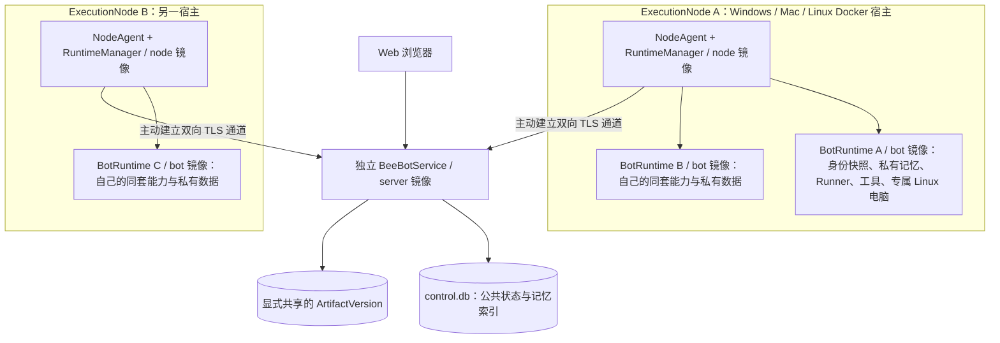
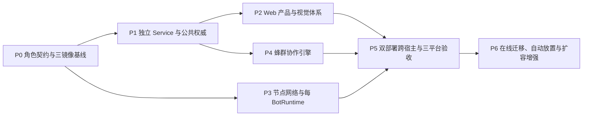

# BeeBot 蜂群产品设计与开发规格

版本：1.3 · 2026-09-17 · 状态：经现有实现核对修订的待开发规格。

读者：负责实施、评审、测试和交付的 AI 开发代理与工程师。

**产品定义：用户通过精致的 Web 界面给出目标与边界，拥有专属电脑的长期 Bot 像蜂群一样自主分工、交换信息、互相补位并完成交付。产品只提供 Web 客户端；Web 服务与 Bot 执行环境独立部署。同一源码发布 server、node、bot 三种 Linux 镜像，通过独立的服务端与执行节点 Compose 包部署在 Windows、macOS、Linux 宿主。**

本文件定义产品与协作行为；[开发技术栈与改造路线](./DEVELOPMENT_STRATEGY.md)、[厂商与模型配置](./MODEL_PROVIDER_CONFIGURATION.md)、[语言与设置](./LANGUAGE_AND_SETTINGS_DESIGN.md)、[独立部署设计](./DOCKER_DEPLOYMENT_DESIGN.md) 分别细化工程、模型、设置和部署契约，共同作为实施依据。先读 [现有实现核对](./EXISTING_BEEBOT_IMPLEMENTATION_AUDIT.md)，区分已实现与待开发。`docs/design/2026-09-16-*.md` 是早期讨论入口。发生契约冲突必须统一这些正式文档，不允许实现者各选一套。

本文的接口、目录和状态机是待实现设计，不代表当前仓库已经提供。官方 Grok Bot 资料用于解释来源，不覆盖 BeeBot 已确认的产品要求。实施路线已定为在现有仓库渐进改造，继续使用 TypeScript、React/Vite、Node.js；不清空重写。

本文中的“必须”是验收条件，“建议”是实现默认值，“后续”不计入第一完整版本。实现者可以调整内部模块和命名，但不得改变用户行为、数据边界或验收语义；必要变更须先更新本文并说明原因。

阅读入口：[需求](#1-已确认需求与范围) · [Web 产品与视觉](#3-产品流程与-web-体验) · [系统架构](#4-系统架构与运行边界) · [数据模型](#5-数据模型与持久化契约) · [蜂群引擎](#6-蜂群协作引擎) · [专属电脑](#7-bot-专属电脑与执行节点) · [接口协议](#8-api事件与跨端协议) · [开发拆分](#10-开发拆分迁移与发布顺序) · [验收](#11-验收与测试矩阵) · [AI 交接](#12-给接手开发-ai-的执行说明)。

## 1. 已确认需求与范围

### 1.1 产品不变量

| ID | 要求 | 验收含义 |
| --- | --- | --- |
| R01 | 用户是 Boss，Bot 自主协作 | 用户不必手动逐项派工、搬运上下文或操作流程图 |
| R02 | Bot 是长期个体 | 保留身份、职责、模型配置、记忆和工作电脑；跨端仍是同一个 Bot |
| R03 | 每个 Bot 有专属持久电脑 | 独立工作文件、浏览器 profile/登录、桌面和运行资源；通过明确共享来协作 |
| R04 | Bot 可完整操作自己的电脑 | 浏览器、终端、文件、桌面、工具安装；权限范围限于分配给它的环境 |
| R05 | 用户可查看、接管、归还电脑 | 浏览器内有真实控制闭环；Bot 与用户不得同时争用输入 |
| R06 | Group 无必选固定主管 | 创建群不要求 leader；不存在每个群背后必运行的主管模型 |
| R07 | 支持普通发言和单人/多人/全员 mention | `@A` 精确指定接收者；明确“这次你牵头”才设置任务级协调者 |
| R08 | 协调角色按需出现 | 属于本次工作，可以为空、改变或撤销；不默认继承到下一次工作 |
| R09 | 共同上下文与显式责任 | 成员能看到目标、已有分工、共享结果；每项执行前有唯一 owner |
| R10 | 有明确的交付和停止 | 发言、reaction、pass、沉默不等于完成；失败和部分成果可见 |
| R11 | 只有 Web 产品入口 | 不发布新的桌面客户端；不同浏览器窗口/设备看到同一份 Bot/群/消息/状态 |
| R12 | 一套代码，服务与 Bot 独立部署 | 首版覆盖 Windows / macOS / Linux；同源码发布 server/node/bot 的 linux/amd64、linux/arm64 镜像，服务包与节点包可分别启动，支持跨机器与同群跨节点 |
| R13 | 模型与平台解耦 | 保留多厂商、每 Bot 模型配置，CLI 路由只在具备相应能力的节点运行 |
| R14 | 简单的产品表面 | 聊天、状态、成果为主，内部任务表/租约/依赖不变成用户配置负担 |
| R15 | 精致的 Web 体验 | 一致的视觉语言、排版、组件、状态、动效和响应式布局，通过第3节视觉验收 |

“蜂群”是工作组织方式：个体持续存在、信息流动、根据职责认领、局部协商、交接和整体交付。头像、命名和动画可以强化表达，但不能代替可运行的协作机制。

### 1.2 第一完整版本与后续范围

第一完整版本必须交付：**一套源码，server、node、bot 三种版本化镜像，各提供 linux/amd64 与 linux/arm64；`compose.server.yaml` 和 `compose.node.yaml` 是两套可独立启动的部署入口。** 服务端运行 BeeBotService 与 Web，不运行 Bot 模型、私有记忆或电脑，也不需要 Docker socket。执行端运行 NodeAgent/RuntimeManager，动态启动每个 Bot 的专属 BotRuntime。两套部署不是两套操作系统业务实现。

Web 服务与 Bot 位于不同机器、同一群的 Bot 分布于两个以上执行节点、节点主动连接、网络断线与结果恢复，均属于第一完整版本。可在同一宿主联合安装，但独立网络协议始终成立；不得依赖共享卷、同一个 Docker Engine、Compose 内部固定服务名或 `localhost` 才能工作。

Windows、macOS、Linux 宿主均使用相同镜像角色与部署文件；宿主不必另装 BeeBot 原生程序、Node、Python 或模型 CLI。三类宿主必须覆盖群自主协作、可选临时协调、每 Bot 专属持久 Linux 环境、浏览器观看/接管/归还、停止、失败与恢复。具体前提见 [Docker 部署设计](./DOCKER_DEPLOYMENT_DESIGN.md)。

“支持 Windows/Mac/Linux”指这些系统可承载相应 Docker 部署。用户浏览器、Service 部署宿主、ExecutionNode 宿主、Bot 内部 Linux 环境是不同维度；用户的 Windows 电脑可以仅打开 Web，也可以作为连接远端 Service 的执行节点。

BotRuntime 包含该 Bot 的身份配置快照、私有 memory/model history、runner/provider、工具和持久专属电脑，不是只有浏览器与终端的远控工具箱。环境可按需启动或停止，但 Bot 的身份与私有数据连续保留；专属环境不要求独占物理服务器。

后续范围：运行中无缝迁移、自动放置与弹性扩容、宿主原生应用集成、多用户团队协作、高可用多副本服务。跨机器连接和同群跨节点协作不得再归入后续范围。原生桌面/手机客户端不在本方案内，窄屏 Web 仍需适配。

实施可分阶段，但阶段原型不能用同进程 adapter、公共全体 Bot Worker 或“只有终端”替代最终网络、专属 Runtime 和电脑接管能力。

## 2. 当前仓库事实与设计差距

分析基于 2026-09-17 当前工作树，包含已有未提交修改。开始实施时必须重新确认 Git 状态，保护现有改动。下表路径相对仓库根目录；行号仅为定位参考，符号名更稳定。

| 位置 | 已观察到的行为 | 必须处理的差距 |
| --- | --- | --- |
| `source/host/main.ts`、`source/host/sand-host.ts:167` | Host 组合 extensions、Runner 和私有会话能力 | 作为每 BotRuntime 的复用起点；不能直接把完整 Host 塞进 Web Service |
| `source/host/gateway-server.ts` | HTTP command + SSE，拒绝带 Origin 的浏览器请求 | 新增用户 API 边界；不能直接取消内部 gateway 防护 |
| `frontend/src/production/bootstrap.tsx` | 启动强制依赖 desktop/coordinatorPort | 注入业务服务与平台适配器 |
| `frontend/src/production/coordinator-client.ts` | 通信绑定 MessagePort | 增加 Web transport，共用业务契约 |
| `source/node-agent-coordinator/main.ts` | 依赖桌面转交端口及其生命周期 | 不可原样充当独立服务器 |
| `source/node-agent-coordinator/inference-router.ts` | 非 HTTP 路由按全局 provider 在桌面执行，另存 transcript JSON；codex 实际含 direct Responses 路径 | 统一每 Bot resolver 与 Runtime 入口；不得把现有 Codex direct 称为已完成 CLI adapter |
| `source/host/extensions/transcript/transcript-store.ts` | 模块级单份活动 transcript cache | 改为按 conversationId 定位的视图/缓存 |
| `source/host/host-gateway-api.ts` | openAgent 可改变后端 activeSession | 客户端焦点与业务会话读写分开 |
| `source/host/extensions/transcript/group-chat-orchestrator.ts` | 全员并发，有人发言就全员再跑；mention 仅提示 | 改为首次参与、工作认领、相关事件唤醒 |
| `source/host/extensions/transcript/group-chat-glue.ts` | 按成员集合复用群；预览与正式消息提交分离 | 群有独立 ID；已接受公开消息立即持久提交 |
| `source/host/extensions/transcript/run-scheduler.ts` | 有单 Bot 队列与私聊优先；队列在内存 | 复用执行互斥思路，补持久工作与恢复 |
| `source/host/extensions/session/agent-db.ts` | 使用 `node:sqlite`；部分写失败返回 false | 新权威状态事务不得静默丢写或提前返回成功 |
| `source/host/box/box-factory.ts:7`、`source/electron-main/box/local-docker-host-connector.ts:201` | 默认 in-box/loopback；Host bundle 装入电脑环境，在同一执行侧运行 Runner 与工具 | 保留 Bot 的完整执行单元；拆除当前多 Bot 共享 Host/容器/卷，不能改成 Web 服务统一跑模型、电脑只跑工具 |
| `source/electron-main/box/local-docker-host-connector.ts` | 固定单容器，共享 workspace、sand-data，包含共享凭据挂载 | 尚不能证明每 Bot 文件/账号隔离；必须改造 |
| `frontend/src/recovered/features/computer/shell/vnc-webview.tsx` | 依赖 Electron webview | Web viewer 使用独立适配器 |
| `scripts/build.mjs`、`scripts/package-macos.mjs`、`scripts/clean-build.mjs` | 默认发行走 fidelity renderer 并注入 BeeBot 补丁；Host/Electron 可通过 production activation 从源码构建 | 新建不依赖旧安装包的 Web 构建入口；逐项迁移补丁功能到 React |
| `source/shared/inference-vendor.ts`、`source/electron-main/main-edge.ts` | 已有多接入配置与每 Bot 绑定；一条记录同时绑定 URL/key/model；保存含本地模式等副作用 | 保留配置与引用，分离接入/模型，取消保存厂商时隐式切换权限和运行环境 |
| `source/shared/ui-language.ts`、`sand-settings-store.ts` | en/zh、默认 en，存于本机 JSON，仅部分 UI 文案覆盖 | 迁移为用户偏好和完整资源；不将 UI 语言当作 Bot 回复语言 |
| `source/host/extensions/memory/agent-state.ts` | 除私有记忆外，还有显式 user/project scope 的写入模型 | 按 scope 迁移，不把所有记忆当私有或全部复制成公共数据 |

执行侧 Host/Runner/私有会话的核对记录见 [现有 Bot 运行边界研究](./research/2026-09-16-beebot-runtime-boundaries.md)。完整现状、构建入口、模型双路径、语言覆盖、群执行和测试边界见 [实现核对](./EXISTING_BEEBOT_IMPLEMENTATION_AUDIT.md)。2026-09-17 的旧基线检查通过 86 项测试及类型检查，前端构建通过；这不是目标 Web/跨节点能力已实现的证明。

现有 `README` 对专属电脑和默认 renderer 的描述不完全等于上述实现事实。本文沿用已确认的产品体验，同时把隔离和跨端能力列为需要验证、实现的工作；不能因为文案出现“独立电脑”就跳过隔离验收。

## 3. 产品流程与 Web 体验

### 3.1 产品不变量

本节落实第 1 节的 R01–R15，尤其是长期 Bot、无必选主管、专属电脑、唯一 Web 客户端，以及首版即支持的服务/执行端分离和同群跨节点协作。

- BeeBot 的产品模型是蜂群：用户作为 Boss 给出目标，长期存在的 Bot 根据专长合作完成。
- Bot 是持续存在的个体，拥有自己的身份、模型配置、专长、记忆和电脑。
- Group 是共享上下文与协作空间，拥有成员、消息、目标、工作记录和产物引用。
- Group 不拥有另一套人格，不要求配置模型，不创建一台替代成员电脑的公共电脑。
- Group 不设置必选或固定主管；数据结构与 UI 均不得要求 `leaderId`。
- 每次工作可以显式指定临时牵头 Bot；牵头关系只属于这次工作，可变更或结束。
- Bot 可以加入多个群，其全局专长保持连续；群内约定不应悄悄覆盖 Bot 的全局人格。
- 每个 Bot 必须有专属且持久的电脑，具有独立文件、浏览器登录状态和桌面。
- Bot 可以完整操作自己的电脑；用户可以观看、接管、操作，再归还给 Bot。
- 独立电脑是持久运行环境，不等于必须单独占用一台物理服务器；具体隔离由 runtime 实现。
- 多个 Bot 合作时通过消息、工作交接和产物传递共享成果，不假设彼此的本地路径相同。
- 只开发、交付和维护 Web 客户端；Windows / macOS / Linux 使用同源码的服务包或节点包，用户通过浏览器访问独立 Web 服务。
- 不发布桌面客户端，不新增 Electron adapter、原生窗口、托盘或桌面更新器；远程“电脑桌面”仍是核心功能。
- 用户关闭客户端、切换群或手机进入后台，不应主动取消已经被服务端接受的工作。

### 3.2 用户应理解的三个对象

| 对象 | 用户看到的含义 | 持久内容 |
| --- | --- | --- |
| Bot | 一位有专长、能操作自己电脑的同事 | 身份、模型、专长、记忆、电脑 |
| Group | 一群同事协作的空间 | 成员、共享消息、上下文、历史成果 |
| 一次工作 | Boss 提出的一个需要完成的目标 | 目标、参与者、认领、依赖、状态、交付物 |

- 同一群可以连续完成多次工作，也可以保留讨论，不把每句闲聊强制转换成任务。
- 一次工作可以只有一个 Bot 处理；不要求为了体现蜂群而制造无用分工。
- 任务与依赖在后台必须明确，界面不强制采用看板或组织架构图。
- 用户可以一直用聊天完成主要操作，任务详情是解释与干预入口。

### 3.3 创建 Bot：低负担且配置真实可用

- 页面名称为“新建 Bot”，首屏展示名称、模型、专长描述和运行位置。
- 名称必需；允许自动填入可编辑默认值，提交时去除首尾空白。
- 模型引用必需；已有默认模型时自动选中，不要求重复输入 API key。
- 运行位置必需但可默认；只有一个可用环境时显示简洁说明，不增加下拉选择负担。
- 专长描述可选，例如“擅长资料研究和引用核实”；空缺不阻止创建。
- 头像和颜色可选，使用自动默认值；高级模型与资源配置置于折叠区。
- 服务端创建 Bot 后，为其分配专属持久电脑标识，界面立即出现 Bot 行。
- 电脑可异步准备；明确显示“正在准备电脑”，失败时提供“重试”和具体原因。
- 准备期间允许查看资料和发送消息，发送只表示 Service 已接受并排队；完整 BotRuntime 未就绪时不得在 Service 临时运行模型冒充 Bot 回复，也不得虚报电脑动作已开始。
- 没有可用模型时就地提供“添加模型”；没有可用环境时提供“连接运行环境”。
- 首次设置引导为：初始化 owner/界面语言/工作时区 → 保存厂商与模型 → 可选非推理连接探测 → 登记执行节点 → 创建 configuration_pending Bot 与专属 Runtime → 在该 Runtime 验证真实模型/工具 → ready 后私聊或建群。创建草稿不要求先通过推理测试，避免“没有 Bot 无法测试、没有测试无法建 Bot”的循环。每步可保存返回；密钥提交后只显示“已配置”。
- 创建失败保留填写内容，重试复用创建幂等标识，避免产生重复 Bot。
- 删除 Bot 与移除群成员是两个独立操作，不允许移出群顺带销毁电脑和文件。

### 3.4 创建与维护 Group

- “新建群”只要求选择成员；名称可填写，也可由成员名生成后再修改。
- 可选群说明用于长期目标、共同约定和资源入口，不要求填写组织岗位表。
- 建群表单中不出现必选负责人、默认主管或固定层级。
- 成员列表显示名称、专长摘要、当前可用性；已有群不能作为成员加入形成嵌套。
- 人数上下限必须来自服务端能力与校验，创建和编辑使用同一规则。
- 首版能力默认 `minGroupMembers=1`、`maxGroupMembers=6`；建议 2–6 人协作。以后调整上限必须同步容量、首次判断预算与性能验收。
- 兼容已有单成员群；团队合作推荐至少两个 Bot，但不要让旧数据失去可访问性。
- 达到人数上限时显示具体上限；不可只把提交按钮置灰而不解释。
- 相同成员可以服务不同项目，新建群不应仅按成员集合自动合并到旧群。
- 成员面板支持添加、移除、查看 Bot 和查看它在本群参与的工作。
- 点击成员默认打开成员详情；私聊、查看电脑是明确的次级动作。
- 移除忙碌成员前列出其在途工作，选择等待结束或取消并重新认领。
- 不删除已发消息与已有产物；历史记录保留当时的作者标识及显示名快照。
- 群成员变更作为系统事件展示，新增成员后续执行可获取允许共享的群上下文。

### 3.5 群内消息与自主协作

- Boss 可以直接描述目标，例如“做一个可演示的官网，完成后把预览和说明交给我”。
- 普通群消息进入共享上下文，由服务端协作策略判断是否建立或补充一次工作。
- 不要求 Boss 为每一步指定执行者；Bot 根据专长自主提出并认领适合自己的部分。
- 未点名的协作不得隐式永久任命某个 Bot 为主管，也不得默认广播成全员抢答。
- `@all` 明确邀请当前群成员共同响应或协作；允许相关 Bot 发言，无贡献者可以保持安静。
- `@某个 Bot` 仅表示本次消息定向给该 Bot，不自动授予牵头权，也不邀请全员补充。
- “@某个 Bot，你来牵头这件事”才产生本次工作的临时协调关系。
- 多人点名只定向给选中的成员；`@all` 与逐个点名同时存在时按明确的全员语义规范化。
- 所有点名消息仍是群内公开消息；“只定向处理”不等于私聊或只对该成员可见。
- 群外 Bot 不在本群点名默认候选中；需要加入或跨群交接时使用明确的独立动作。
- 自主认领必须有真实服务端结果；模型说“我来做”但认领失败时不能显示为执行人。
- 同一工作单元的排他认领由服务端决定；其他 Bot 看到认领结果后选择协助或其他工作。
- 交接卡至少展示交出方、接收方、目的、成果引用及是否接收；未接收不显示为已完成交接。
- Bot 遇到可自行解决的问题可重试或求助同伴，只有需要 Boss 决定时才标记“需要你”。
- 讨论停止、所有 Bot 选择不发言、达到循环上限都不等于目标已完成。
- 完成条件是目标相关工作与验收已满足且交付物可访问；失败和剩余事项必须明确披露。
- 无临时牵头者时也需要形成目标级交付；允许某个 Bot 认领汇总，汇总不产生永久管理权。

### 3.6 点名与消息交互契约

- 点名由编辑器生成结构化 token，存储真实 Bot ID，不以显示名正则匹配判断接收人。
- 显示名可以重名或修改；历史点名继续指向原始 ID，并保留渲染标签。
- 消息保存可渲染正文和结构化接收对象；富文本点名 token 必须与规范化接收对象一致。
- 接收对象区分全员与具体成员，不允许客户端显示一套收件人、服务端执行另一套。
- 纯文本中手写 `@名字` 可以作为普通文本；通过候选选择后才转换为确认过的定向 token。
- 跨客户端 API 允许直接提交结构化 mentions；服务端验证 Bot 是目标群的有效成员。
- 临时牵头通过单独的任务级命令或已确认语义表示，不从单个 mention 自动推导。
- 本次牵头关系可以为空，用户能够查看谁设置、何时生效以及后续变更。
- `@all` 的有效接收成员由服务端在接受消息时确定；成员变化不应使历史投递对象漂移。
- 同次发送重试保持相同提交身份，服务端返回相同接受结果，界面不产生重复消息。
- 回复工作消息时保留原消息与工作的关联，减少“补充哪件事”的歧义。

### 3.7 页面与主要流程

- 左侧会话列表同时容纳 Bot 和 Group，以头像/标识区分；保留搜索、置顶、未读。
- Bot 会话顶部展示身份、运行状态、“查看电脑”入口与设置入口。
- Group 顶部展示群名、成员、当前工作摘要；不常驻“主管”栏。
- 群主时间线展示 Boss 目标、Bot 必要讨论、认领与交接、阻塞、交付。
- 工具输出和高频执行细节默认收起，用户可以从工作卡或 Bot 活动打开。
- 群工作卡显示目标、状态、参与 Bot、当前认领及产物，支持展开依赖与验证记录。
- 临时协调人存在时仅在该工作卡显示“本次牵头：某 Bot”，不改变群身份。
- 右侧详情按需展示成员、共享资料、工作和产物；窄屏改为独立页面或抽屉。
- 不强制首页看板；聊天必须足以发目标、提要求、看进度、接收结果和处理阻塞。
- 空群历史展示“向团队描述目标，可 @all 邀请协作”，而非要求先选负责人。
- 工作进行中输入框仍可用；补充消息先保留，服务端明确其归属与处理状态。
- “停止工作”和“继续”有显式入口，遵循服务端状态回执；停止进入取消状态，继续终态工作会建立关联旧成果的新工作。电脑接管期间暂停输入是独立控制动作。
- 手机窄屏以列表→会话→详情逐层导航，输入框适配软键盘和安全区域。
- 应用进入已有工作空间或简洁的连接/首次设置页，不制作营销 landing page 或巨型标语。

### 3.8 必须区分的业务状态

| 对象 | UI 状态 |
| --- | --- |
| 消息投递 | 本地待发、发送中、已接受、失败；断线时明确排队 |
| 一次工作 | 待处理、协作中、等待依赖、需要 Boss、验收中、已交付、失败、已取消 |
| 电脑输入控制 | 暂停 Bot 输入中、用户控制中、归还中；不得点击后直接伪造已接管 |
| 工作单元 | 待认领、已认领、排队、执行中、待验收、完成、阻塞、失败、取消 |
| Bot 可用性 | 空闲、工作中、等待资源、电脑准备中、不可用 |
| 网络 | 连接中、已连接、重连中、离线；离线不覆盖真实工作状态 |

- Bot 在多个群间排队时说明“正在处理其他工作”，不要只显示无反馈的 Working。
- 单个 Bot 失败不自动宣告群目标失败；可恢复与不可恢复结果由工作状态明确区分。
- “需要 Boss”显示一个具体问题、可执行选项和受影响范围，避免多人重复询问。

### 3.9 专属电脑、浏览器与控制权

- Bot 详情展示电脑的持久身份和运行位置；每个 Bot 的电脑归属稳定，不随群切换。
- 重启 Bot 或 runtime 后，已保存文件与浏览器登录仍属于该 Bot，不能换成临时空机器。
- 群成员查看电脑时进入选中 Bot 的专属电脑，不进入群共享电脑。
- 电脑页必须支持观看桌面和浏览器、连接状态、接管、归还、回到聊天。
- 用户接管后可以直接操作该电脑中的浏览器、终端和桌面应用。
- 用户在浏览器完成登录后，Bot 在同一专属浏览器环境继续工作，不另开隔离登录副本。
- 电脑运行状态与控制状态分开建模，不能用一个 `isRunning` 同时表示所有含义。
- 运行状态：未准备、准备中、运行中、休眠、启动中、不可用。
- 控制状态：Bot 控制、申请用户接管、用户控制、申请归还、恢复 Bot 控制。
- “观看”只连接画面，不抢占 Bot 控制权，也不因鼠标进入画面自动暂停 Bot。
- 接管申请必须经过服务端仲裁；确认后暂停 Bot 对该电脑的输入操作并授予用户控制租约。
- 接管中若尚有操作收尾，显示“正在暂停 Bot 操作”，不得让双方同时注入键鼠事件。
- 用户控制期间 Bot 可继续与用户交流或做不冲突的推理，但不得偷偷点击、输入或导航。
- 归还后撤销用户输入租约，让 Bot 获取最新画面和用户操作摘要再恢复。
- 一个电脑同一时刻只能有一个交互控制者；其他客户端可以观看并看到控制者状态。
- 用户控制端断线后保持无人输入，等待用户重新连接并接管或归还；首版不自动恢复 Bot 点击。
- 浏览器登录态与桌面文件是 runtime 私有资源；另一 Bot 需要资料时通过产物交接获取。

### 3.10 Web 服务与浏览器能力边界

- `AppServices.session`：用户会话、当前 workspace、运行环境和权限信息。
- `AppServices.providers`：模型厂商配置、凭据写入、连接测试、模型列表及默认模型；读取接口只返回凭据是否已配置。
- `AppServices.settings`：用户外观/语言/显示时区与 workspace 工作默认值；按语言设置规格分权保存，使用统一事件流同步。
- `AppServices.agents/groups/messages/work`：业务读写、群成员、消息、工作认领和状态。
- `AppServices.events`：权威事件流、连接状态、游标恢复和快照补偿。
- `AppServices.artifacts`：上传、提交、预览、下载和工作成果引用。
- `AppServices.computers`：专属电脑状态、观看会话、接管租约、归还与控制事件。
- `BrowserServices.storage`：浏览器本地草稿、布局、缓存；不能作为工作事实唯一来源。
- `BrowserServices.openExternal/notifications/filePicker`：使用标准浏览器实现，显式处理权限或能力不足。
- React 业务组件依赖服务接口；浏览器不直接调用本机进程、Docker socket 或原生文件系统。
- BeeBotService 管理公共业务；执行节点的 NodeAgent/RuntimeManager 管理专属 BotRuntime。Service 不执行 Bot 模型，不要求与节点同机或持有 Docker socket。
- 同一 UI 支持本地与服务器部署；客户端不依赖 `localhost`、宿主绝对路径或直接调用 Docker。部署层以 Docker 为首版统一标准。
- 首版允许同群 Bot 分布在不同节点；UI 展示 Bot 的实际执行位置、在线状态和能力，不要求 Boss 手动搬运文件。
- Web 使用同源 API 与事件流；本地 service 可以同时提供页面和 API，服务器通过受控入口提供相同契约。
- 远程页面连接本地环境时通过明确的连接/配对流程，不能默认 HTTPS 页面可随意直连本机 HTTP。
- 暴露 `artifactId` 与授权资源 URL；绝对文件路径只留在服务端/runtime 内部映射。
- 启动读取可用能力，但专属电脑、浏览器观看与接管是本期产品必需能力，不是永久可选插件。
- 不支持的增强功能显示具体原因或隐藏入口；不得无声空操作或把成功结果伪造为完成。
- 后端缺少必需电脑能力时显示“此环境尚未配置电脑服务”，阻止宣称完整可用并提供配置入口。

### 3.11 当前源码的改造入口

- `frontend/src/production/bootstrap.tsx:18`：移除启动必须存在 `window.desktop/coordinatorPort` 的要求，创建 Web 服务依赖。
- `frontend/src/production/ProductionRenderer.tsx:608`：拆分服务依赖，逐步减少巨大根组件直接读取 DesktopBridge。
- `frontend/src/production/coordinator-client.ts:51`：保留 call/subscribe 业务语义，替换 MessagePort 为 Web transport。
- `frontend/src/recovered/runtime/coordinator-source.ts:61`：复用业务方法/source/controller 边界，提供 Web adapter。
- `frontend/src/recovered/contracts/desktop-bridge.ts:428`：仅作为迁移时的旧能力清单；Web 启动、业务组件和构建不依赖该契约。
- `frontend/src/production/ProductionRenderer.tsx:2833`：现只有 CreateBot 入口；补原生 React 创建 Group 流程。
- `frontend/src/recovered/features/agent-info/group-members/`：复用成员管理，补错误展示、忙碌成员移除处理和跨端文案。
- `frontend/src/recovered/features/conversation/workspace/editor-suggestion-provider.ts:166`：候选按群成员过滤，支持结构化 `@all` 和 Bot ID。
- `frontend/src/recovered/features/conversation/workspace/desktop.ts:57`：附件暂存/提交依赖改为 ArtifactService。
- `frontend/src/recovered/features/computer/shell/controller.ts:75`：复用电脑业务状态读取，增加控制租约状态。
- `frontend/src/recovered/features/computer/shell/vnc-webview.tsx:247`：迁移为真正浏览器可用的电脑观看/输入组件，移除 Electron webview 依赖。
- `source/electron-main/media/media-protocol.ts:19`：参考旧媒体行为实现 HTTPS 资源与 Range 读取，不继续引入 `sand-media://`。
- `source/host/gateway-server.ts:23`：目前拒绝带 Origin 的浏览器请求；新增客户端 API 边界，不直接取消现有内部边界。
- `source/host/gateway-server.ts:38`：现 SSE 无可恢复 event ID；先完成重连快照补偿，再提供游标事件恢复。

### 3.12 本期验收必须支持

- Web 可创建 Bot、创建无负责人的 Group、发消息、查看历史与产物，无 preload 注入也能正常运行。
- `@all`、单 Bot 定向、多人定向和本次可选牵头语义分离，重名/改名不误投递。
- Boss 下达目标后，至少两个 Bot 能自主认领不同工作并完成一次真实交接与目标交付。
- Bot 的专属电脑、文件和浏览器状态经过重启仍保持归属；两个 Bot 登录态与文件互不混用。
- Web 可观看 Bot 的桌面/浏览器，接管实际键鼠操作，并归还让 Bot 继续；不是静态截图演示。
- 接管期间 Bot 不与用户争抢输入；多客户端同时接管只有一个成功。
- 本地和服务器部署各完成一次端到端群协作；客户端不依赖部署机器的绝对路径。
- 断网重连、刷新与关闭客户端后再次进入，消息不重复，工作状态能恢复且产物可访问。
- 创建、认领、附件上传、电脑连接和接管失败都有具体反馈及可执行恢复入口。
- 本期不做桌面客户端、原生移动 App、复杂看板和固定组织架构；移动浏览器需满足本节响应式体验。
- 本期不得把专属持久电脑、浏览器观看或用户接管列为可无限延期的未来能力。

### 3.13 视觉方向与设计 tokens

- 产品气质：安静、清楚、有手感的协作工作台；蜂群身份通过少量蜂蜜琥珀色表达。
- 以消息、成员和真实成果为视觉主角；避免大面积渐变、玻璃模糊、发光边框及一屏等大卡片。
- 使用语义 CSS variables 管理主题；组件禁止散落硬编码颜色，代码/图片/远程画面保留本来颜色。

| Token | Light | Dark | 使用约定 |
| --- | --- | --- | --- |
| `--bg-app` | `#F6F5F1` | `#171816` | 应用与会话列表底色 |
| `--bg-surface` | `#FFFEFA` | `#20211E` | 主会话、浮层、输入区域 |
| `--bg-subtle` | `#EEEBE4` | `#2A2C27` | hover、引用、次级区域 |
| `--text-primary` | `#25231F` | `#EEEDE6` | 正文与标题 |
| `--text-secondary` | `#6B665D` | `#B4B3A8` | 时间、说明与状态文字 |
| `--border-subtle` | `#DEDAD1` | `#393B34` | 区域分割，不作唯一交互提示 |
| `--accent-solid` | `#9A5700` | `#F2C56B` | 主操作、焦点与选中强调 |
| `--accent-on-solid` | `#FFFFFF` | `#342400` | 主操作按钮文字 |
| `--accent-soft` | `#FFF0D2` | `#3A3020` | 点名、选中项和蜂群标识底色 |
| `--danger-text` | `#B42318` | `#FF9990` | 错误与危险操作，配文字/图标 |

- 状态色克制使用；成功、进行中、异常均同时有图标与文案，不依赖红绿颜色区分。
- 主题支持浅色、深色、跟随系统；首次采用系统设置，用户选择持久化，不在加载时闪白。
- 正文与交互文字实际渲染对比至少 4.5:1，大字至少 3:1，交互边界/焦点至少 3:1；验收实际组合。
- 基础间距用 4px 网格：4/8/12/16/24/32；主内容边距宽屏 32px、笔记本 24px、窄屏 16px。
- 圆角分层：小控件 6px，输入区/消息附件 10px，弹层 14px；主界面不处处包圆角卡片。
- 阴影只用于浮层和覆盖抽屉；普通区域依靠留白、底色和 1px 分割线建立层次。
- 图标统一 20px/1.75px 描边，辅助图标 16px；禁止同一工具栏混用表情图标和多个图标体系。
- 主操作保持唯一视觉重心：输入区发送、电脑页接管/归还；次要操作用中性色或文字按钮。

### 3.14 响应式布局与组件细节

- 标准结构为三个区域：会话导航、主会话、按需详情侧板；主会话持续是中心。
- 详情侧板按当前选择展示电脑、成员或成果，不默认同时打开多列详情。
- 宽屏 `>=1440px`：导航 248px，主区弹性，侧板 360–440px；关闭侧板时消息阅读列居中。
- 笔记本 `1100–1439px`：导航 224px；主区不得被侧板压到小于 560px，否则详情改覆盖抽屉。
- 中屏 `768–1099px`：导航收为 64px 轨道，会话列表可展开；详情覆盖，返回后保留阅读位置。
- 窄屏 `<768px`：一次只呈现列表、会话或详情一个主区域，标题提供清晰返回与详情入口。
- 消息正文最大阅读宽度 800px；表格、代码和成果预览可扩展，长内容不能撑破页面。
- 会话页头高 56px；显示群/Bot 身份、简洁状态与必要操作，避免用多排徽章占据正文高度。
- 导航会话行高至少 60px，头像 32px，最多两行摘要；选中使用淡琥珀底色和清楚文字。
- Bot 消息使用头像、名称、可选专长与正文组成连续时间线；同作者连续消息减少重复头部。
- Boss 消息用轻背景和明确作者区分；不要让每条 Bot 输出都成为厚边框大卡片。
- 时间与操作在 hover/focus 时可见，触屏有显式菜单入口；删除等动作不得依赖仅 hover。
- 输入区固定在会话底部，支持多行、附件进度、结构化点名；高度增长有上限，不遮住全部历史。
- `@` 候选展示头像、名称、专长和可用性；键盘可选择，已选 token 可删除并有清楚焦点。
- 工作卡只呈现目标、阶段、参与者和当前变化；详细认领/依赖按需展开，不重建一屏看板。
- 成果条目展示类型图标、名称、提供者、版本和可访问状态；主操作为预览，下载为辅助操作。
- 图片/视频预留尺寸，避免加载后挤动时间线；代码块独立滚动，提供复制反馈与长内容折叠。
- 电脑侧板先提供实时观看；接管后固定显示控制状态和归还按钮，不能被远程画面盖住。
- 电脑支持全屏观看/操作；窄屏允许缩放、平移及必要键盘辅助，提示横屏但不禁止竖屏访问。
- 当前电脑与所属 Bot 始终可识别；切换 Bot 时旧输入会话先失效，避免输入落到错误电脑。

### 3.15 完整状态、中文排版与可访问性

- 空列表说明如何创建 Bot；空群历史说明如何下达目标；没有成果说明结果将在这里出现。
- 首次加载采用与实际结构一致的骨架；不使用无意义的多张占位卡片或持续全屏 spinner。
- 按钮处理中保持原尺寸，显示具体动词；返回失败后恢复可操作，不清空用户已填写内容。
- 初次加载失败提供原位重试；已有数据刷新失败继续保留内容，标明“更新失败”而非清空页面。
- 离线在页头显示一条持续且克制的连接提示；区分本地待发消息与服务端已接受工作。
- 重连时恢复消息位置和展开状态；不要重复弹成功通知或重放进场动画。
- 电脑离线、正在准备、无观看权限、由其他用户控制分别呈现，不能统一成黑色画面。
- 对无法预览的文件提供可下载入口与原因；权限不足时展示申请/联系配置者的实际可行路径。
- 中文字体优先系统 UI、PingFang SC、Microsoft YaHei、Noto Sans CJK SC，避免运行时依赖外部字体 CDN。
- 正文 15px/1.65，长文可 16px；辅助文字不小于 12px，核心状态不使用难读的浅灰小字。
- 页标题 20px/1.4，中级标题 16px/1.5；使用 500–600 字重，避免所有区域都粗体。
- 中文不强制两端对齐，不添加字母式大字距；中英文、数字与单位保持自然间隔。
- 代码使用等宽字体 13px/1.6；长 URL、文件名有可访问全文入口，不让工具提示成为唯一读取方式。
- 交互目标至少 40px，窄屏关键操作至少 44px；图标按钮均提供准确的可访问名称。
- 页面、会话列表、消息区、输入区和详情有语义 landmark；焦点顺序与视觉顺序一致。
- 弹层限制焦点且关闭后回到触发器；Escape 可关闭可取消的弹层，不自动取消后台工作。
- Enter 发送、Shift+Enter 换行允许设置；输入法 composition 期间 Enter 不提交消息。
- 提供快捷键帮助和可发现入口；不要劫持浏览器保留快捷键，远程电脑键盘捕获必须显式启用和退出。
- 流式输出使用节制的 `aria-live`，按语义片段更新，不逐 token 打断读屏。
- 所有按钮、菜单、点名和电脑外部控制栏均可键盘操作；焦点环不以移除 outline 的方式隐藏。
- 动效仅解释状态变化：hover 100–140ms，抽屉/弹层 160–200ms，消息进入最多 120ms。
- 尊重 `prefers-reduced-motion`：取消位移、缩放和装饰循环，保留即时状态与必要进度信息。
- 用户向上阅读时不自动拉回底部，显示“有新消息”；用户在底部才跟随新增内容滚动。

### 3.16 Web 视觉与交互验收

- 在真实 Web 构建中截图验收，不能只提交静态设计稿；本节是实现完成后的验收要求。
- 必拍视口：1440×1000、1280×800、1024×768、390×844；至少覆盖浅色与深色主会话。
- 场景至少包含：首次空状态、多 Bot 群对话、工作交接、长中文/代码、成果预览、电脑观看和用户接管。
- 状态截图至少覆盖加载、连接失败、离线待发、成员不可用、电脑由他人控制；同状态文案不得矛盾。
- 检查无横向页面溢出、无输入区遮挡、无头像/工具栏错位；手机软键盘打开后仍可发送和返回。
- 用相同数据比较主题和断点，检查阅读层次、点名可辨认性、状态对比度与主操作一致性。
- 使用键盘完成建 Bot、建群、点名、打开成果和电脑接管/归还；验证输入法 Enter 与焦点恢复。
- 启用 reduced motion 后录制关键流程，确认无强制滑动/缩放、闪烁装饰和持续脉冲。
- 在同一后台同时打开两个浏览器会话，验证状态同步、接管排他与归还反馈。
- 截图、交互测试结果和未解决问题随实现一并提交；不得以“后续美化”替代上述首期视觉验收。

### 3.17 设置、语言与模型入口

设置中心固定提供通用、模型、执行节点、电脑、安全、数据与诊断六类真实页面。Bot 的模型/回复语言放 Bot 详情，群工作语言放群详情；模型中心管理可复用厂商实例、精确模型 ID、凭据状态与测试证据。详细字段、空状态和错误处理见 [模型规格](./MODEL_PROVIDER_CONFIGURATION.md) 与 [语言设置规格](./LANGUAGE_AND_SETTINGS_DESIGN.md)。

界面语言支持自动/简体中文/English，默认自动；主题支持跟随系统/浅色/深色，个人偏好保存到 Service 并跨设备同步。Bot.replyLanguage 与 Group.workLanguage 默认 auto，分别控制私聊与群工作；切换界面语言不重写历史、不改运行中的交付语言。工作时区独立于设备显示时区。

中英覆盖首用、设置、会话、群、电脑、错误和空状态；使用 i18next/react-i18next 与统一资源，不继续 DOM 翻译补丁。旧桌面更新、原账号账单等不可用能力不显示假入口。设置保存失败必须可见，不能只改本地显示。

## 4. 系统架构与运行边界

### 4.1 Web 服务、执行节点与每 BotRuntime



- **BeeBotService**：独立部署的 Web/API 与公共状态权威，管理账号、Bot 注册与配置、群消息、Run、认领、成果授权、调度和租约。它不运行任何 Bot 模型回合，不装配 Bot 私有上下文，不存私有 memory/model history 正文；不需要 Docker socket，也不要求与 Bot 同机。
- **ExecutionNode**：提供 Docker、资源和网络的 Windows/Mac/Linux 宿主。其 **NodeAgent/RuntimeManager** 负责主动连接 Service、节点身份、容量报告、动态创建/启停每 Bot 环境、健康检查及协议/画面转发，是唯一持有本节点 Docker 管理连接的角色。它不运行 Bot 模型，不加载全体 Bot 私有记忆，不充当公共 Runner。
- **BotRuntime**：每 Bot 的完整执行单元，包含身份和配置快照、私有 memory/model history、Host/Runner、provider、工具、ComputerSupervisor 以及专属持久 Linux 电脑。首版每 Bot 使用专属环境，模型推理调用、上下文装配和工具执行均由该环境的 Runtime 发起；电脑不是由远端公共模型进程操纵的空工具箱。
- **Web 客户端**：提交意图、消费公共状态、查看成果、做用户决策与电脑接管；不持有节点管理凭据，不运行权威任务状态机。
- **Worker 术语约定**：如为适配现有接口保留 Worker，只指某个 BotRuntime 内部的执行适配器，不是同一个进程负责所有 Bot，也不是 Service/NodeAgent 的模型执行角色。已有源码路径保留原名不改变这一边界。

普通执行链路应为：Service 持久接受消息/派发 attempt → NodeAgent 通过已建立的通道转发 → 指定 BotRuntime 装配其私有上下文、运行模型与工具 → Runtime 提交公开结果 → Service 原子确认。NodeAgent 可以转发但不能擅自切换执行 Bot、读取其私有历史来代跑，或把节点转发 ack 当作结果提交成功。

当前 `source/host/box/box-factory.ts:7` 明示默认 in-box，`source/electron-main/box/local-docker-host-connector.ts:201` 把 Host bundle 装入执行环境，`source/host/sand-host.ts:167` 组合 Runner。这支持复用完整执行侧 Host；现状的共享 Host/容器仍须拆成每 Bot 私有环境，不能宣称现状已经隔离。

### 4.2 独立部署与三种镜像

每个 workspace 只有一个可写 BeeBotService。浏览器、NodeAgent、BotRuntime 均不能因失联自行变成业务主节点。BotRuntime 持有自己的长期状态，不意味着可以离线绕过公共租约继续新增群任务副作用。

同一源码与产品版本发布三种镜像，均提供 linux/amd64、linux/arm64：

| 镜像与部署入口 | 内容与职责 | 必须独立满足的条件 |
| --- | --- | --- |
| `beebot-server` / `compose.server.yaml` | BeeBotService、Web 静态资源、公共数据库及成果存储接入 | 不依赖 node/bot 容器、Docker socket、Bot 私有卷或本机模型进程即可启动 |
| `beebot-node` / `compose.node.yaml` | NodeAgent/RuntimeManager、节点注册及动态 Runtime 生命周期 | 仅需显式 Service URL、节点登记和本节点 Docker；可位于另一台机器 |
| `beebot-bot` / 由节点动态实例化 | 每 Bot Host/Runner/provider、私有记忆/会话、工具及持久 Linux 电脑 | 每实例只有一个 Bot 身份和私有持久数据；不持有节点 socket 或 node 注册凭据 |

`compose.server.yaml` 和 `compose.node.yaml` 各自可独立 `up -d`；节点在 Service 尚不可达时进入未连接/重试状态，不以跨包 depends_on 阻止启动。server 上线不要求先有节点，Web 应能展示未登记节点与等待执行的真实状态。

| 宿主 | 统一部署方式 | 首版支持 |
| --- | --- | --- |
| Windows | Docker Desktop / WSL 2 / Linux 容器模式，按需启动 server 或 node 包 | 连接远端 Service、动态运行 BotRuntime；同机联合安装可选 |
| macOS | Docker Desktop，匹配 Intel/Apple Silicon 镜像 | 与 Windows/Linux 相同协议和业务代码 |
| Linux 本机/服务器 | Docker Engine + Compose，amd64/arm64 | 可只运行 Service、只运行执行节点，或显式联合安装 |
| 跨机器/同群跨节点 | 一个独立 Service，多个主动连接的节点，各有 BotRuntime | 第一完整版本必需，不是后续扩展 |

同机安装不改变隔离和协议：server/node 各自的数据、凭据与网络边界独立，Bot 私有卷只在执行节点；禁止跨包共享数据库/私有会话卷，禁止硬编码 localhost、Compose DNS 或必须共用一个 Engine。只有 node 角色持有本节点 Docker 管理连接，不使用 Docker-in-Docker。

关闭 Web 不停止后台；停 Service 会导致租约无法续期，BotRuntime 依协议安全停新动作并保留未确认结果；停某节点只影响该节点上的 Bots，其余节点继续在有效租约内工作。停止节点包前须处理它管理的动态 BotRuntime；动态实例不天然随 Compose down 清理。停止、取消任务和删除私有数据是不同操作。

镜像、网络、端口、节点登记、停止恢复与平台矩阵见 [Docker 部署设计](./DOCKER_DEPLOYMENT_DESIGN.md)。双部署入口不意味着分别维护 Windows/Mac/Linux 三套业务实现。

### 4.3 推荐工程结构

工程决策：在原仓库使用 TypeScript strict；Web 沿用 React + Vite，服务/节点/BotRuntime 沿用 Node.js，HTTP/SSE/ws 与 Zod 使用既有技术体系，公共数据库首版使用 SQLite。新 Web 入口从 React 源码构建，旧发行 renderer 补丁仅作迁移依据。版本基线、依赖方向、构建命令与删除条件见 [开发路线](./DEVELOPMENT_STRATEGY.md)，不留给接手 AI 重新选栈。

以下为新增边界，不要求一次重命名整个仓库；旧路径只在明确迁移时修改：

```text
source/service/                 # 独立 Web/API、鉴权、公共状态与调度组合根
source/domain/                  # Group/Run/Work/Artifact 公共业务规则
source/storage/                 # control.db、事务、公共 repository、outbox
source/node-agent/              # 主动连接、节点登记、路由与资源报告
source/runtime-manager/         # 唯一 Docker 管理角色，动态 BotRuntime 生命周期
source/bot-runtime/             # 每 Bot 入口、私有 memory/history、Runner/provider 适配
source/computer-supervisor/     # Bot 环境内受控执行域与用户接管门禁
deploy/docker/                  # server/node/bot 镜像与两套独立 Compose 入口
source/shared/contracts/        # 公共 DTO、节点/Runtime 协议、schema、事件与错误
frontend/src/platform/          # Web 能力、浏览器存储、下载与通知
frontend/src/services/          # BeeBotClient、事件恢复、artifact client
frontend/src/features/groups/   # 群入口、进度、成果、成员
frontend/src/features/computer/ # computer UI 与网络 viewer adapter
```

现有 Host/Runner/tool/provider/私有会话存储优先复用到 BotRuntime；Service 只抽取公共状态和业务命令处理能力。禁止为了复用 Host 入口而把所有执行 extensions 加载到 Service，或让 NodeAgent 加载全体 Bot 会话。UI 不导入 Node 文件系统/Docker 操作，三种运行角色都不依赖 Electron 生命周期。

### 4.4 模型与工具运行位置

每个 Bot 的用户指令、群工作、交接和 Routine 统一进入该 BotRuntime 的 Runner。HTTP vendor 与 CLI provider 只在 Runtime 内的 ProviderAdapter 中不同；不能建立桌面 CLI 或 Service 公共 Worker 的第二套模型回合入口。

Service 中 `BotModelBinding` 是模型绑定的唯一可编辑来源，引用 providerId/providerModelId；Bot DTO 的 `modelPolicy` 仅是该绑定的只读投影，不能独立保存第二份参数。Runtime 接收每次 attempt 的不可变 ModelBindingSnapshot，使用自己的私有记忆装配上下文。私聊、群、Routine、摘要统一按每 Bot 解析；新 Bot 默认值不影响已有 Bot。派发前校验镜像、模型/工具能力及配置 ACK；缺失时阻塞，不静默改模型、改节点或在 Service 代跑。

HTTP 模型请求由 BotRuntime 发起；自带 Shell/文件工具的 CLI 也安装并运行在该 Bot 的专属 Linux 环境。API key 可由授权 secret broker 提供有范围票据，节点管理进程仅转发密封材料；CLI 登录与私有模型历史留在该 BotRuntime 的私有卷，不挂入 Service 或其他 Bot。

Service 的 provider 连接测试必须明确是无 Bot 上下文的有界协议探测；需要实际模型生成/CLI 登录的能力验证则派给指定 BotRuntime 并记录执行位置。不能把连接测试接口扩展成 Service 内的 Bot 对话执行器。NodeAgent/RuntimeManager 不运行 provider 模型回合或模型可控制的 Shell。

## 5. 数据模型与持久化契约

### 5.1 标识和版本

- 外部 ID 使用不可猜测的稳定字符串；不可使用成员名字、文件路径、容器名作为业务主键。
- 业务实体属于 workspace；当前 authority 下的身份、会话和个人偏好是明确的身份级例外。跨业务实体引用必须校验 workspace 一致，不能只验证 ID 存在；个人偏好只能由所属 principal 访问。
- 时间统一为服务端 UTC 毫秒；Routine 单独保存时区。
- `revision` 是实体投影版本，每次对外可见变化递增，用于查询、CAS 和 SSE 的 aggregateRevision。`goalRevision` / `workRevision` 仅在目标或工作执行契约变化时递增；状态由 running 变 submitted 不改变工作契约版本。`attemptId`、`fencingToken`、`invalidationGeneration` 各自表达尝试身份、执行权和失效代次，不得混用。
- 收件人与消息可见范围分开：群中 `@A` 默认仍是公开群消息，只改变被唤醒的人。

### 5.2 核心实体

| 实体 | 必需信息 | 关键约束 |
| --- | --- | --- |
| Workspace | id、authorityId、displayName、schemaVersion | 一个可写 authority |
| PersonalPreferences | principalId、uiLocale、theme、displayTimeZone、revision、updatedAt | 身份级；同authority同步，auto在各设备解析；独立于浏览器焦点 |
| WorkspaceRegionalSettings | workspaceId、workTimeZone、revision | 仅owner修改；新工作捕获，已有Routine不自动重排 |
| Bot | id、workspaceId、name、roleDescription、modelPolicy、replyLanguage、configurationStatus、computerId、revision | 长期身份；modelPolicy为绑定投影；配置pending/ready与Runtime在线状态分开 |
| BotRuntime（Service登记，执行端实体） | runtimeId、botId、nodeId、runtimeVersion、configRevision、status、privateStateRef | 单Bot完整执行环境；Service仅存登记与最小索引，不存私有正文 |
| BotComputer | id、botId、nodeId、runtimeKind、storageRefs、status、generation | 属于该 BotRuntime；一个活动电脑只归一个 Bot，私有存储 |
| ComputerControl | computerId、computerGeneration、controlEpoch、phase、botInputPaused、revision | 电脑停止/断线/Service 重启都不隐式清除用户暂停状态 |
| ControlLease | id、computerId、computerGeneration、controlEpoch、holderSessionId、expiresAt、status | 同时仅一份有效输入租约；过期不自动恢复 Bot 输入 |
| ExecutionNode | id、workspaceId、capabilities、status、lastHeartbeatAt、capacity、nodeAuthorizationGeneration | 可信登记；租约与授权受 Service 控制；撤销递增授权代次 |
| NodeEnrollment | id、workspaceId、tokenHash、expiresAt、state、installationId?、enrollmentRequestId?、nodeId? | 单次限时授权；消费与节点登记同事务；幂等恢复不新增节点 |
| ProviderConfig | id、workspaceId、label、preset、adapter、baseUrl?、authMode、secretRef?、secretVersion?、authorizedBotIds、status、revision | 厂商连接；密钥与模型目录分离，API不回读秘密 |
| ProviderModel | id、providerId、modelId、label、capabilities、availability、revision、capabilityEvidenceIds | providerModelId引用此id；modelId为厂商精确字符串，不混用 |
| BotModelBinding | botId、providerId、providerModelId、parameters、revision | 每Bot一条主绑定；修改默认next_attempt生效 |
| ModelBindingSnapshot | id、bindingRevision、providerRevision、modelRevision、modelId、adapterVersion、parameters、secretVersion、capabilityEvidenceIds | attempt不可变配置；只存引用/摘要，不存密钥或私有历史 |
| ProviderTest | id、providerId、providerModelId?、targetRuntimeId?、mode、status、executedBy、snapshotRef?、results、usage | probe无生成；inference只在授权BotRuntime，独立预算/互斥/租约 |
| Conversation | id、workspaceId、kind=dm/group、botId/groupId | 所有 API 显式定位；无全局 active conversation |
| Group | id、workspaceId、name、description、workLanguage、revision | 没有必选 lead；同成员可创建多个群；workLanguage默认auto |
| GroupMember | groupId、botId、roleBrief、joinedAt、leftAt | 禁止群嵌套；群内角色不覆盖全局人格 |
| Message | id、conversationId、author、content、audience、attachments、replyTo、runId? | 已接受公开消息立即提交；稳定作者 ID |
| MessageDispatch | id、messageId、recipientIds、state、createdRunId?、languageContext | 一条接收消息只有一个路由事实；attention期间语言暂定，屏障后封存 |
| GroupRun | id、groupId、triggerMessageId、parentRunId?、participants、coordinatorAgentId?、goal、goalRevision、revision、completionMode、status、budget、languageContext | 一个 triggerMessageId 至多一项 Run；协调者可空；语言随目标版本封存 |
| WorkItem | id、runId、kind、objective、ownerAgentId?、reviewPolicy、dependsOn、status、workRevision、revision、inputRefs、resultRefs | 执行前 owner 唯一；依赖无环 |
| RunAttempt | id、dispatchId?、runId?、workItemId?、purpose、botId、modelBindingSnapshotId、languageContextRef?、nodeId、nodeAuthorizationGeneration、computerId、computerGeneration、workRevision?、invalidationGeneration、fencingToken、leaseUntil、status | attention/provider_test可无Run；测试仍需独立预算与执行锁 |
| InputRequest | id、runId、fromBotId、toBotId、inputWorkItemId、requesterWorkItemId?、question、responseRef | 与 kind=input 工作一对一；状态由该工作投影，不另建竞争状态机 |
| Artifact / ArtifactVersion | id、owner、versionId、hash、size、mime、storageRef、availability | 版本不可变；路径只在内部解析 |
| ArtifactGrant | versionId、targetType、targetId、permission | 通过 group 或指定 Bot 显式分享 |
| UserDecision | id、workspaceId、runId?、attemptId?、revision、scope、status、expiresAt | 多客户端只能决策一次；目标变化使旧授权失效 |
| DurableEvent / Outbox | eventId、outboxSeq、scope、workspaceSeq?、groupId?、groupSequence?、entityId、revision、type、payload、dedupeKey | 统一cursor见§8.5；workspace/群序号仅相应业务事件拥有；均由同一事务分配 |
| MemoryRecord（BotRuntime 私有存储） | id、botId、sourceRefs、scope、content、updatedAt | 正文仅在所属 BotRuntime；不进入 control.db，不默认复制给其他 Bot |
| MemoryIndex（Service，可选） | botId、recordId、runtimeRef、revision、最小元数据 | 不含私有记忆正文或模型历史；显式共享内容转为受授权公共材料 |
| SharedContextRecord | id、workspaceId、sourceBotId、sourceRefs、scope、grants、contentRef、revision | 仅显式共享user/project记忆或材料；保留来源，不默认公开所有记忆 |

状态枚举、转换和非活动等待原因详见第 6、7 节。状态枚举用共享 schema 定义，前端、NodeAgent 和 BotRuntime 不另写一份不同拼写。

模型实体详细schema与迁移见模型规格；`languageContext` 字段、来源和封存见语言设置规格§3/§8。个人偏好、区域配置、模型绑定各有自己的revision；不拿Bot revision代替模型绑定revision。

MessageDispatch.state 使用 pending / evaluating / settled / blocked / cancelled。pending 表示待派发首次判断，evaluating 表示判断或路由澄清尚未收束，settled 表示本消息的投递/提案已处理（关联 Run 可以继续运行）。blocked 必须带原因及恢复入口；取消仍未执行的投递使用 cancelled，不能把它当作删除公开消息。该状态与 GroupRun.status 分开。

### 5.3 权威数据库与旧存储

第一版使用服务侧 `control.db`（SQLite）保存所有公共消息、群状态、Run、WorkItem、Attempt、事件、幂等记录和授权元数据；成果字节使用受管理文件目录。启用外键，使用显式事务、迁移版本与受控写入队列。

原有每 Bot `store.db`、conversation blobs 保留或迁入所属 BotRuntime 的私有持久卷，作为模型私有上下文与迁移输入。Service 的 control.db 对这些私有记录只保存最小索引，不能集中保存其正文。不得让两个数据库各自决定同一条公开群消息或 WorkItem 的最终状态。旧 runner 的公开输出必须经过服务 MessageRepository；更新模型私有历史失败可以被记录/修复，不能撤销已经接受的公开消息。

公共历史迁移：在静默窗口导入旧 transcript，保留 legacy `(agentId, entryId)` 映射、作者和附件来源；导入可重复执行且不生成重复消息。切换后的新消息只走新权威写入。禁止跨文件双写后假装拥有原子事务。

SQLite 写忙可做有界退避，耗尽后返回明确失败；不能复制旧实现的“写失败返回 false，但上层仍当成功”。运行预算预留、认领、状态提交和 outbox 必须共享成功/失败边界。

### 5.4 数据库约束与事务示例

至少实现以下唯一约束/索引及 workspace 外键校验：

```sql
-- 示意：实施时与完整表字段、迁移脚本一起定义。
CREATE UNIQUE INDEX message_client_id
  ON messages(workspace_id, conversation_id, author_user_id, client_message_id)
  WHERE client_message_id IS NOT NULL;
CREATE UNIQUE INDEX run_trigger
  ON group_runs(workspace_id, trigger_message_id);
CREATE UNIQUE INDEX dispatch_message
  ON message_dispatches(workspace_id, message_id);
CREATE UNIQUE INDEX work_claim_active
  ON work_claims(workspace_id, work_item_id)
  WHERE released_at IS NULL;
CREATE UNIQUE INDEX attempt_current_work
  ON run_attempts(workspace_id, work_item_id)
  WHERE is_current = 1 AND work_item_id IS NOT NULL;
CREATE UNIQUE INDEX event_dedupe
  ON events(workspace_id, dedupe_key);
```

`is_current` 不等于进程已停止。`unknown` 的旧尝试继续占有相关执行/资源保留，直到确认终止或核对安全，才能签发新代次。另建 Bot/computer/resource 的 active lease 索引，覆盖无 workItemId 的参与判断、私聊和汇总回合。

认领并派发的最小事务：校验合法候选依据、成员/Run 状态、工作 revision 与契约 → 条件更新可认领工作及 owner → 建 claim → 预留预算/资源 → 建 queued attempt → 写事件和 outbox → 提交。任一环节失败全部回滚；未成功的认领者得到 `WORK_ALREADY_CLAIMED`、资源/预算阻塞或版本冲突，不执行该工作。

接受消息的最小事务：校验用户与会话 → 查询稳定 clientMessageId → 新建 Message/Dispatch + 事件/outbox → 提交 → 返回 accepted。相同 key 不同正文返回冲突；相同内容重试返回原 messageId/dispatchId。模型执行只能发生在提交之后。

## 6. 蜂群协作引擎

- 本章描述待实现的目标架构，不代表当前 BeeBot 已具备这些能力。
- 实现者必须保留蜂群自组织：Group 不要求固定主管，也不能为无人协调的任务暗中启动主管模型。
- 普通成员与协调者都使用已有 Bot；协调者只在本次 GroupRun 中被 Boss 明确指定时存在。
- 每个 Bot 保留长期身份、记忆和专属电脑；文件、浏览器登录、桌面互相隔离，跨 Bot 只显式共享成果。
- 用户入口仅为 Web 浏览器；BeeBotService 与执行节点独立部署，本机或服务器执行端均遵循相同网络、命令、事件和状态语义。

### 6.1 运行时实体与不变量

- GroupRun：一次需要持续执行的共同目标，保存 participants、可空 coordinatorAgentId、目标版本、预算、最终交付与状态；普通闲聊不创建 Run。
- MessageDispatch：一条已接收消息的持久投递记录，保存 dispatchId、triggerMessageId、收件人快照、runTarget、可空 runId 和初始判断进度。
- WorkItem：一项有边界的工作，保存 ownerAgentId、依赖、验收条件、输入和结果引用；执行前必须有唯一 owner。
- RunAttempt：一次实际模型执行，关联 dispatchId、可空 runId、可空 workItemId、执行 Bot、用途、执行端、版本及执行凭证；首次判断可以尚无 Run。
- GroupEvent：权威运行时提交的事实及待处理通知；包含 eventId、workspaceSeq、groupId、groupSequence、可空 runId/dispatchId、type、payload、dedupeKey；无 Run 的消息事件也可提交。
- ArtifactVersion：不可变成果版本，包含 artifactId、versionId、producer、内容摘要、存储引用和可访问成员范围。
- 成员引用必须能唯一定位所有者与 Bot；跨账号不能只使用本地 agentId 字符串。
- GroupRun.participants 是本次受邀参与者快照；新增群成员不会自动加入正在执行的任务。
- coordinatorAgentId 为 null 是正常模式；业务协调权与调度服务的权威写入权互不等价。
- WorkItem.ownerAgentId 在认领前可空；同一工作版本只能有一个有效执行 attempt。
- 工作 owner、输入答复者、reviewer、最终汇总者都是具体职责，不能自动获得修改他人任务的权限。
- Bot 的物理电脑及会话执行资源仍按 Bot 互斥；不同 Bot 的专属电脑可以并行。
- GroupRun、WorkItem、RunAttempt 的状态变更必须由命令处理器提交，模型不得直接写状态表。

### 6.2 指令寻址与本次协调者

- `POST /api/v1/workspaces/:workspaceId/conversations/:conversationId/messages` 接收 clientMessageId/text/mentions/attachments/runTarget。
- runTarget 为 auto/new/existing；existing 同时携带明确 runId，并校验属于当前群且可接收输入。
- 服务在 control.db 同一事务持久化公共消息、MessageDispatch 和 outbox，返回 202 与 messageId、dispatchId、可空 runId。
- 该响应只确认消息已接收，不声称模型已启动或任务已完成；重试相同 clientMessageId 返回原接收结果。
- 对外请求统一使用第 8.3 节的 audience、mentions、coordination 字段；服务据此生成 recipientIds 收件人快照，不另设第二套公开参数。自然语言可由参与成员提出结构化解释。
- 普通消息或 @所有人：向本次符合资格的成员各派发一次初始判断；成员可提出贡献、直接答复或声明无需行动。
- @A：仅邀请 A 处理当前请求；不自动运行 B/C，也不自动设置 coordinatorAgentId。
- “@A 你牵头／由你安排大家”：明确设置 coordinatorAgentId=A；初始只唤醒 A，participants 包含 Boss 明确授权协作的群成员，后续由具体工作触发。
- 仅出现“@A”或引用别人消息里的“你来负责”不能授予协调权；无法确定时保持 coordinatorAgentId=null。
- 协作模式中成员可向已参与的同事定向请求输入；扩展到本次 participants 以外的 Bot 需单独、显式的授权规则。
- 执行期间的普通成员消息只入群记录；感谢、reaction、进度、token delta 均不产生新模型执行。
- 已有 Run 的 Boss 消息先保存为消息及输入事件；不得因为出现新消息就废弃所有旧 attempt。
- V1 每群至多一个正在推进的非终态主 Run；新的独立目标可进入 queued，补充要求关联当前 Run。
- runTarget=existing 只允许更新指定 Run；new 仅在成员提出实际工作后创建新 Run，仍不因闲聊建任务。
- runTarget=auto 将当前 Run 作为上下文提供给首次判断；成员通过结构化提案声明追加当前任务或开始独立目标。
- 首次有效提案用 dispatch revision 暂时绑定目标 Run；初始判断结束且路由无冲突前，该 dispatch 提出的工作不可执行。后续成员提出冲突路由时记录 routing_conflict，维持这些工作的冻结。
- 冲突交给相关提出者做一次有界澄清；仍不明确则问 Boss，不采用首个 Bot 的猜测直接启动有影响的动作。
- 引用旧消息或关键词不直接改变任务目标；客户端“补充／新任务”只是低成本纠正入口，用户不必操作任务板。

### 6.3 无主管时如何形成初始计划


图中的服务只执行确定性规则和成员已提交的意向，不是另一名主管 Bot。

- 权威运行时先创建 MessageDispatch，记录 attentionEpoch、收件人快照和 attentionDeadlineAt，不先创建 GroupRun。
- 对每个收件人最多创建一个 purpose=attention 的 RunAttempt；该轮提供相同消息、群职责及当前共享工作快照。
- 初始判断只开放读已授权资料、公开答复、propose_work、volunteer_work、finish_attention 等能力；不开放无限互相唤醒。
- 该阶段禁止执行目标相关的外部写入；不能在尚未确定工作归属时多个人同时付款、发信或修改项目。
- 首个 propose_work 通过唯一键 workspaceId+triggerMessageId 调用 getOrCreateRun，并绑定该 dispatch；追加现有 Run 时直接引用既有 runId。
- 创建 Run 与写入第一项 proposed 工作及 outbox 同事务；其他成员的提案必定落到同一已绑定 Run，不能各自新建。
- 已有活跃 Run 时独立新目标保持 queued，初始提案可以保存但不能执行；取得活动槽位后再开启 planning。
- propose_work 必须提交 objective、deliverableKey、scope、acceptance、inputRefs、dependsOn 和自愿承担的范围。
- deliverableKey 是 Run 内声明的产出名称或操作目标键；不允许以随机 UUID 绕过重复产出检查。
- 每项提案先成为 proposed WorkItem；系统不把“我觉得应有人调研”直接当成已认领工作。
- 同一 deliverableKey 的提案归并到同一候选记录，保留各自说明和候选 owner；不得静默覆盖其他成员提案。
- 不同 key 但被成员指出范围重叠的提案设置 conflict 标志，状态仍用 proposed/blocked；相关提出者收到一次定向澄清机会。
- 澄清只可合并、缩小范围、声明独立产出或撤回提案；不唤醒全群，也不自动指定某个 Bot 裁决全部计划。
- 程序只能保证同一任务和操作键不重复，不能声称纯字符串规则能识别所有语义重复。
- 所有初始 attempt 完成、明确拒绝或超时后关闭 attentionEpoch；失联成员记为 unavailable，不能无限等待。
- 若已产生 Run，且它取得活动槽位，初始判断快照作为其 planningEpoch 输入；不重复运行已做过的初始判断。
- 关闭计划阶段前将已确认提案转为工作图；验证引用存在、依赖无环、执行者属于 participants、产出范围合法。
- 没有冲突且依赖已满足的工作转 ready；依赖未满足或范围冲突的工作转 blocked，并记录具体原因。
- 有冲突不阻塞独立工作；仅对冲突相关成员安排有预算的澄清，超出上限后记录无法解决并等待 Boss 取舍。
- 任何成员均可在后来发现缺项时 propose_work，但新增必需范围要递增 goalRevision、实体 revision 并记录来源，不能无限自增任务。
- 单收件人的直接完整答复在该 attention 结束且没有提案时可以关闭 dispatch。多收件人时答复即时持久化，但必须等整个 attention 屏障关闭、无待做提案和路由冲突，才能 settled；不得因第一个成员已答复而丢掉其他人的提案。无需持续执行的答复不制造 delivery WorkItem 或 GroupRun。
- 若所有成员 finish_attention(no_action) 且没有待做提案，dispatch 标记 settled，runId 保持 null。
- 全部不可用或拒绝承担时，dispatch 标记 blocked 并显示原因；只有已经创建的实际 Run 才使用 waiting_user。

### 6.4 工作认领与无主管交付

- claim_work(workItemId, expectedRevision, commandId) 在权威数据库事务内检查 ready、无 owner 冲突和成员资格。
- 初始判断关闭后，Service 根据持久的 volunteer_work / 提案承担意向执行 claimAndScheduleWork，代为提交该 Bot 已表达的认领意图；无需再唤醒一次模型来认领。明确用户指定对象、有效协调者的 assign_work、定向 input 的接收者也构成可审计的候选依据。
- 存在多个候选 owner 时，按显式职责匹配配置、当前可用性、近期同类任务次数和稳定成员顺序选择；无人表达意愿且没有明确指派依据时，先发有预算的单人邀请，收到结构化意愿后再认领，不能冒充 Bot 同意。
- 这些是公开、确定性的分配规则；系统不得为选择 owner 额外调用隐藏主管 LLM。
- 认领成功记录 ownerAgentId、claimGeneration，并转 claimed；失败返回当前 owner 与最新工作快照，不能启动执行。
- proposed/blocked 不可执行；owner 可主动释放尚未开始的工作，释放必须留下 reason 和事件。
- 已有协调者时，可 assign_work 指定 owner；同样接受资格、版本、依赖和预算校验，不能绕过执行规则。
- 无协调者时成员不能擅自覆盖别人的 owner；重新分配来自原 owner 交接、明确取消或系统有界失效处理。
- 计划关闭时记录 completionMode=independent_results 或 synthesized，依据 Boss 目标和已接受的结果契约；不明确时保持 planning 并做有界澄清。
- 需要综合成果（synthesized）的 Run 必须有一个 kind=delivery 的 WorkItem，且始终至多一个有效版本和 owner，执行前必须有 owner。
- 初始判断通过 volunteer_work 记录 delivery 候选，不对 proposed/blocked 提前 claim；进入 ready 后走同一原子 claim。
- 无人自荐时，系统将 delivery 作为普通工作依次邀请可用成员，优先考虑明确擅长综合的职责，其次按轮换顺序。
- 接受者只负责整合与检查此次交付，不自动获得派工、预算调整、修改成员或批准所有工作项的权力。
- 邀请有截止时间与有限候选次数；无人可承担时转 waiting_user，给 Boss 显示已完成部分和“无人可完成汇总”，不能保持假运行。
- delivery 默认依赖当前所有 required 的非 delivery 工作；新增 required 工作时必须原子更新其依赖快照，禁止自依赖或依赖环。
- “当前工作集”排除已被合法 supersede 的历史项；替换关系、当前 required 集合及下游依赖更新必须同事务提交。旧 failed/completed 记录继续可见，但不再阻挡新工作的完成判断，也不重复进入 delivery 依赖和最终成果清单。仍有 unknown 执行的旧工作不得通过标记 supersede 来绕开资源冻结。
- 任何需要外部发送或发布的交付动作也须作为有明确权限的工作，不因“汇总者”身份自动取得授权。
- delivery owner 可定向请求补充或提出缺项；其他工作 owner 按任务规则响应，不形成无限全员复议。
- request_input 在同一事务创建 kind=input 的 WorkItem 及一对一 InputRequest，保存 requesterWorkItemId、recipientAgentId、question 和 requestId；相同 requestId 不重复建项。InputRequest 的状态从关联 WorkItem 投影。
- 请求者若必须等待答复则释放 Bot 锁并 blocked(waiting_input)；input 工作 completed 后只唤醒请求者并绑定答复版本。
- 同事拒绝、超时或失败也必须提交明确 outcome，给请求者一次有界处理机会；不可用普通消息反复 ping 同事。
- 禁止产生循环等待关系；确需互相补充时先提交已有部分成果，再用新的独立 input 工作交换，不互相持锁。
- 若全局目标存在无法自动消解的冲突，允许 waiting_user；不靠临时强制选出主管掩盖冲突。

### 6.5 提交、验收、依赖满足

- submit_work 必须包含 workItemId、attemptId、expectedWorkRevision、claimGeneration、invalidationGeneration、resultRefs、acceptanceEvidence、commandId；事务校验当前状态，不把启动时的实体 revision 当成必须不变的工作契约。
- resultRefs 指向已持久化且目标读者可访问的 ArtifactVersion 或群消息；不得只引用另一台电脑的裸本地路径。
- 命令处理器校验当前 owner、有效凭证、任务版本、输入版本、必需结果字段和成果可读性，然后转 submitted。
- 没有 reviewer 的工作由 owner 在 acceptanceEvidence 中明确自检每条验收条件；程序执行结构与完整性校验。
- 这种模式不承诺程序能证明自然语言结论正确；成员对自己的结果负责，delivery owner负责整体交付检查。
- 若 reviewerAgentId 为空且结构校验通过，在同一事务内 submitted→completed，并记录两条有序事件；两次变化分别递增实体 revision，因此客户端不会把 completed 当成重复 submitted 丢弃。
- 若配置 reviewerAgentId，则保持 submitted，写入待复核事件；等生产者 attempt 确认结束并释放 current 执行标记后，才能派发 purpose=review 的 attempt。review 占用预算和 reviewer 的 Bot 锁，校验 reviewer 身份与提交版本，无需把工作 owner 改成 reviewer。
- review_work(approve) 将 submitted→completed；reject 必须说明缺项并增加 workRevision，保留旧契约与结果，转 ready 或 blocked。
- reviewer 不可通过普通聊天完成验收；未完成复核的 submitted 不满足依赖。
- 提交产物与 work.submitted 事件同事务；验收通过与 work.completed、依赖满足事件同事务。
- 无 reviewer 时上述两个事务边界合并；有 reviewer 时必须分开，不能在 submitted 提前启动下游。
- 下游读取依赖完成时绑定的 ArtifactVersion，不能读取会被其他成员后来覆盖的可变文件。
- delivery 完成时检查 required 工作、未解决阻塞、目标版本和最终消息；满足条件则 GroupRun→completed。
- 允许 delivery 明确提交 partial 结果，列出未完成项；原子关闭或取消残余待执行工作后 GroupRun→partial。
- independent_results 不要求 delivery 或额外总结模型。Service 在全部 required 工作 completed、对应版本对 Boss 可读、无待处理目标修订/提案、无未结未知副作用且其余工作已完成或显式取消后，原子生成结果清单与结束记录，再令 Run→completed。清单只列实际结果，不声称已做模型综合审查。
- 该模式需要部分结束时，也须列明未完成范围并关闭剩余工作后进入 partial；可以由明确授权的预算/截止策略或 Boss 命令触发。
- 成员只发过消息、pass、reaction 或“收到”均不改变 WorkItem 完成状态。

**执行权释放规则：**`submit_work` 成功即封存结果并关闭该生产者的后续副作用工具权限；允许完成必要的收尾答复，但 Bot 锁和 `is_current` 必须等进程结束得到确认后才释放。普通 succeeded/failed/interrupted、进入 blocked 或验收退回时，在确认停止的事务中释放 active claim/current attempt；owner 的优先认领意向可以保留，不能用它代替执行锁。再次执行创建新 claimGeneration/attemptId。unknown 保留执行资源占用，先核对再释放。review attempt 以 reviewer 身份独立校验，正常结束后同样清理 current 标记。工作完成事件可以先公开，不能以它代替进程停止证明。

### 6.6 三层状态机

GroupRun.status 仅使用 queued、planning、running、waiting_user、completed、partial、cancelled、failed。

- queued→planning：取得本群活动 Run 槽位，归集触发 dispatch 的实际用量，并预留剩余计划及最终收敛预算。
- planning→running：初始判断关闭，有可执行工作或待交付结果。
- planning/running→waiting_user：当前无法再推进，且需要 Boss 决策、追加预算或解除明确阻塞。
- waiting_user→planning/running：收到针对该问题的有效答复或继续命令；保留已有成果和累计用量。
- running/planning/waiting_user→completed/partial：提交可验证的结束记录；partial 必须记录未完成范围。
- 非终态→cancelled：Boss 停止；非终态→failed：无法恢复且没有可交付结果，并记录具体原因。
- completed/partial/cancelled/failed 为终态；后续“继续”创建关联前序结果的新 Run，不原地改写终态历史。

WorkItem.status 仅使用 proposed、ready、claimed、running、submitted、completed、blocked、failed、cancelled。

- proposed→ready/blocked/cancelled：提案通过图校验、存在阻塞或被撤回。
- ready→claimed→running：认领、预算与 attempt 创建、执行端确认开始；各步使用条件写入。
- running→submitted→completed：有结果提交；是否需要 reviewer 决定 submitted 是否停留。
- running/claimed/ready→blocked：等待输入、私聊抢占后的待恢复检查、预算或资源阻塞，必须有 reason。
- blocked→ready：阻塞解除并重新检查依赖、版本和预算；可以保留原 owner 的优先认领权。
- submitted→ready/blocked：验收退回，增加 workRevision 和实体 revision，保留旧结果；completed 不直接回退。
- 已完成工作被目标变化取代时创建后继 WorkItem，显式记录 supersedesWorkItemId，不抹掉完成事实。
- 非终态→failed/cancelled：重试用尽或被撤回。显式 retry 创建新的后继 WorkItem（supersedesWorkItemId），保留旧终态；原子更新尚未执行下游的依赖，重新校验环与输入。Run 终态时先通过 continue 建后续 Run。

RunAttempt.status 仅使用 queued、running、succeeded、failed、interrupted、unknown、cancelled。

- queued→running：执行端取得有效凭证、Bot 资源锁并确认开始，预算从 reserved 转 consumed。
- queued→cancelled：未开始就撤销，释放对应预留；不会抹掉已 consumed 的旧 attempt。
- running→succeeded：该次模型执行正常结束并交回明确 disposition；不自动等于 WorkItem completed。
- running→failed：确认失败；running→interrupted：确认执行已停止；running→unknown：无法确认是否仍在执行或动作结果。
- unknown→succeeded/failed/interrupted/cancelled：只有核对证据后允许转换；不能仅凭超时选择成功或失败。
- attempt 不原地重跑；恢复或重试始终创建新的 attemptId，保留旧记录。
- 每个工作 attempt 结束必须交回 completed、submitted、waiting_input、needs_continuation 或 failed disposition；attention 使用 finish_attention。
- needs_continuation 将工作暂置 blocked(continuation)，调度器在预算、版本和资源重新通过检查后转 ready，并创建新 attempt。
- 缺少 disposition 时将工作 blocked(protocol_incomplete)，不能留下永久 running，也不能自行假定已完成。

### 6.7 Boss 补充、停止与私聊抢占

- 补充消息先持久化为 GroupEvent；有关成员或明确协调者提出目标/任务 patch，运行时用 expectedRevision 提交。
- 确定的新约束先使受影响任务进入待检查状态；范围暂不确定时只冻结新增高影响动作，不销毁全部正在执行的工作。
- run.goalRevision 记录目标变化；work.workRevision 只递增受影响的工作，未受影响任务保留有效执行资格。实体 revision 仍按每次公开状态变更递增。
- attempt 使用其 workRevision 和显式 invalidationGeneration 校验，不能只因全局 Run 的 revision 或 goalRevision 改变就拒绝所有结果。
- 受影响 attempt 在工具开始和结果提交边界检查失效；可中断时停止，不能中断的动作继续记录真实结果。
- 旧版本结果保存为候选 ArtifactVersion，由相应工作 owner、delivery owner 或明确 reviewer 判断是否复用；候选是结果适用性标记，不改变版本不可变性。
- 不可把旧结果默认为满足新要求，也不可因过期而删除已发生操作或已公开消息。
- stop_run 是有授权的系统命令：事务内标记 cancelled、提高 cancelGeneration、撤销 queued attempts 并取消未开始工作。
- 随后向执行端发送中断；已开始且不能确认停止的 attempt 转 unknown，并显示仍在核对的动作。
- Run 的 cancelled 表示不再接受新工作，不谎称所有外部动作已撤回；后到结果记录为取消后的历史结果。
- 私聊优先只抢占同一 Bot 的执行，不改变其他成员及整个 GroupRun 的目标版本。
- 私聊到达时发出中断请求；确认旧群 attempt 停止并释放 Bot 锁后才能启动私聊，不能只释放调度队列造成并行操作。
- 可恢复的群工作进入 blocked(dm_preempted)，保留 runId、workItemId、输入版本、工具结果和恢复检查点。
- 私聊结束后生成定向 resume event，重新校验任务、权限、资源与预算，再创建新 attempt 继续。
- 是否发过一句话或 reaction 与恢复资格无关；不能沿用当前“已有 sent 消息就不再重驱”的判断。
- 若中断确认失败，则保持资源阻塞并显示情况；无法确定副作用时转 unknown，先核对再恢复。

### 6.8 幂等、事务与权威调度

- 公共消息、MessageDispatch、GroupRun、WorkItem、RunAttempt、GroupEvent 与 outbox 以中央服务 control.db 为权威，事实提交同库事务。
- 模型私有 conversation store 必须留在所属 BotRuntime；Service 不运行 Runner 或装配私有记忆。Runtime 内执行适配器不是公共任务权威，不能自行决定对外是否已完成。
- 所有客户端和执行端只提交命令；每群同一时刻只有一个 authority runtime 有权提交状态和发放执行凭证。
- 本机或服务器上的独立 BeeBotService 及 control.db 持有公共权威；跨机器的 NodeAgent 转发派发，每 BotRuntime 遵守相同 fencing 与租约规则。
- 多个浏览器窗口、不同设备上的浏览器或远程成员不能各自在本地认领成功后直接执行。
- 权威迁移必须提高 authorityEpoch；旧实例提交的状态变更和执行授权被拒绝。
- 命令使用 actorId+commandId 唯一约束；同 key 同 payload 返回原结果，同 key 不同 payload 返回冲突。
- 重复命令先验证调用者身份与资源范围，再查询已提交的幂等结果；已成功命令直接返回原回执，不因为原租约后来过期而返回 STALE_ATTEMPT。只有尚未提交的执行请求才进一步检查当前租约与工作契约。
- GroupEvent 使用稳定 eventId、工作空间递增 workspaceSeq 及群内递增 groupSequence；outbox 与业务状态在同一事务写入。客户端恢复以编码 workspaceSeq 的 opaque cursor 为准，成员群内消费以 groupSequence 为准，过滤后的序号跳号不代表丢事件。
- 消费端按 subscriberId+eventId 去重；必须提交消费结果后确认，禁止先标 seen 再依赖易丢失的内存执行。
- 每次可执行工作的认领、版本校验、预算预留、queued attempt 与 dispatch event 必须在同一事务内完成。
- 真正执行前再验证 authorityEpoch、claimGeneration、attemptId、cancelGeneration 及 Bot 资源所有权。
- RunAttempt 租约包含 executorHostId、expiresAt、fencingToken；过期不意味着外部动作已经停止。
- 执行端与工具网关必须拒绝过期凭证；网络分区期间不得离线启动新的受控副作用。
- 专属电脑只由其有效 Bot 执行租约驱动；远程迟到执行必须先确认已停止，才允许另一个执行端接管。
- 相同工具操作的 effectKey 和已确认结果落库；支持幂等的外部系统复用 key，不支持的先查询或请求核对。
- 只保证可证明的去重边界，不承诺外部世界的全局 exactly-once。
- 消息由 SendMessage 接受时持久化 messageId、作者、runId、workItemId、attemptId；发布事件与保存同事务。
- 流式 delta 只更新草稿投影；已提交消息不因切换浏览器窗口或设备、晚到 token 或新用户消息消失。

### 6.9 原子预算预留与收敛保证

- 预算覆盖所有真实模型 attempt：初始判断、澄清、执行、协商、review、恢复、重试和最终交付。
- 配置 maxAttempts、deadlineAt、可可靠计量时的 token/cost 上限；不规定固定 12 回合。
- 预算账本保存 consumed、reserved、settlementReserve 及 reservationId；任何客户端计数都不是权威。
- 首次判断尚无 Run 时，先使用 workspace/dispatch 预算预留每位收件人的 attention attempt，最多一轮且限制工具与输出。
- Run 创建时以 attemptId 将触发 dispatch 的 consumed/reserved 归集到 Run 预算，保留原 dispatch 账目，不重复计费或再次执行。
- 创建 Run 时验证额度包含已消耗/预留的首次判断和剩余计划；synthesized 模式还须保留至少一次 delivery attempt。模式未确定时保守预留，确认 independent_results 后可释放无需的模型收尾预留；不能悄悄少邀请被 @ 的成员。
- 已接收消息遇到额度不足时将 dispatch 设 blocked；已存在的 Run 进入 waiting_user。可预先发现的配置错误在接收前返回。不得把已经接受的消息伪装为未接收，也不得先部分启动再假称全员已参加。
- synthesized 的 settlementReserve 至少覆盖一次 delivery；需要独立最终 review 时另保留其额度。independent_results 使用系统清单收尾，不强制预留额外总结模型；它的实际 review attempts 仍计入预算。
- 派发普通 attempt 在事务内判断 consumed+reserved+settlementReserve+newReservation<=maxAttempts。
- 执行端确认开始时将 reservation 原子转 consumed；已确认未开始的撤销才释放 reservation。
- 开始确认丢失的 attempt 保留预留并标 unknown；核对是否执行后再转 consumed 或释放，不能重复退款。
- delivery/review 只消耗为该目的保留的额度；一旦进入预算收敛阶段，不允许再拿保留额度派新研究任务。
- token/cost 预留采用可验证的上界，实际用量结算后释放差额；路由不支持时只提供 attempt/time 限制及实测展示。
- 预算接近耗尽时发出一次 budget.settle_required，允许 delivery owner交付 partial，并停止新增非必要工作。
- 部分收尾使用明确的 settlementMode=partial 及不可变 settlementSnapshot，只有 Boss 命令或已配置的预算/截止策略能进入。Service 冻结新增范围并记录已有可读成果、未完成项和 unknown 动作；仅此模式下 delivery 的 ready 条件改为“收尾快照可读、控制权有效且收尾预算可用”，允许原 required 依赖尚未全部完成。它只能提交 partial，不能把未完成工作写成 completed；普通工作依赖仍按原规则校验。
- 若当前 delivery owner 的执行权仍因 unknown 被占用，不释放锁抢跑收尾。可在已授权候选中确认其他交付者，或由系统展示部分结果清单与未完成原因；不得为出一段总结而掩盖未知动作。
- 若时间已到或没有额度启动模型，由系统直接展示已提交产物、未完成工作和停止原因，不偷偷补跑一个模型回合。
- 无法完成模型收尾时，默认进入 waiting_user，reason 为 budget_exhausted 或 deadline_exceeded，并展示系统结果清单；继续会追加预算/截止时间，停止会取消。只有已经配置自动部分交付策略时才原子进入 partial（有可用结果）或 failed（没有可交付结果）。到期必须撤销未开始的执行并处理在途停止，不能保留无实际执行的 running 状态。
- deadlineAt 默认计算墙钟时间；等待 Boss 或离线不会隐式延长，需要显式继续命令更新截止时间和额度。
- 继续命令采用 addBudget 的幂等记账，保留历史 consumed；终态 Run 的继续创建 successor Run 并引用旧结果。

### 6.10 重启、失联与恢复

- 启动恢复先重建权威租约，再扫描未 settled 的 MessageDispatch、非终态 Run、未投递 outbox、queued/running/unknown attempts。
- 首次判断已完成但无 Run 的 dispatch 只恢复消息投递及剩余收件人，不凭重启自动创建任务。
- queued 且从未授予执行凭证的 attempt 可安全重投同一 dispatch；不得生成新的 attemptId 绕过预留。
- running 且执行端确认仍在运行的 attempt 重新连接；确认已停止但未交回的标 interrupted。
- 执行端无法联系或动作结果缺失的标 unknown，冻结相关工作与资源的接管，展示“正在核对上次执行”。
- 恢复检查至少读取工具调用记录、外部幂等回执、ArtifactVersion、已提交消息与执行端终止证明。
- 可证明只做了读取或可幂等重放时，按预算创建新 attempt；无法证明则 blocked(reconciliation_required)。
- 提交成功而回复丢失时，重复 submit_work 经过身份/范围检查后返回相同幂等结果，即使原租约已结束；不能创建第二条完成事件或重新启动依赖者。
- 状态提交成功但通知丢失时，由 outbox 重投；成员结果提交者不负责在内存中继续唤醒整条工作链。
- 恢复时重算 ready 条件、成员资格、取消代次、资源租约与预算，不能仅按“上次是 running”直接执行。
- 群的消费游标属于成员在该群的订阅；看过但没发言也能推进，失败消费按 attempt 和事件确认规则重投。
- 首个可发布版本至少能把未恢复的遗留执行显示为 interrupted/unknown；不得永远显示无实际 BotRuntime 执行的“运行中”。

### 6.11 当前实现的改造接口与验收

- 当前 `source/host/extensions/transcript/group-chat-orchestrator.ts` 按全员波次执行，需替换为上述命令与事件驱动器。
- 当前 `source/host/extensions/transcript/group-chat-glue.ts` 混合成员 runner、群流式消息和结果提交，应拆成明确适配层。
- 当前 `source/host/extensions/transcript/send-group-fanout.ts` 和 `send-pipeline.ts` 用新 epoch 触发群回合，不能继续作为任务失效协议。
- 复用 `source/host/extensions/transcript/run-scheduler.ts` 的 Bot 队列能力，新增持久 attempt 与资源凭证，避免重做无关 runner 能力。
- 修改 `source/host/extensions/transcript/send-turn-dispatch.ts` 的私聊抢占适配，以及 `group-chat-glue.ts` 中依据 sent/reaction 放弃恢复的条件。
- `source/host/extensions/cross-user-sharing/xuser-remote-turns.ts` 的 turnNonce/messages 协议需版本化扩展，不能宣称已有任务租约和成果确认。
- `source/host/groups/group-store.ts` 升级时保留已有远端字段；coordinator 属于 Run，不能重新变成群配置必填项。
- 验收必须覆盖：无 coordinator 的多人自行分工且唯一交付；@A 不运行 B；明确牵头只影响本次 Run。
- 验收必须覆盖：两个浏览器窗口或设备同时 claim 只有一方成功；submitted 等待 reviewer 时不启动下游；无 reviewer 可按自检提交完成。
- 验收必须覆盖：预算并发派发不超额且能收敛；补充不丢既有成果；私聊抢占后恢复正确群工作；停止后不启动迟到工作。
- 故障注入覆盖：提交后断网、开始确认丢失、outbox 重投、远程执行失联、旧权威晚到、非幂等动作结果未知。

## 7. Bot 专属电脑与执行节点

- 本章定义待实现的电脑与部署边界。
- 已确认：每个 Bot 拥有独立文件、浏览器登录和桌面；群协作通过交接成果完成。
- 产品仅提供 Web 客户端；首版同时覆盖 Windows / macOS / Linux 的独立 server/node 部署，server/node/bot 三镜像均提供 amd64/arm64 变体。
- 本节“桌面”指 Bot 电脑内的虚拟桌面，不指 BeeBot 桌面 App；历史 Electron 代码仅作为迁移来源。

### 7.1 当前代码事实与可复用部分

- `source/electron-main/box/local-docker-host-connector.ts:14` 使用固定容器名 `grok-bot-local-vm`。
- 同文件 `:198` 固定挂载 `grok-bot-local-vm-workspace` 与 `grok-bot-local-vm-data` 两个共享卷。
- 同文件 `:157` 将整个用户 `.codex`、`.claude` 目录只读挂入该容器，不能沿用于每 Bot 默认配置。
- 同文件 `:199` 还挂入共用 settings 与 box-secrets 文件；新电脑不能获得全工作空间密钥集合。
- 同文件 `:196` 使用固定本机端口；多电脑不能按原方式重复绑定这些端口。
- `source/host/box/shared-desktop-sand-box.ts:32` 给 Bot 分配窗口与 owner token。
- 同文件 `:36` 上传、下载忽略传入的 agentId，最终访问 sharedBoxId 的文件系统。
- `source/host/box/loopback-sand-box.ts:42` 按显示编号路由电脑工具和 VNC，仍是同一 box。
- `source/host/box/box-factory.ts:7` 明确默认电脑为 in-box；connector 的 `:201` 挂入 Host bundle，`source/host/sand-host.ts:167` 组合 Runner。模型、私有会话和电脑原本属于完整执行环境，并非独立公共 Worker 加空电脑。
- `source/host/runner/tools/sand-browser-driver-source.ts:18` 浏览器视图状态按 display 编号保存。
- 上述机制提供显示路由与并发控制，不证明独立文件、进程、凭据或浏览器登录的隔离。
- 可复用电脑工具动作、文件传输抽象、健康检查、VNC 界面、provider adapter 和运行状态呈现。
- 必须替换固定容器、共享 Host/卷、全账号挂载、按全局 runtime 切换以及共享电脑生命周期；拆成每 Bot 一个完整 BotRuntime，不能只拆工具容器而保留公共全体 Bot 模型进程。

### 7.2 身份、Runtime 与电脑的唯一归属

| 对象 | 语义 | 主要字段 |
| --- | --- | --- |
| Bot | 长期同事身份、职责、记忆和模型策略 | botId、workspaceId、computerId |
| BotRuntime | 单个 Bot 的身份快照、私有记忆/模型会话、Runner/provider 和工具运行单元 | botId、runtimeId、nodeId、runtimeVersion |
| BotComputer | 属于该 BotRuntime 的持久 Linux 电脑与交互资源 | computerId、ownerBotId、generation、storageRef |
| ExecutionNode | 提供算力、容器管理和网络连接的宿主节点 | nodeId、platform、capacity、capabilities |

- Bot、BotRuntime、BotComputer、ExecutionNode 分别分配 ID，任何一项都不能由另一项的 ID 代替。
- 首版每个活动 Bot 恰有一台当前电脑，每台电脑只能归属一个 Bot。
- 一个节点可以承载多个隔离 BotRuntime，每个自行运行模型、私有记忆和电脑；同一 BotRuntime/电脑同一时刻只能在一个节点获得有效运行权。
- 重建容器保留 computerId，提升 generation；迁移节点也不改变 Bot 身份和群成员关系。
- 归档 Bot 可以保留关机电脑及数据；删除 Bot 与销毁电脑数据分开处理并明确影响。
- 节点失联不会自动删除电脑；容量不足也不会将两个 Bot 合并到同一共享电脑。

### 7.3 每 Bot 的容器与持久数据布局

- 首版使用一 Bot 一套专属 `beebot-bot` Linux 执行环境，包含该 Bot 的 Host/Runner/provider、memory/model history、工具、浏览器及显示服务。Runtime 与电脑属于同一 Bot 的完整执行单元，不把模型执行搬到公共节点进程；完整执行单元不等于必须共用一个可被 root 改写的保护域。
- 在 P3 实施前验证受信 Runtime/ComputerSupervisor 与模型可控工作进程的权限边界。若单容器无法证明临时 root 不能读写监管代码、身份及回执，必须在该 Bot 专属环境内部拆分保护域；可用同一 bot 镜像的受信 Runtime 与工作电脑两个启动角色构成隔离单元，无需增加镜像家族或公共模型进程。未通过该门槛不得宣称支持任意 root 安装和可靠停止。
- 建议运行名为 `beebot-bot-<botId>-g<generation>`；服务批准身份与 generation，节点 RuntimeManager 创建实例。
- 容器标签记录 workspaceId、computerId、generation 和受控 schemaVersion，便于核对归属。

| 位置 | 内容 | 生命周期 |
| --- | --- | --- |
| `/home/bot` 独立卷 | 用户文件、应用配置、浏览器 profile、获准保存的登录 | 随电脑持久保留 |
| `/workspace` 独立卷 | 工作资料、源码、任务输入与生成成果 | 随电脑持久保留 |
| `/var/lib/beebot/bot` 独立卷 | 身份/模型配置快照、私有 memory、model history、会话 blobs、Runtime outbox | 随该 Bot 持久保留；不得挂入 Service/其他 Bot |
| `/tmp`、`/run` | 临时文件、会话票据、运行时 socket | 重建时清除 |
| 容器系统层 | OS、系统包、受控安装变更 | 按系统版本与安装记录管理 |
| 节点私有目录 | runtime 元数据、短期转发缓存、容器登记 | Bot 不可见 |

- 浏览器 user-data-dir 必须固定指向该电脑自己的持久目录，不能指向宿主 Chrome profile。
- 显示服务、D-Bus、X11 socket、CDP 端口与浏览器进程均位于该 Bot 工作电脑的专属命名空间内。
- 不同容器可以复用相同内部端口与 `DISPLAY=:1`，外部必须通过 computerId 路由。
- 不把 display 编号、VNC 端口或容器名称当作浏览器登录身份。
- 不共享可写 home/workspace；基础镜像层、只读工具包与不含账号的下载缓存可以共享。
- 共同项目由各 Bot 独立检出或接收产物；同一 Git 仓库通过独立工作目录、分支和评审合并。
- 共享资料目录仅在显式授予时只读挂载；默认使用产物交接以避免并发文件冲突。

### 7.4 隔离强度与容器内外权限

- 多个容器共享运行内核；这提供进程、挂载、网络等命名空间边界，不等同于每 Bot 一台虚拟机。
- Windows/macOS 上的 Linux 容器运行于 Docker 提供的 Linux 后端；多个 Bot 共享该 Linux 内核。Linux Engine 直接使用宿主 Linux 内核。
- 首版面向同一用户/工作空间的 Bot，不能将默认容器边界宣传为恶意多租户的 VM 级隔离。
- 需要更强隔离的部署，可将同一个 BotComputer 接口映射到专属 VM，属于后续 runtime adapter。

- Bot 可在自己的电脑内运行程序、改文件、操作浏览器、管理本机应用与查看自己的桌面。
- 默认业务进程使用非 root 用户；需要系统安装时走本电脑的受限临时 root 安装通道。非 root 默认值不能作为监管隔离的证明。
- 受管 Runtime/ComputerSupervisor 的代码、执行身份、授权票据及停止回执存储必须位于模型可控工作进程不可改写、不可读取秘密的保护域。工作进程即使取得本电脑安装权限，也不能共享其 root/PID/ptrace 权限、读取其凭据、杀死监管者或伪造已停止回执。模型的 memory 工具由 Runtime 提供范围受限的接口，不以可写挂载受信私有状态目录替代。
- 容器的 root 权限不包含宿主控制权，也不包含读取其他 Bot 卷或控制其他电脑的权限。
- 禁止默认 `--privileged`、host PID/IPC/network、宿主根目录挂载和敏感宿主设备直通。
- 禁止向 Bot 挂载 Docker socket、containerd socket、节点管理 API 或节点注册凭据。
- 禁止无范围的宿主 home、SSH、Keychain、`.codex`、`.claude` 目录挂载。
- 容器使用受限 capability 集、no-new-privileges 和运行环境支持的默认系统调用限制。
- 应用确需额外 capability 时，以特定电脑配置声明并检查，不能由 Bot 自行提升宿主策略。
- 浏览器尽量保留自身 sandbox；不以添加 `--no-sandbox` 作为所有电脑的默认兼容方案。
- 网络允许完成已授权工作，但默认阻断节点管理端点、云元数据端点及其他 Bot 的管理接口。
- MCP 或电脑工具在节点入口校验 computerId、ownerBotId 和当前执行权，不信任模型提供的路由 ID。
- node 镜像内的 NodeAgent/RuntimeManager 属于可信基础设施，独占本节点 Docker 管理连接；server 和每 BotRuntime 均不持有该连接。节点进程不运行 Bot 模型。

- 容器内自治只扩大本电脑的操作范围，不额外授予给他人发消息、花费资金或修改外部系统的授权。
- 外部动作沿用工作空间策略和当前任务授权；已有明确授权的常规步骤不重复弹确认。
- 主机文件与真实用户桌面属于额外资源，通过单独能力授权访问，不能视为 Bot 专属电脑的天然部分。

### 7.5 临时 root 安装与持久化

- 安装请求包含 computerId、目标软件、命令/安装来源、期望版本和影响范围，归档到电脑操作记录。
- 控制服务按已配置策略授予本电脑的安装操作；允许自治安装时不要求每个包再次征询 Boss。
- 节点管理通道只为指定电脑启动有限时长、范围受限的安装进程；不得在与受信 Runtime/Supervisor 共用身份或 PID 权限的环境中执行模型提供的任意 root 脚本。安装进程只接触工作电脑系统层与获准目录，结束后继续使用原非 root 业务进程。
- 该进程仍受工作电脑的挂载、网络与 capability 上界约束，不能使用 privileged exec 绕开边界；不能挂入受信 Runtime 的身份、私有状态或 Supervisor 控制目录。软件包安装脚本也按任意代码对待，不能因来源是包管理器就放宽此规则。
- capability 配置需覆盖实际支持的包管理操作并经镜像测试；缺少能力时返回明确不支持原因。
- 安装时对本电脑加维护锁，暂停可能争用包数据库的其他安装操作，并记录安装结果与系统变更。
- 用户级 Python/Node/CLI 包优先安装到该电脑持久 home，减少对系统层的依赖。

- 普通关机和重新开机复用现有容器及其系统层，已安装软件继续存在。
- 受控系统包安装记录包名、版本、来源及可复现步骤，形成该电脑的 installation manifest。
- 镜像升级/容器重建前，用 manifest 在新系统层复现安装，再挂载数据副本并执行兼容检查。
- 任意 root 修改不一定可复现；电脑必须标记 systemDirty，不能静默销毁或声称升级后全部保留。
- 首版遇到无法复现的系统变更，应保留原容器并阻止自动重建，给出备份和处理入口。
- 后续可提供加密的电脑私有系统快照；快照不得作为共享基础镜像发布。
- 不默认对运行中、含已登录账号的容器执行 docker commit 后分发给其他 Bot。

- 运行时注入的短期密钥不能写进安装 manifest、构建参数日志或公共镜像层。
- 安装失败保留现有数据，展示失败步骤；恢复前核对包管理状态，不直接重复整套脚本。

### 7.6 节点管理与每 BotRuntime 网络协议

- `compose.node.yaml` 只启动 node 镜像中的 NodeAgent/RuntimeManager；它不附带 Web Service，也不预设全部 Bots 在公共 Worker 进程运行。
- NodeAgent 主动向显式配置的 BeeBotService URL 建立 TLS 通道并登记，不要求宿主暴露公网入站端口。Service 与节点位于不同机器是首版正常路径。
- 节点登记包含 nodeId、节点认证、宿主 OS/架构、Runtime 镜像版本、容量、电脑/Runtime 清单；每 BotRuntime 另外报告自己的 provider、工具和私有会话健康状态。
- NodeAgent 将已授权的 attempt、配置快照、取消、画面会话命令转发给指定 BotRuntime；Runtime 在自己的环境装配私有上下文、执行模型及工具。
- NodeAgent/RuntimeManager 只作管理、受控转发和动态生命周期操作，不解释 Bot 私有模型历史，也不在 Runtime 不可用时替它执行模型。
- 长期 node 注册凭据仅在 node 管理进程；BotRuntime 使用绑定 botId/runtimeId/computerGeneration 的可撤销身份及短期 attempt 能力票据。不得把 node token 挂入 Bot 环境。
- Service 不挂 Bot 私有数据卷；消息、配置快照、公开结果、共享成果与电脑流均经网络协议传输。文件名和本机路径不构成跨机器共享契约。
- 统一 DTO 使用 computerGeneration；派发、开始、续租、工具调用及结果提交均核对此代次，交互动作还核对 controlEpoch。
- NodeAgent 的传输 ack 只代表已转发；业务结果仅在 Service 事务提交后确认。Runtime 持久 outbox 保留未确认结果，断线后重投原 ID。

| 命令/事件 | 管理或执行责任 |
| --- | --- |
| ProvisionBotRuntime | Service 批准 botId/computerId/generation/规格；NodeAgent 动态创建完整专属 Runtime 与私有卷 |
| StartComputer / StopComputer | 保留既有用户 API；NodeAgent 启停该 BotRuntime 的电脑环境与执行服务，停止不销毁私有数据 |
| ApplyBotConfig | Runtime 接受带版本的身份/provider 配置快照，确认本地应用结果；NodeAgent 只转发 |
| StartAttempt | Service 提交带身份、契约、代次与租约的 attempt；指定 BotRuntime 执行，attention 可无 runId |
| Heartbeat / RenewLease | 节点健康与每 Runtime/attempt 健康分别上报，不把“节点在线”误当“Bot 正在工作” |
| CancelAttempt | Runtime 停止指定执行尝试并返回确认；NodeAgent 可核对/隔离失控实例，不在其他进程补跑 |
| AttemptEvent / CompleteAttempt | Runtime 提交序号、公开结果与产物引用；Service 原子提交后 ack |
| RequestComputerSession | Service 授权范围；NodeAgent 建立通向所属 Bot 环境的受控画面/输入转发 |

- 同群 Bot 分布在不同节点时仍使用同一公共认领、预算和依赖状态；BotRuntime 从 Service 拉取被授权成果到自己的私有 workspace。
- Service、NodeAgent 转发入口、BotRuntime 及受控工具入口各校验相应身份/租约；转发不能扩大能力范围。
- Runtime 使用单调计时计算续租期限；时钟跳变不能恢复过期执行权。失去续租即停止新受控动作，尝试终止受控进程并保留最后状态。
- 节点离线、Runtime 离线、Service 离线分别记录；任何网络超时都不证明外部动作停止。未知结果进入 unknown，work 阻塞原因为 reconciliation_required。
- Service 恢复后先重放事实/确认执行状态，不能把同一 Bot 临时转到另一节点重跑未知副作用；私有数据也不会因为模型配置相同而自动出现。
- 同一 computerId 未确认原写入者停止/隔离前，不在新节点创建可写副本。自动迁移不是首版恢复前提。
- 事件至少一次传递；稳定 commandId/frameId 保证重连重投不重复提交。首版必须通过真实跨机器网络验收，进程内适配器只可用于单测。

### 7.7 容量、停启与持久电脑状态

- 电脑状态建议为 provisioning、stopped、starting、ready、busy、maintenance、stopping、error、unknown。
- 任务等待原因独立记录 waiting_for_node、waiting_for_capacity、waiting_for_computer 与 waiting_for_user。
- 节点报告 CPU、内存、存储剩余量和已预留容量；调度时先保留容量，再启动电脑。
- 为每台电脑配置 CPU、内存、进程数和存储预算；磁盘配额依赖存储后端验证，不能只写 UI 数字。
- 超限区分 OOM、磁盘不足和平台资源不足，保留诊断与可恢复工作状态。
- 初期不承诺通用固定并发数；按 Docker 容量与镜像实测决定允许同时唤醒的电脑数量。
- 空闲电脑可停止节省内存；保留 home、workspace、已安装软件记录及浏览器 profile。
- 运行中任务、用户接管和安装维护期间不自动休眠；暂停后不能承诺内存中的 GUI 会话原样恢复。
- 关机前正常关闭浏览器、刷新文件与产物；异常断电恢复后检测 profile 锁和数据一致性。
- 容器停止不删除卷；销毁电脑、清空登录和恢复出厂分别是显式操作。

### 7.8 屏幕流、查看与用户接管

- 客户端请求 computerId，服务核对工作空间权限，再签发短期、只针对该电脑的 screen session。
- 节点代理内部 VNC/屏幕服务，外部不暴露原始 CDP、无鉴权 VNC 或容器固定管理端口。
- 复用现有电脑视图状态模型，在 Web 中实现受控 viewer；历史 Electron webview 不作为运行依赖。
- 屏幕图像、键盘鼠标和剪贴板分别授予能力；查看权限不包含输入、下载或凭据读取权限。
- 一个电脑可有多个查看者，但同一时刻只有一个有效输入控制租约。
- control lease 与 task lease 分开：前者控制交互资源，后者控制任务尝试及其状态提交。
- 以下路由省略统一前缀 `/api/v1/workspaces/:workspaceId`。用户接管入口为 `POST /computers/:id/control-leases`，服务返回 leaseId、epoch、范围与到期时间。
- 归还入口为 `POST /computers/:id/control-leases/:leaseId/release`，重复归还按幂等处理。
- 服务事件反馈待暂停、已授予、已撤销状态；客户端不能在尚未获准时直接发送输入。

ComputerControl.phase 使用 bot / taking_over / user / unowned / returning，botInputPaused 是持久执行门禁。接管设置它之后，租约到期、页面刷新、用户退出或服务重启都不能直接清除。续租默认每 10 秒一次、租约 30 秒，时序通过故障测试调整；续租、输入和归还绑定 holderSessionId、computerGeneration 与 controlEpoch。旧 lease 的迟到归还不能撤销新控制者。恢复先核对服务记录与实际控制通道，再允许输入；断线后显式归还可由相同 owner 身份完成，无需保留已过期的原浏览器会话。

为保证接管能落到执行层，所有 Bot 启动的程序必须登记到 ComputerSupervisor 可暂停/终止的执行域，由 RuntimeManager 经管理协议请求暂停并核对；仅跟踪最初的 Shell PID 不足以覆盖后台子进程。实现不得默认依赖宿主 systemd 或直接挂载宿主 cgroup；采用的进程监管/受限 Linux 能力必须在三类 Docker 环境实测。桌面/浏览器基础服务与自动化执行域分开，不能用暂停整个电脑容器替代接管。确认执行域静止后才授予用户输入；无法确认时维持 taking_over 并给出原因。详见 Docker 部署规格第 8 节。

ComputerSupervisor 的执行截止受 Service 授予的有效 task lease 约束，NodeAgent 的本地心跳不是续权。Service 签发的租约期限在收到时转换为保守的本地单调时钟截止，续期只有核验 Service 的新授权才可延长；断联、时钟回拨或节点本地消息均不能延长执行。截止前必须收束已启动的后台自动化，无法核实停止则上报 unknown 并保留锁。Runtime/Supervisor 重启默认没有执行权，须先向 Service 核对当前身份代次、租约与 fencing 后恢复。监管者必须位于第 7.4–7.5 节定义的受信保护域，不能靠模型进程自报“已停止”授予用户控制。

1. 用户申请接管，Service 递增控制 epoch，经节点通道通知所属 BotRuntime 停止电脑输入动作。
2. BotRuntime 与 ComputerSupervisor 在其专属环境暂停或终止全部自动化执行域，包括 Shell/CLI 子进程、detached 后台脚本、CDP/browser-use 连接；NodeAgent/RuntimeManager 核对停止证据，保留虚拟桌面与浏览器服务。安装维护与接管互斥。
3. 确认旧控制通道停止后，才向用户签发输入票据；每个输入动作核对 epoch。
4. 首版接管期间不运行该电脑中的 Bot Shell、CLI、后台自动化或安装进程。默认暂停该 BotRuntime 的模型回合；若保留不含电脑工具的纯对话，也只能在原 Runtime 内并经工具门禁验证，不能迁到 Service 或 NodeAgent 继续运行。
5. 用户交还后，撤销用户票据，Bot 重新截图并检查页面状态，再继续执行。
6. 接管连接断开或租约过期时进入无人控制，默认保持 Bot 输入暂停。用户重连后可以重新接管或显式归还；首版不自动转回 Bot，后台任务显示 waiting_for_user_control。

- 接管期间用户输入的网站密码不进入聊天和常规操作日志；录屏/教学记录另行获得明确授权。
- 电脑登录属于该电脑状态，接管只提供操作入口，不自动授予其他成员使用这份登录。

### 7.9 凭据、CLI 账号与成果交接

- 凭据记录 ownerScope、authorizedBotIds、allowedUses、nodeConstraints、version 和撤销状态。
- 工作空间共享一个模型 key 是明确授权选择；不得由“同群”推导所有账号和浏览器登录共享。
- 模型 API key 由授权 secret broker 为指定 BotRuntime 提供有范围材料，Runtime 发起模型请求；NodeAgent 仅转发密封材料，不运行推理。Service 可保存配置/secretRef，但不能借凭据代理装配 Bot 私有上下文或代跑回合。
- 网站 session/cookie 属于该 BotComputer 的浏览器 profile，默认不导出、不复制给其他 Bot。
- 同一外部账号确需被多 Bot 使用时，分别授权和登录；外部平台是否支持多会话要实际验证。
- CLI 登录文件留在实际登录的 BotRuntime 私有电脑；不进入 NodeAgent 公共目录，不自动导入 Windows/Mac/Linux 用户整份宿主配置。
- CLI 的安装与运行以 Linux 容器内的目标架构为准；宿主上已安装或已登录的 CLI 不代表该 Bot 已有此能力。
- 迁移跨 CPU 架构时重新安装相应程序；不复制二进制后直接宣称可运行。
- 撤销凭据立即停止新使用并撤销临时票据；已写入电脑的长效登录需执行登出或上游撤销。

- 产物使用 artifactId、versionId、hash、mime、size 和来源引用 runId?/attemptId?/dispatchId?/messageId?；私聊及未创建 Run 的成果允许 runId 为空，不能用宿主绝对路径交接。
- 产出 BotRuntime 提交清单并通过网络上传内容，Service 校验并持久提交后才发布 artifact.ready 事件；节点不共享其私有卷来代替上传。
- 接收 Bot 下载到自己的 workspace；文件相同也不意味着获得发送者的 home、环境变量和登录。
- 大文件分块传输、校验哈希和断点恢复；路径穿越、越界 symlink 与尺寸超限由传输入口处理。
- 群共享资料与私人电脑文件分开授权，只有明确提交或授权的材料进入共享上下文。

### 7.10 三平台、独立部署与首版跨节点

- Windows、Mac、Linux 使用同源码的 server/node/bot 镜像和 `compose.server.yaml`、`compose.node.yaml`；不是为三种 OS 各写一套业务。三镜像均发布 linux/amd64、linux/arm64，并验证浏览器、CLI 与原生依赖。
- 首版必需矩阵包括 Windows x64、Mac Intel/Apple Silicon、Linux amd64/arm64；Docker 前提与 Windows ARM 兼容边界见 [部署规格](./DOCKER_DEPLOYMENT_DESIGN.md)。
- Service 可以单独运行在宿主 A，node 包运行在宿主 B；同一群的另一 Bot 可在宿主 C。NodeAgent 主动连接公网/专网 Service，不要求浏览器直连节点地址。
- 同机 server+node 只是可选安装拓扑；不共享 control.db、memory/history 或浏览器 profile 卷，不依赖 localhost 固定端口。首版验收必须覆盖真正不同宿主。
- 关闭浏览器不停止执行；Service 离线使租约失效，单节点离线只影响其 Runtime。连接恢复先核对 Runtime 身份、电脑代次、未确认结果和接管状态，不能重放未知副作用。
- 私有文件、记忆、模型历史和浏览器登录由各 BotRuntime 的持久卷保留；Service 备份只有公共状态与显式共享成果。跨机器可协作不等于能无缝迁移这些私有卷。
- Bot 内部统一 Linux；用户宿主原生应用控制、自动放置、在线迁移和弹性扩容是后续能力。
- 当前固定 amd64 与共享 Host 仅是迁移来源；未有真实双部署、双架构和跨宿主证据前不得宣称本期通过。

### 7.11 从旧共享电脑迁移

1. 暂停旧群工作和自动唤醒，检查仍运行的浏览器、Shell 与外部动作，取得一致的迁移边界。
2. 保留旧容器和卷，生成可校验备份；备份含账号材料，按原拥有者范围加密保存。
3. 清点 Bot、项目目录、已发布产物、浏览器 profile、CLI 配置与应用安装，形成迁移清单。
4. 为每个 Bot 创建完整且干净的 BotRuntime；按 Bot ID 迁入其身份配置、私有 memory/model history 与会话 blobs，不把旧共享 Host/数据卷复制给全部 Bot，也不搬到 Service 执行。
5. 按明确文件归属复制工作资料；共同资料成为授权只读输入或版本化产物。
6. 旧共享浏览器登录和 CLI 凭据无法自动推断归属；由用户选定唯一接收者或重新登录。
7. 取消整份 `.codex`/`.claude`、settings、box-secrets 的默认共享挂载，建立新凭据引用。
8. 保留 Bot 身份与群历史，新增其 computerId 映射；路径引用转换为 computer-local 或 artifact 引用。
9. 在至少两台电脑上验证文件、登录、进程、屏幕和工具路由互不串用，再切换权威配置。
10. 切换后旧电脑停止可写执行并保留回滚窗口；旧、新电脑不能同时执行同一工作。

- 回滚先停止新电脑并核对新产生的外部动作，再恢复旧环境；不能将回滚理解为撤销外部世界的操作。
- 迁移成功不自动删除旧卷；最终清理应单独列出删除范围，由用户明确触发。

### 7.12 Runtime/电脑开发切片与验收

C0–C7 均属于整体 P3/P5，必须在第一完整版本交付；其中 C6 的真实网络与跨节点恢复不是后续迁移增强。

- C0：定义 BotRuntime、ComputerStore、NodeRegistry、RuntimeDriver 与 SecretResolver；分离公共控制状态与每 Bot 私有 Host/Runner。
- C1：node 镜像动态创建两个完整独立 BotRuntime；验证模型进程、memory/history、文件、浏览器登录和桌面彼此隔离。
- C2：在 Runtime 内接入现有 Runner、Shell/浏览器工具及 provider；跨 Bot computerId 被拒绝，Service/NodeAgent 不加载模型回合。
- C3：完成持久数据、停启、容量、安装记录及重建保护；关闭浏览器不停止有效执行。
- C4：完成网络屏幕查看、接管、归还、重连；旧 controlEpoch/generation 输入被拒绝。
- C5：两套独立部署入口在 Windows/Mac/Linux 必需矩阵运行，server/node/bot 三镜像原生 amd64/arm64 验证，无宿主原生 BeeBot 进程前提。
- C6：Service 在宿主 A、BotRuntime 在宿主 B；再加入宿主 C 的 Bot 做同群协作，验证主动连接、双向结果确认、断网重连、旧执行 fencing 与 unknown 核对。
- C7：旧共享 Host/电脑迁移演练；私有记忆归属正确，未授权凭据不复制，回滚不产生同一 Bot 双重执行。

验收注入节点断网、Runtime/NodeAgent/Service 各自崩溃、浏览器占用、磁盘不足、重复事件与过期结果。Web 查看/接管、完整 BotRuntime 隔离、Service 独立运行和跨节点网络均是首版发布门槛，不能用 UI 不同名称或同进程 mock 代替。

## 8. API、事件与跨端协议

### 8.1 用户 API 边界

用户 API 前缀 `/api/v1`，下面示例中的 `{w}` 表示经过身份校验的 workspaceId。JSON 输入采用运行时 schema 校验，返回稳定错误码；客户端不能通过任意 method 字符串访问内部维护命令。

本地部署：由本地 service 提供同源页面和 API，首次使用本机一次性配对/初始化凭证建立会话。Loopback 本身不是身份凭证；验证 Host/Origin，使用受限会话和 CSRF 防护。

服务器部署：TLS + 独立服务会话。首版默认实现单 owner 账号的标准密码认证，使用成熟库进行带盐密码散列和登录限流；已有可靠 OIDC 接入时可作为部署替代，不同时自创两套认证。首次 owner setup token 仅在部署终端生成、一次使用，完成后禁用 setup。退出与撤销会话必须有效。

Web 会话使用 HttpOnly/SameSite cookie，写请求校验 CSRF token/Origin；用户在本地与服务器的Web入口分别建立对应会话。不要向页面暴露 host token、node/Runtime key 或 provider key。非 localhost 的服务地址必须使用 TLS。

### 8.2 端点清单

| 方法与路径 | 意义 | 核心返回 |
| --- | --- | --- |
| GET `/session` | 当前身份、workspace 和能力 | principal + capabilities |
| POST `/auth/setup`、`/auth/login`、`/auth/logout` | 首次初始化、登录、退出 | 会话状态；setup 仅在未初始化时可用 |
| GET/POST `/{w}/bots` | 列出/创建 Bot；实际前缀为 `/workspaces/{w}` | bot + provisioning state |
| PATCH `/{w}/bots/{id}` | 更新身份/职责/replyLanguage，带expectedRevision；模型仅走model-binding端点 | 新 revision |
| GET/POST `/{w}/groups` | 群列表/建群，名称可缺省 | group + conversationId |
| PATCH `/{w}/groups/{id}` | 群名/说明/workLanguage，带expectedRevision；默认语言不改当前Run | group revision |
| PUT `/{w}/groups/{id}/members` | 原子更新成员，处理在途工作 | group revision + affected work |
| POST `/{w}/conversations/{id}/messages` | 接受消息和 dispatch | messageId + dispatchId + runId? |
| GET `/{w}/conversations/{id}/snapshot` | 当前消息窗口、成员、运行状态及一致水位 | snapshot + eventCursor |
| GET `/{w}/conversations/{id}/messages?before=...` | 历史分页 | entries + nextBeforeCursor |
| GET `/{w}/events?after=...&conversationId=...` | SSE 事件恢复 | 有序、已授权事件 |
| GET `/{w}/runs/{id}` | 工作、依赖、预算、结果 | RunView |
| PATCH `/{w}/runs/{id}` | 更新目标/明确输出语言/参与者/可选协调者，CAS | revision + affected work；目标语言变化更新goalRevision并收束相关旧attempt |
| POST `/{w}/runs/{id}/cancel` | 请求停止 | cancelRequested + 当前实际状态 |
| POST `/{w}/runs/{id}/continue` | 非终态补预算；终态基于旧成果开后续工作 | 原runId或successorRunId，附预算/revision |
| POST `/{w}/works/{id}/retry` | 重试指定失败工作 | 后继 workItemId 及排队状态，或需核对原因；Run 终态时指引 continue |
| POST `/{w}/decisions/{id}/resolve` | 回答问题/批准已展示范围 | 结果或已解决/过期冲突 |
| POST `/{w}/uploads` | 建附件上传会话 | uploadId + 大小/类型约束 |
| PUT `/{w}/uploads/{id}/content` | 上传字节 | bytesReceived |
| POST `/{w}/uploads/{id}/complete` | 校验并封存 | artifactVersionId |
| GET `/{w}/artifacts/{versionId}/content` | 授权预览/下载，支持 Range | 字节流 |
| POST `/{w}/artifacts/{versionId}/grants` | 指定群/Bot 共享只读版本 | grantId |
| GET `/{w}/computers/{id}` | 生命周期、持久存储、控制状态 | ComputerView |
| POST `/{w}/computers/{id}/start`、`/stop` | 启动/停止专属电脑 | operationId |
| POST `/{w}/computers/{id}/view-sessions` | 申请电脑观看会话 | 短期 stream session |
| POST `/{w}/computers/{id}/control-leases` | 请求用户接管 | lease 或 taking_over 状态 |
| POST `/{w}/computers/{id}/control-leases/{leaseId}/renew` | 当前会话续租，核对 generation/epoch | expiresAt 或明确失效原因 |
| POST `/{w}/computers/{id}/control-leases/{leaseId}/release` | 归还电脑 | 控制状态 |
| GET `/{w}/nodes` | 可用执行节点与能力 | 列表 |
| POST `/{w}/nodes/enrollments` | owner创建限时一次性节点登记授权 | enrollmentId、首次可见token、expiresAt、serviceUrl |
| DELETE `/{w}/nodes/enrollments/{id}` | 撤销尚未消费的登记授权 | revoked；不隐式撤销已登记节点 |
| POST `/{w}/nodes/{id}/revoke` | 撤销节点身份与新执行资格，停止有效租约 | operationId、受影响Runtime/attempt及实际状态 |
| DELETE `/{w}/nodes/{id}` | 解除已撤销且无活动/未知绑定的节点登记 | tombstone；不删除远端私有卷 |

表中除 `/session`、`/auth/*` 外均使用 `/workspaces/{w}`；不得实现为不校验 workspace 的全局同名路由。用户只能操作自己有权访问的资源。Bot 内部工具通过执行凭证进入独立命令通道，不能伪装为用户调用 coordinator/授权变更接口。

创建/取消/继续/重试/电脑生命周期等写命令统一支持 `Idempotency-Key`；消息正文里的 clientMessageId 是消息专用稳定 key。生命周期长操作返回 operationId，幂等重试返回原操作，不重复创建容器。

终态 Run 的 continue 在同一事务创建一条明确展示“继续此前工作”的用户意图消息与新 Run，新消息 ID 作为 triggerMessageId，并以 parentRunId 引用原工作。不能复用旧 triggerMessageId 违反唯一约束，也不能把协调者默认继承为下一次工作的主管。相同继续命令的重试返回同一 successorRunId；沿用哪些成果与参与者要写入新目标快照。

### 8.3 消息契约

```ts
type Audience =
  | { kind: 'auto' }
  | { kind: 'all' }
  | { kind: 'members'; botIds: string[] };

interface SendGroupMessage {
  clientMessageId: string;
  text: string;
  mentions: Array<
    | { kind: 'bot'; botId: string; start: number; end: number }
    | { kind: 'all'; start: number; end: number }
  >;
  audience: Audience;
  attachments: Array<{ artifactVersionId: string }>;
  initiatorUiLocale?: 'zh-CN' | 'en'; // 仅语言末级回退提示。
  outputLocale?: string; // 用户明确选择的本次输出语言；严格校验BCP47。
  replyToMessageId?: string;
  runTarget:
    | { kind: 'auto' }
    | { kind: 'new' }
    | { kind: 'existing'; runId: string; expectedRevision: number };
  coordination?: { kind: 'assign'; botId: string } | { kind: 'clear' };
}
```

mention offsets 固定为前端 JS 字符串 UTF-16 索引；服务检查范围、成员 ID 和结构一致。`audience=members` 才限制执行对象，消息仍对群成员可见；`auto`/`all` 不代表永久开启全员广播执行。只发附件也必须有效。

存在 all token 时 audience 必须规范化为 all；只有 bot tokens 时为去重后的 members；没有 token 的普通 Web 消息为 auto。API 集成可以只提供结构化 audience 而不写文字 token，UI 仍须展示明确的收件人信息。二者同时存在却不一致时拒绝请求，不静默改投。接受消息时冻结成员快照；后来改名或加群不改变旧消息路由。

`coordination` 只有用户明确 UI 操作或明确话语解释后才设置。自然语言解释是成员参与阶段的动作：携带原 userMessageId，由 service 校验来源和目标，显示本次协调关系。其他 Bot 的聊天内容和附件里的文字不能当作 Boss 授权。语义不明确时保留空值，不隐式选群主管。

接受返回示例：

```json
{
  "messageId": "msg_...",
  "dispatchId": "dispatch_...",
  "runId": null,
  "acceptedAt": 1789552800000,
  "eventCursor": "opaque-cursor"
}
```

accepted 表示已持久接收，不表示已经完成或一定创建任务。普通讨论可以不创建 Run；创建后通过 `run.created` 关联消息。

### 8.4 稳定错误

错误形态 `{code, message, retryable, details?, requestId}`。至少定义：

`UNAUTHENTICATED`、`FORBIDDEN`、`INVALID_INPUT`、`REVISION_CONFLICT`、`IDEMPOTENCY_CONFLICT`、`MEMBER_NOT_FOUND`、`WORK_ALREADY_CLAIMED`、`DEPENDENCY_CYCLE`、`NODE_UNAVAILABLE`、`NODE_REVOKED`、`NODE_HAS_BINDINGS`、`ENROLLMENT_USED`、`ENROLLMENT_EXPIRED`、`ENROLLMENT_REVOKED`、`CAPABILITY_UNAVAILABLE`、`COMPUTER_BUSY`、`CONTROL_LEASE_CONFLICT`、`BUDGET_EXHAUSTED`、`STALE_ATTEMPT`、`RESULT_UNKNOWN`、`ARTIFACT_UNAVAILABLE`、`CURSOR_EXPIRED`。

失败不能转成空数组或 pass。离线排队和真正失败必须区分。文本显示可本地化，业务判断只使用 code。

### 8.5 SSE 与一致性恢复

```ts
interface DurableEvent {
  eventId: string;
  cursor: string;
  workspaceId?: string; // workspace事件必填；身份级事件不得伪造workspace归属。
  scope: { kind: 'workspace' } | { kind: 'principal'; principalId: string };
  conversationId?: string;
  aggregateId: string;
  aggregateRevision: number;
  type: string;
  occurredAt: number;
  causationId?: string;
  payload: unknown; // 实际使用按 type 区分的 schema union。
}
```

事件包括 `message.committed/updated`、`run.created/revised/status_changed`、`work.proposed/claimed/submitted/completed/blocked`、`attempt.started/finished`、`input.requested/responded`、`artifact.shared`、`decision.requested/resolved`、`computer.status_changed/control_changed`、`preferences.updated`、`workspace.regional_settings_updated`。共享schema按scope做严格union：workspace事件必须带workspaceId；principal事件只能投递给同一principal的有效会话，不向整个workspace广播。

首版同一Service outbox保存两类事件，以单调内部序列生成opaque cursor；业务事件仍有workspaceSeq/groupSequence，身份事件没有虚构的群归属。订阅鉴权后过滤；全局及conversation订阅都接收本人的偏好更新。个人偏好快照与事件水位同事务读取，断线恢复校验偏好revision；序号有间隙不代表漏消息。

Service 在事务快照中返回消息/运行状态和水位 C；客户端随后消费 `after=C`。订阅建立前发生的事件必须可重放。对会话的过滤在服务端鉴权后进行，客户端不得根据序号跳号认定漏消息；游标是服务端 opaque 值。

SSE 使用 `id: cursor`，恢复支持 `Last-Event-ID` 或 query `after`，同时提供时必须一致。旧 cursor 超出保留期返回 `CURSOR_EXPIRED`，重新获取快照。不能先抓快照再只听“今后新事件”而漏掉中间变化。

客户端按 eventId 去重，按 aggregateRevision 忽略旧更新，遇到不连续实体版本重新取该实体快照。接受新状态后再保存游标。多个客户端不共享 UI 焦点；用户已读采用单调 cursor，草稿按客户端保存，首版不自动合并草稿。

aggregateRevision 对应实体的 revision，不是 goalRevision/workRevision。同一事务的多次可见状态变化也必须有递增 revision；过滤事件或客户端错过中间态时允许直接用最终快照补齐。

流式草稿使用 `messageId + streamId + chunkSeq` 的短期流，最终消息提交后覆盖草稿。它不进入工作调度，不要求永久保存每个 token。连接恢复优先取当前完整草稿快照和正式记录。

### 8.6 Service—NodeAgent—BotRuntime 网络协议

首版必须实现真实网络连接；Service 与执行节点可在两台没有共享文件系统的机器独立启动。NodeAgent 主动建立 WSS 或等价 TLS 双向通道，按明确注册流程获授权；浏览器不持有 node credential，也不负责维持该连接。进程内 adapter 只允许用于测试，不是可交付部署方式。

NodeAgent 转发到指定 BotRuntime，Runtime 自己运行 Runner/provider 并持久化私有状态。沿用 Worker 名称时，它仅是该 Runtime 内执行适配器。不得在 Service 或公共节点 Worker 中统一运行所有 Bot 模型。

帧至少包含 `protocolVersion, frameId, nodeId, nodeAuthorizationGeneration, workspaceId, botId?, runtimeId?, kind, payload`。执行命令另带 `attemptId, purpose, computerId, computerGeneration, dispatchId?, runId?, workItemId?, workRevision?, invalidationGeneration, authorityEpoch, cancelGeneration, fencingToken, leaseUntil`；不得只比较全局 run revision。

节点层消息：register/capabilities、heartbeat、provision/start/stop Runtime、route status；BotRuntime 层消息：apply config、offer/accept/reject attempt、renew lease、progress、commit message、submit result、cancel、ack。Service 分别记录节点与 Runtime 健康，NodeAgent 在线不代表某 Bot 已启动。

公开结果由 Runtime 的持久 outbox 保留到 Service 事务 ack；NodeAgent 可缓存转发但不能提前确认业务成功。重连先互换已确认游标/attempt 摘要，再重投原 frameId/idempotencyKey。共享成果通过受授权上传/下载传输；不使用宿主绝对路径或共享卷引用。

长期 node token 只在 NodeAgent/RuntimeManager；每 BotRuntime 获得绑定身份、电脑代次和能力范围的独立可撤销凭证。模型工具拿到当前 attempt 所需最小票据，不得读取/替换节点注册身份或指挥其他 Runtime。

**节点登记与撤销契约：**用户管理入口均位于 `/api/v1/workspaces/{w}`，复用 owner鉴权、CSRF、Idempotency-Key及公共事务/outbox；节点消费入口独立为 `POST /node-api/v1/enroll`，不复用浏览器会话。

- `POST /nodes/enrollments` 保存 enrollmentId、workspaceId、expiresAt、tokenHash、state=pending及可选节点约束；建议默认10分钟有效。返回一次性原token供节点安装使用，普通列表/日志不返回原文；它只能登记一个节点，不可调用公共业务或执行Bot工作。
- NodeAgent在本节点私有卷生成身份密钥，向 `/node-api/v1/enroll` 提交 enrollmentId、token、enrollmentRequestId、installationId、公钥、OS/架构、protocolVersion和签名证明。Service验证TLS、授权状态/期限、签名及workspace绑定；workspace不由节点自由指定，跨workspace请求拒绝。
- 消费事务原子将pending→consumed并创建nodeId/公钥绑定/登记事件。响应给NodeAgent返回nodeId、workspaceId、节点身份凭证或公钥证书；私钥不离开节点，浏览器永不收到长期节点执行凭据。Service保存可撤销的登记事实。
- 登记响应丢失时，相同enrollmentRequestId、installationId及公钥证明可取回原登记结果，不创建第二个节点；其他请求重复消费返回ENROLLMENT_USED。过期/撤销分别返回ENROLLMENT_EXPIRED/ENROLLMENT_REVOKED。
- `DELETE /nodes/enrollments/{id}`只撤销未使用授权，重复撤销幂等；已消费返回已绑定nodeId及明确冲突，调用者须显式撤销节点，不能把“撤回邀请”伪装成已停止运行。
- `POST /nodes/{id}/revoke`事务内标节点revoked、提升nodeAuthorizationGeneration、禁止新增派发/续租、失效未启动attempt授权，并生成停止事件。已有通道尽力通知各Runtime停止；未确认停止的attempt转unknown，电脑/资源保持隔离保留，不立即改派或删除卷。
- Runtime接到撤销或租约到期即停新动作；失联节点可能已有不可撤回动作，Web必须展示实际停止/未知状态。普通控制通道不再接受被撤销节点新请求；必要核对回执只能走受限的原attempt结果通道或owner重新授权的恢复流程，不能借上报重新取得执行权。
- `DELETE /nodes/{id}`仅对已撤销、无活动/unknown执行且BotRuntime/电脑绑定已显式处置的节点允许；否则返回NODE_HAS_BINDINGS及清单。删除留下身份tombstone并禁止旧凭证复活，不删除远端数据或自动把Bot迁往别处。
- 重新登记使用新的登记授权和身份代次；复用已有Bot私有卷前核对原归属、computerGeneration和旧进程停止证据，不能因nodeId变化绕过同一电脑写入者唯一性。


初始可用 heartbeat 10 秒、lease 30 秒、连续 3 次缺失标离线，经真实网络故障测试校准。节点层 heartbeat 只报告存活，不能签发或延长 Runtime 执行权；只有 Service 对当前 nodeAuthorizationGeneration 和 attempt 的有效授权可续租，收到撤销后的普通执行请求返回 NODE_REVOKED。Runtime 无法续租时停止新工具动作，由受信 Supervisor 按单调时钟截止在到期前暂停/终止受控执行；网络中的不可撤销请求仍可结果未知，按第 9 节核对。Service 重启、单节点失联和跨节点协作必须首期验收。

### 8.7 模型配置与首次使用闭环

以下接口均置于 `/api/v1/workspaces/{w}`，仅 owner 能修改配置；Bot 只能读取已授权的能力描述。复用现有 provider 路由和配置校验，替换旧 DesktopBridge 上的 `getInferenceVendors/upsertInferenceVendor` 入口。

| 方法与路径 | 语义 |
| --- | --- |
| GET/POST `/providers` | 列出/新增连接；preset、adapter、baseUrl、authMode、secretConfigured和revision；可同时添加initialModel |
| GET/PATCH `/providers/{id}` | 按expectedRevision读取/修改；密钥replace/keep/clear明确区分；普通修改next_attempt生效 |
| POST `/providers/{id}/disable` | 禁止新请求并停止相关活动attempt；未核实副作用保持unknown |
| DELETE `/providers/{id}` | 有Bot绑定或active/unknown尝试引用时拒绝；删除无引用配置并保留审计 |
| GET/POST `/providers/{id}/models` | 读取已保存模型/手填精确modelId；可用性和能力分别记录 |
| PATCH/DELETE `/providers/{id}/models/{providerModelId}` | 更新显示/能力声明或删除无引用行；更换modelId视为新增 |
| POST `/providers/{id}/model-discoveries` | 可选目录刷新；失败不清空手工配置 |
| POST `/providers/{id}/test`、GET `/provider-tests/{testId}` | connectivity无生成；inference指定targetRuntimeId/providerModelId/能力，在资源已准备的草稿Runtime验证，不要求Bot已推理ready |
| GET/PATCH `/settings/model-defaults` | 新Bot预填providerId/providerModelId；不静默改变已有Bot |
| GET/PATCH `/bots/{botId}/model-binding` | 唯一精确模型绑定；expectedRevision与next_attempt生效，返回pending/applied版本 |
| POST `/bots/{botId}/provider-login-sessions` | 已开放adapter在指定BotRuntime内完成授权，返回短期交互入口，不回登录token |

凭据写入 Service secret store 后只保存 secretRef；所有列表、详情、错误和测试回执均不返回密钥。Service 配置身份与模型厂商身份分离。CLI provider 显示节点、专属电脑、安装/登录状态；其登录必须在实际执行环境完成，不把访问者的本机 CLI 登录当成服务器能力。

完整字段、适配协议、首次配置、能力测试、配置快照、轮换和迁移以 [模型规格](./MODEL_PROVIDER_CONFIGURATION.md) 为准。厂商实例和精确模型是两个实体，不再用一条vendor记录兼任所有含义。owner绑定时明确授予该Bot使用权限；同群不自动共享凭据。

第一条完整验收从空数据目录开始：Web 完成 owner/语言/工作时区初始化，保存HTTP厂商与模型，可选连接探测，登记节点并创建草稿Bot和电脑，在其Runtime做真实模型与工具测试，再发首条消息收到真实回复。不能依靠开发者编辑JSON；Service探测成功不能冒称Runtime验证通过。

### 8.8 Bot 内部协作命令

这些命令通过所属 BotRuntime 的执行身份提供给成员；不开放为允许网页冒充任意 Bot 的通用 RPC。每个命令至少带 commandId、workspaceId、botId、attemptId 与相应执行凭证，服务校验成员范围和当前允许的工具阶段。参数以下表和共享 schema 为准。

| 命令 | 主要输入 | 权威结果与限制 |
| --- | --- | --- |
| `propose_work` | dispatchId/runId、objective、deliverableKey、scope、acceptance、inputRefs、dependsOn、required | 建立/关联 Run 与 proposed 工作；禁止模型直接增加预算 |
| `volunteer_work` | workItemId 或明确产出范围、承担意愿 | 记录候选；不在 ready 前执行工作 |
| `finish_attention` | dispatchId、贡献/无行动/不可用原因 | 关闭该成员的初始判断；不代表整个 Run 完成 |
| `propose_output_language` | dispatchId/私聊回合、userMessageId、原文范围、outputLocale或明确要求、expectedRevision | 接受阶段校验Boss原文与来源，语言随屏障封存；不授予协调者身份，当前Run修改须走目标修订 |
| `claim_work` | workItemId、expectedRevision | 与 Service 的 claimAndScheduleWork 共用原子命令处理器 |
| `assign_work` | workItemId、targetBotId、expectedRevision | 仅当前明确协调者可指派，用户直接派工由用户命令入口处理 |
| `request_input` | requesterWorkItemId、recipientBotId、question、inputRefs、requestId | 建一次定向输入工作与 InputRequest；验证参与者范围和依赖无环 |
| `handoff_work` | workItemId、targetBotId、checkpointRefs、reason | 原 owner 提出交接；接收者确认后且旧执行停止，原子换 owner/claimGeneration，不假报已接收 |
| `release_work` | workItemId、reason | 释放已确认停止的执行权，保留结果和重新认领线索 |
| `submit_work` | 工作/尝试/契约版本、resultRefs、acceptanceEvidence | 按第 6.5 节提交，不能用普通发言替代 |
| `review_work` | workItemId、被审结果版本、approve/reject、evidence | 仅被指定 reviewer 可用；退回保留历史并增加 workRevision |
| `report_blocked` | workItemId、reason、已尝试步骤、需要的输入 | 持久化阻塞，形成一次具体用户决策或同事求助 |
| `SendMessage` | conversationId、正文、成果引用、runId?/workItemId? | 即时持久化公开消息；普通进度不触发全员再次执行 |

后续提案、邀请和协商可以使用 purpose=coordination 的受限 attempt，只允许读共享信息、提案与协商命令，并计入 Run 预算。只有成功认领的 purpose=work 才开放对应工作所需的有副作用工具；这里 coordination 表示回合用途，不授予协调者身份。私聊执行使用自身已授权的会话运行凭证，不绕过同一 Bot/电脑执行锁。

新成员加入当前 Run 或超出当前 participants 的请求需要明确规则：Boss 的协作目标默认授权群内受邀快照成员正常协作；新加入群的成员先通过 Run participants 更新纳入。跨群/跨 workspace 协作不在首版自动扩权范围。

### 8.9 个人偏好与设置 API

完整契约见 [语言与设置规格](./LANGUAGE_AND_SETTINGS_DESIGN.md)。以下路径保留 `/api/v1`；workspace路径显式带完整归属。

| 方法与路径 | 契约 |
| --- | --- |
| GET/PATCH `/me/preferences` | 当前principal的uiLocale/theme/displayTimeZone、revision；PATCH采用expectedRevision和幂等键，不得读取他人偏好 |
| GET/PATCH `/workspaces/{w}/settings/regional` | workTimeZone/revision；仅owner修改，IANA校验 |
| GET `/auth/sessions`、DELETE `/auth/sessions/{id}` | 查看/撤销本人Service会话，不回token；撤销当前会话后退出 |
| GET `/workspaces/{w}/settings/overview` | 版本、迁移、服务元数据备份和生效策略；未知状态如实标明 |
| GET `/workspaces/{w}/settings/diagnostics` | owner下载白名单字段的脱敏JSON，不打包私聊、key、profile或私有记忆 |

setup允许initialPreferences与工作时区初值；Bot/Group创建和更新分别增加replyLanguage/workLanguage。设置写入使用CAS与outbox；冲突返回最新版本，不能静默覆盖另一设备。账号偏好权威在Service，浏览器缓存只用于首屏和登录前外观；auto在每台设备独立解析。

## 9. 可靠性、记忆、成果与运行管理

### 9.1 不承诺端到端 exactly-once

稳定请求 key 保证同一消息/指令创建同一条接收记录和至多一个关联 Run；原子 claim 保证某工作只有一个当前 owner；fencing 保证旧 attempt 不能覆盖当前状态。这些不能证明外部系统的发信、提交或扣款只发生一次。

工具调用记录 `operationId, attemptId, effectClass, target, requestHash, status, resultRef`。可幂等操作复用目标系统 key；不确定的副作用对应 attempt 进入 unknown，work 阻塞原因为 reconciliation_required。只有查询或明确可重放的步骤可自动重试，不能重放整个模型回合里的全部动作。

所有执行结果校验其工作契约版本、输入版本及失效代次后提交；只提高 Run revision 不使无关工作失效。旧版本成果保留为材料，但不自动满足新目标的依赖。已发送消息不得因 Boss 中途补充而删除。

### 9.2 记忆和上下文

保留每个 Bot 的长期身份与记忆，同一 Bot 不因参与不同群而“换脑”。私有 MemoryRecord 正文、model history 和会话 blobs 只保存于该 BotRuntime 的私有存储；control.db 最多保存最小索引及显式共享材料，不作为私有记忆库。每次运行由该 BotRuntime 装配：Bot 身份与允许使用的长期记忆、所在群共同上下文、当前 Run/Work/已知分工、相关成果版本、增量消息。

私聊、其他群和工具记录保留来源与可见范围。给 Bot A 使用的个人记忆不会默认复制到 Bot B；发到当前群的资料可以由本群成员使用。不得将整个所有-Bot数据目录挂进电脑以代替上下文注入。

旧实现显式user/project scope记忆按原来源与可见范围导入SharedContextRecord/授权材料；未经核实的记录保留在迁移源。共享scope不是将全部私有memory搬到Service的理由；原源码的可选共享读取接口也不能当作所有路径已接通。

Run/私聊的languageContext与工作时区进入Runtime上下文，语言来源按设置规格记录。新群工作随attention屏障封存，现有工作变更语言须用户目标修订；Service只校验和持久化成员结果，不运行语言判断模型。UI显示语言、显示时区变化不改变已封存工作，也不成为人格记忆。

第一版默认同一 Bot 每次仅运行一个顶层回合，减少共享私有会话冲突；后台工具继续运行时也占有对应资源。模型私有历史可以继续利用原 store 格式，但公共结果路由必须明确归属 conversation/run。

### 9.3 成果交接

共享单位是不可变 ArtifactVersion。发送或提交时声明目标群/成员并生成 grant；接收者通过 ArtifactService 拉取验证过的版本到自己电脑的输入目录。合作不依赖对方主机路径，也不默认共享对方整个工作盘。

每次更新生成新版本，附 parentVersionId；并行代码使用 commit/patch 或独立 worktree，文档以版本合并。共享文件夹是后续明确授权能力，不能悄悄复用旧全局 `/workspace`。

上传流程先写 staging、校验长度/hash/type，封存后才能被消息引用。下载校验 workspace 与 grant，禁止路径穿越和符号链接跳出存储根；预览不在应用同源执行任意上传脚本。对本地无法上传或已离线的成果显示 unavailable，不伪造可下载链接。

### 9.4 用户决策与密钥

用户决策是 Service 中的可持久记录，绑定操作范围、版本和必要输入摘要。不同浏览器窗口/设备看到同一决策，首个合法响应以 CAS 提交，其他端收到 resolved。目标、版本或关键参数改变时，旧批准不能直接复用。

拥有 BotComputer 的操作能力不等于拥有宿主所有权限，也不自动扩大外部系统授权。沿用工具原有授权边界，团队内部正常分工不反复打断用户。

密钥不进入聊天正文、日志、浏览器 localStorage 或共享产物。节点级密钥与 Bot 级凭据分离；可以共享“可用能力目录”，实际使用仍需 grant。网页登录 Bot 电脑中的服务，状态保留在该 Bot 的 profile。

### 9.5 运行、备份与可观测性

标准交付是同一产品版本的 server/node/bot 镜像，以及可独立启动的 `compose.server.yaml`、`compose.node.yaml`。分别通过 `docker compose -f compose.server.yaml up -d` 与 `docker compose -f compose.node.yaml up -d` 部署；同机联合安装可选。节点包按已授权注册主动连接显式 Service URL，动态创建 BotRuntime。安全停止、迁移预演和备份恢复提供各角色管理命令/Web 运维入口。具体见 [Docker 部署设计](./DOCKER_DEPLOYMENT_DESIGN.md)。

配置分层：Service 的 Web/API/TLS/公共数据根/账号、个人偏好与模型配置；NodeAgent 的 Service URL/节点注册/重连；RuntimeManager 的本节点 Engine/容量/动态环境；BotRuntime 的身份和模型配置快照/私有数据/工具；浏览器的视图焦点/草稿/偏好缓存。本机体验可将 Web 绑定 loopback；跨机器 Service 必须提供节点可达的受保护 TLS 地址。节点管理端口不向公网发布，不把 localhost 默认值写成跨机器要求。

Service 公共数据、artifact 存储、各 BotRuntime 的私有记忆/模型历史/home/workspace 分别备份，并保存关联快照标识；备份 Service 不能宣称已经备份了远端 Bot 私有状态。SQLite 使用受支持的备份方法或先停止写入，不能只复制有活跃 WAL 的单个 db 文件。恢复在隔离测试环境演练；凭据与权限映射也要核对。

日志统一关联 `workspaceId/conversationId/runId/workItemId/attemptId/botId/computerId/nodeId/requestId`，默认不记录秘密或完整私聊。指标至少含：接收→开始延迟、工作排队、模型用量、失败原因、重复事件次数、旧尝试拒绝、接管耗时、节点失联、电脑资源占用。

默认运维页面只展示真实状态，不把离线误显示为空闲。预算记录区分估计与实际计量；不可可靠计量的 CLI 路由不得宣传严格费用封顶。

## 10. 开发拆分、迁移与发布顺序

### 10.1 依赖顺序



P2/P3/P4 在共享契约稳定后可并行开发。P1 与 P3 首先打通无共享文件系统的真实网络小闭环；Service 不因 P3 尚未完成而临时承接模型执行。P5 以前跨机器、同群跨两节点和断线恢复必须已经可用；P6 不能用于推迟它们。

### 10.2 可交给多个 AI 的工作包

| 工作包 | 修改边界 | 可独立交付的内容 | 合入门槛 |
| --- | --- | --- | --- |
| P0 基线/契约 | shared contracts、fixtures、本文、三镜像/双包构建骨架 | 明确 Service/NodeAgent/BotRuntime 数据与执行边界；公共状态、网络帧、角色身份及双架构依赖 | 三角色可分开构建，禁止公共Worker；来源代码映射与旧基线检查明确 |
| P1 Service/Store | service、domain、storage、server镜像、compose.server.yaml | 独立Web/API、账号/Bot配置、公共消息/Run/认领/outbox、节点登记和调度租约 | 无Docker socket/私有Bot卷/模型进程也可独立启动；事务失败不回成功 |
| P2 Web产品 | frontend services/platform/features、设计tokens | 首次配置、登录、运行节点选择、群聊附件、事件恢复、电脑viewer与精致界面 | 无Electron依赖；未就绪Runtime只排队不伪回复；远程拓扑可解释 |
| P3 Node/BotRuntime | node-agent、runtime-manager、bot-runtime、supervisor、node/bot镜像、compose.node.yaml | 主动连接Service，动态每Bot完整Host/Runner/provider/私有memory与电脑；网络结果确认、租约、接管 | 与Service跨真实宿主；节点不跑模型；两Bot私有会话/文件/账号隔离，失联安全恢复 |
| P4 Swarm | 公共domain引擎、每BotRuntime协作工具、group UI投影 | 无主管协商、claim、交接、review、交付、取消；同群不同节点共享相同公共状态 | 真实网络跨Bot产物交接，不靠共享盘，不增加隐藏主管或全员回声 |
| P5 集成交付 | deploy/docker、migration、E2E、CI、运维文档 | 三镜像双架构、两套独立部署、三宿主验证、Service与Bot分机、同群跨节点、升级备份 | 第一完整版本矩阵全部通过，真实断网/服务与节点单独重启可恢复 |
| P6 运行增强 | placement、迁移协议、容量策略 | 自动选择节点、弹性扩容、受控私有状态迁移及在线迁移增强 | 已有首版网络与多节点能力不回退；私有状态、执行权和副作用迁移有证据 |

模型/设置不能延至收尾：P1实现Provider/Model/Binding、secret store、个人偏好/CAS；P2实现中英首用与真实设置；P3统一每Bot模型路由、CLI工具桥和配置ACK；P5执行M01–M12及语言规格全部L用例。旧workflow/MCP配置、共享记忆、routine与云依赖按开发路线§6逐项处理；基础单Bot定时触发由P1负责，执行仍由P3承担。

每个工作包提交范围、实现、必要迁移、测试证据、未支持项与回滚方式。先做接口适配和完整小闭环，不以目录搬迁、公共进程代跑或同机演示替代目标行为。

### 10.3 建议提交粒度

1. 共享契约/验证器与 fake BotRuntime/provider；锁定角色身份、公开与私有数据边界。
2. server/node/bot 三镜像及两套独立 Compose 骨架，验证三类宿主和双架构依赖。
3. Service 公共会话、事务消息、幂等/outbox；脱离所有Bot私有存储独立启动。
4. NodeAgent 主动登记/重连与 RuntimeManager 动态生命周期，在另一宿主启动一个完整 BotRuntime。
5. 每Bot复用Host/Runner/provider/私有记忆与电脑，通过网络提交真实回复；扩为两个 Runtime 验证隔离。
6. Web 登录、群聊、节点状态、附件与事件恢复，Bot未就绪只接受排队。
7. 无主管群首次参与、原子认领、跨两个节点定向交接，再实现review和两种交付模式。
8. 更新/停止/私聊抢占/预算，分别注入Service、NodeAgent、BotRuntime断线崩溃；正确呈现unknown并核对恢复。
9. 网络viewer与用户接管/归还，验证旧执行域暂停、不同浏览器重连及controlEpoch。
10. 完成三平台双架构、双包独立部署、动态资源安全停启、旧共享Host迁移及分层备份恢复验收。

### 10.4 旧数据和旧环境迁移

迁移默认可预演。开始前盘点：Bot profiles、group.json、agent DB、模型厂商引用、CLI transcript、附件、旧 workspace、浏览器 profiles 和凭据来源。生成文件/记录数与 checksum 报告，不输出密钥内容。

- 为旧 Bots/Groups 保留稳定 ID；Group 单独入表，保留其旧 transcript ID 映射，不启动群自己的模型。
- 导入已提交消息，丢弃可明确判定为临时预览的缓存；无法判定时保留为标记旧记录，不伪造完成事件。
- group 成员集合不再做唯一约束。已有单成员群可继续使用；新建建议 2–6，后端统一上限，超限报错不静默截断。
- 旧 JSON provider/model history 按来源归入所属 BotRuntime 私有存储；公开消息另按迁移映射去重导入 Service。相同 ID 不同内容报告冲突，不能把模型私有历史整份搬进 control.db。
- 旧vendor account分别导入ProviderConfig+ProviderModel，保留每Bot绑定和原来生效的环境覆盖；不按名字/URL合并、不沿用旧保存厂商时隐式修改权限的副作用。旧Codex direct历史不能伪造为CLI原生session。
- 旧uiLanguage按显式en→en、zh→zh-CN迁移，字段缺失才auto；只导入一次，不覆盖已存在的新偏好。界面语言不推导Bot或群输出语言。workflow、MCP和Routine逐项保留，Routine导入默认暂停，新旧触发者不能同时运行。
- 旧共享工作盘不能无差别复制给每个 Bot。先留为只读迁移源，按已知归属/用户选择导入各电脑或发布共享 Artifact。
- 旧共享浏览器登录、账号目录、box-secrets 不能自动扇出；按 Bot 明确绑定已有凭据授权，必要时在专属电脑重新登录。
- 对没有完成新隔离迁移的电脑显示 `legacy-shared`，不宣称已经满足 R03；旧模式可供迁移前继续使用，但不能作为新版本隔离验收的通过依据。
- 切换时停止旧 authority 写入、备份、事务导入、校验、启用新 authority。已有在途 attempt 按证据标为 interrupted 或 unknown，相关 work 设 reconciliation_required 阻塞，不能无条件恢复副作用。
- 回滚前停新写入并导出新增数据；回滚到旧共享环境需要明确操作，不自动合并新私有卷。只改前端包不能安全回滚新 schema。

### 10.5 功能开关与兼容

用有限的服务端开关控制新 API、新群引擎、私有电脑和迁移状态。一个 workspace 的一次 Run 只能由一种引擎负责，禁止新旧引擎双跑。

API、节点与 BotRuntime 协议带版本和能力协商；不兼容时给清晰升级提示，不能忽略未知关键字段。旧客户端在迁移后可只读，不能通过旧接口越过私有电脑或群工作约束。

第一完整版本必须通过 [Docker 部署设计](./DOCKER_DEPLOYMENT_DESIGN.md) 的 Windows / macOS / Linux 必需矩阵与 amd64/arm64 运行验证。发布说明记录实测宿主、Docker 版本及镜像 digest；不能仅凭 Compose 能启动或旧 Electron 支持多系统就宣称完整通过。

## 11. 验收与测试矩阵

### 11.1 行为验收

| ID | 场景 | 必须观察到的结果 |
| --- | --- | --- |
| A01 | 无负责人建群 | 无 leader 必填字段、无需隐藏主管 Bot |
| A02 | `@所有人` 竞品分析 | 成员认领互补工作、真实交接、交付结果；不是仅模拟聊天 |
| A03 | 普通问题/闲聊 | 可直接回答或保持安静，不强制创建 Run/任务板 |
| A04 | `@A` 与 `@A 这次牵头` | 前者只定向请求，后者仅改变当前 Run 的协调关系 |
| A05 | 同名 Bot / 伪 mention | 按成员ID准确路由；引用/code文字不误唤醒 |
| A06 | 两Bot同时认领同一work | 一个成功，另一个明确冲突，失败者无工具副作用 |
| A07 | 跨角色依赖/评审 | 需要review时提交不能直接满足依赖；无review时按验收规则推进 |
| A08 | 全员无人承接/节点不具备能力 | 有界补充邀请后给出缺口，不无限循环或假报成功 |
| A09 | 普通进度/感谢/pass/reaction | 不引发全员模型循环，不误标任务完成 |
| A10 | 一个模型API失败 | 其他工作继续；失败有归属；仅对指定失败工作重试 |
| A11 | Boss中途补充与停止 | revision更新；保留成果；旧尝试不可覆盖新状态 |
| A12 | 私聊抢占群工作 | 正确记录中断和恢复目标；发过确认消息不等于已完成 |
| A13 | 两端同时打开不同群 | 互不改变对方会话；消息/状态按ID归属 |
| A14 | 相同clientMessageId重试 | 原message/dispatch/run引用返回，不新建重复Run；不同内容冲突 |
| A15 | SSE断线及快照竞态 | 重连无漏掉已提交消息；重复事件不重复显示或派工 |
| A16 | Service/NodeAgent/BotRuntime分别崩溃或断线 | 公共状态和各Runtime私有状态分别持久恢复，未确认结果重投；unknown副作用核对后再决定继续 |
| A17 | Bot A/B文件隔离 | A无法列出/读取/修改B私有卷及服务控制数据库 |
| A18 | 浏览器登录隔离 | A登录的测试站点，B初始未登录；A重启后仍保留登录 |
| A19 | 环境持久化 | 文件与声明的已安装工具跨 stop/start 保留；重建按安装清单验证，systemDirty 阻止静默重建 |
| A20 | Web查看电脑 | 显示实际Bot桌面，身份/连接正确，无占位假预览 |
| A21 | 两客户端争夺接管 | 同时仅一个控制lease；Bot在用户接管期间不发送输入 |
| A22 | 接管客户端断线 | 保持无人输入与 Bot 输入暂停，用户重新接管或明确归还后恢复 |
| A23 | Artifact跨电脑交接 | 授权版本可读，未授权私有文件不可读；不依赖对方绝对路径 |
| A24 | 群图像/附件输入 | 被派工Bot确实收到对应字节/可读内容，不是仅显示文件名 |
| A25 | 关闭客户端 | 后台服务/服务器继续；停止服务或主机休眠状态如实呈现 |
| A26 | 修改成员/删除Bot | 原子处理在途工作、电脑归属与保留策略，不留孤儿执行 |
| A27 | 凭据和权限 | 用户页面无host/node密钥；Bot电脑不能访问其他Bot登录目录 |
| A28 | 预算耗尽 | 正确停止新增执行，收尾额度可用；展示已有成果与未完成原因 |
| A29 | 迁移重跑/回滚演练 | 无重复历史、无凭据扇出，校验报告与恢复步骤可复现 |
| A30 | 无协调者的收尾 | 有单一成果时交付work有人负责，多成果时正确列出；无需选主管 |
| A31 | Web视觉与响应式 | 通过第3节的尺寸、主题、全状态、键盘和视觉质量验收；不是只展示静态首页 |
| A32 | 全新安装首次使用 | 空Service初始化owner、配置厂商、注册执行节点、创建完整BotRuntime后收到真实回复；准备期间仅排队，无Service代跑 |
| A33 | 接管后服务重启/脚本残留 | 用户暂停状态持久恢复；后台脚本和旧CDP不能继续操作；电脑重建后旧generation输入被拒绝 |
| A34 | 独立多成果与单成果收尾 | 两种completionMode均可结束；无delivery不额外启动总结模型；末位attention提案不丢失 |
| A35 | review与重试执行权 | 生产者停止后才能review；旧claim正确释放，unknown保留资源；重复成功提交返回原回执 |
| A36 | Windows / Mac / Linux统一角色交付 | 同源码三镜像、server/node两入口在必需矩阵运行；无三套OS业务或宿主Node/Python/Electron前提 |
| A37 | 动态电脑生命周期 | manager 崩溃、Compose 停止、Docker 重启后无无人管控自动化，卷保留，旧资源按身份/代次核对 |
| A38 | 原生双架构镜像 | server/node/bot在amd64与arm64分别通过启动、网络、模型/工具、浏览器、接管和持久化验收 |
| A39 | Service独立部署 | 宿主A仅启动server包；无Docker socket、Bot私有卷和模型进程，账号/Web/公共API可用，无节点时真实排队 |
| A40 | Service与Bot分属两台宿主 | 宿主B仅启动node包主动连接A，动态BotRuntime在B运行真实模型与工具；公开结果通过网络提交，无共享盘或localhost依赖 |
| A41 | 同群跨两个执行节点 | B与C各有BotRuntime，自主认领、传递授权成果、依赖接续及最终交付，模型历史/文件/浏览器账号仍各自私有 |
| A42 | 网络中断与单侧重启 | Service或单节点失联后租约生效、Runtime outbox保留；重连无重复交付，未知副作用不重跑，其余有效节点不被错误合并 |
| A43 | 模型与私有记忆运行边界 | 进程/挂载/数据库核对证明Runner/provider和私有memory/history只在对应BotRuntime；Service/NodeAgent无公共全体Bot模型执行器 |
| A44 | 节点登记、撤销与解绑 | 限时单次token、跨workspace拒绝、消费响应丢失重试不重复注册；撤销后禁止续权，未核实执行保持unknown；有绑定不得解绑，旧身份不能复活 |
| A45 | 安装权限与断联监管 | 实际安装脚本无法读取/改写监管代码、凭据或回执、无法杀死监管者；Service断联且节点本地心跳持续时，detached自动化仍在授权截止前收束；重启默认无权，未停止不得授予用户输入 |
| A46 | 厂商与模型完整配置 | 通过模型规格M01–M12，HTTP、CodexCLI与Claude SDK均在对应BotRuntime验证；手填模型、密钥、测试、绑定、停用和迁移有真实闭环 |
| A47 | 语言与设置 | 通过语言规格L01–L17；中英全流程、双设备CAS/SSE、语言优先级、时区与旧值迁移正确 |
| A48 | 继续原仓库改造 | 无清空重写、无用户改动丢失；源码构建不读ASAR/DMG/Electron；独立worker、动态依赖和浏览器辅助程序在双架构真实可用 |
| A49 | 既有能力去向 | Bot身份/记忆/历史、workflow/MCP、显式共享scope与Routine有逐项迁移证据；定时触发不双跑，云依赖不假称已自托管 |
| A50 | 跨Bot工具迁移 | 合法同事消息/查询通过Service授权；群内求助和派工进入Work/InputRequest；Bot不可借旧SendToAgent或创建工具越权访问私有数据、任意创建电脑 |

第一完整版本必须通过 A01–A50、M01–M12与L01–L17，按 Docker 部署矩阵执行必需宿主/架构流程。A39–A44 必须使用真实网络与不同宿主；同群跨两节点还须重跑 A06/A16/A21/A23/A27，并注入失联旧进程仍运行的故障。不得只以同进程adapter或同机共享卷通过这些测试。

### 11.2 测试分层

- Domain 单测：状态转换、依赖无环、claim竞争、reviewPolicy、协调者可空、取消、预算预留。
- Repository 集成：真实 SQLite 事务回滚、写忙失败、unique约束、迁移重跑、outbox去重、快照水位。
- Protocol 集成：真实TLS主动连接、Service/NodeAgent/Runtime身份范围、schema版本、消息重试、SSE恢复、旧fencing拒绝、网络上传/Range；进程内mock只补充单测。
- BotRuntime/Node集成：两个完整Runtime的模型/私有history、文件/profile隔离；节点动态生命周期、接管互斥、失联未知结果。检查NodeAgent不执行模型。
- 部署集成：server独立无socket启动，另一宿主node主动登记，两个节点同群协作；关闭各侧与切断网络后核对权威、私有持久状态和未确认结果。
- 前端 E2E：普通浏览器无bridge加载、同时两个会话、草稿、group入口、附件、通知与真实状态。
- 端到端：使用可控 fake provider 验证确定性协作逻辑；再用实际provider进行至少一条工具执行与真实产物的烟测。不要用文案断言替代真实调度验收。

对计划新增测试可采用 `tests/swarm-*`、`tests/service-*`、`tests/computer-isolation-*` 等前缀；这些是建议名称，尚未存在。

### 11.3 仓库检查

开始前安装锁定依赖并记录现有失败。遵循 CONTRIBUTING.md：

```sh
npm ci
npm run check
npm run frontend:build
```

`npm run package` / `npm run verify` 属于现有macOS应用发行路径，不是新Web产品的发布目标；只有修改仍需保留的历史打包代码时才运行对应检查。保留现有 checksum、bundle身份、签名、publication检查，不通过删除历史约束来掩盖构建错误。

新增Web/Service/NodeAgent/BotRuntime/RuntimeManager/Supervisor的构建验证；提供server/node/bot双架构镜像及compose.server.yaml、compose.node.yaml独立发布入口，并写入package.json/CI。真实跨宿主网络和同群跨节点属于首版发布门槛；Web生产构建不得要求Electron或官方安装包。不要提交生成应用包、凭据、个人会话或本机证据，也不能把本文建议命令列作已通过。

本文是目标规格。实现者须提供与新行为对应的检查证据，旧群回归通过不能作为本规格已实现的证据。

## 12. 给接手开发 AI 的执行说明

1. 先读现有实现核对、开发路线、本文及三个专项规格，再读 CONTRIBUTING.md，检查当前工作树；保护已有未提交改动，不自动重置。先追踪实际调用链再修改，不用目标文档反推现状。
2. 输出本文 R01–R15、已有功能、保留/替换/新增决定与对应工作包的映射；包括厂商模型、语言、记忆、workflow/routine和旧云依赖。以代码核对为准，不把早期讨论稿或官方实现当成硬性规格。
3. 锁定共享状态、API和事件契约，再开始并行开发；对同一文件分配一个明确修改者。
4. 从P0/P1开始做可运行小闭环。每个阶段提供真实启动方式、验证记录、已知限制及下一阶段依赖。
5. 明确区分用户看见的产品行为、程序调度约束和模型提示。提示词不能代替认领、预算、版本或隔离。
6. 不添加必选群主管；不在Service或NodeAgent统一跑Bot模型；不把所有Bot的私有记忆/文件/账号放共享盘，不把节点token交给网页，不让浏览器断线决定任务完成。
7. 每次提交描述最终行为与验收证据。必要范围调整写进本文；未完成的电脑隔离、Web接管或数据恢复应保留为明确未完成项。

建议首条开发任务：**先核对当前构建与功能链路、保留数据并锁定契约；搭建独立的源码 Web 与三角色构建入口，完成 owner/语言设置、厂商模型配置、远端节点登记、单 Bot 的真实模型与电脑工具闭环，再扩展跨节点蜂群。** 用户不需要预先编辑宿主配置文件；Service 不代跑模型。

### 12.1 来源与适用边界

本规格采用的参考理念：长期Bot、共同上下文、可见交接、按需协调、降低用户管理负担。来源为官方设计文章与产品说明；BeeBot 已确认的独立文件/登录/桌面要求优先于官方共享账号电脑的实现。

- [Designing Grok Bot for a world of persistent agents](https://x.ai/news/designing-grok-bot)
- [Message and collaborate](https://docs.x.ai/grok-bot/chat-and-collaboration)
- [Create and manage Bots](https://docs.x.ai/grok-bot/bots)
- [Use the computer and apps](https://docs.x.ai/grok-bot/computer-and-apps)
- [Skills and routines](https://docs.x.ai/grok-bot/skills-routines-and-automations)

本机0.53.0本地host的核对说明保留于 [研究笔记](./research/2026-09-16-official-grok-bot-group-design.md)。这不构成对其服务器ROOM内部实现的证明。
