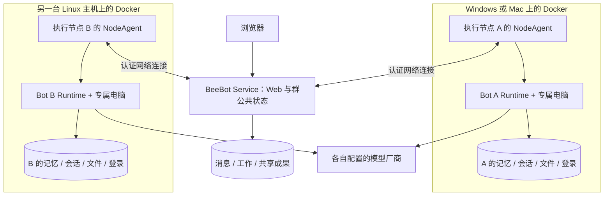

# BeeBot 服务与 Bot 执行端独立部署设计

版本：2.0 · 2026-09-17 · 状态：待开发规格。

本文与 [主规格](./BEEBOT_SWARM_DESIGN_AND_DEVELOPMENT.md) 一起作为实施依据。核心边界是：**BeeBot Web 服务独立运行；每个 Bot 的完整运行时与专属电脑在执行端运行。双方通过网络连接，可以位于不同机器。Windows / macOS / Linux 使用同一份源码构建的 Docker 交付物。**

工程选择与源码改造见 [开发路线](./DEVELOPMENT_STRATEGY.md)，首用模型/语言流程见 [模型配置](./MODEL_PROVIDER_CONFIGURATION.md) 与 [语言设置](./LANGUAGE_AND_SETTINGS_DESIGN.md)。镜像中需包括所属角色的worker、原生依赖及浏览器辅助程序；旧桌面打包产物不作为新镜像构建输入。

“一套代码”不要求服务与 Bot 安装在同一台机器，也不要求放进同一份必选 Compose。服务与执行端分开部署、同群成员分布在不同执行节点，属于第一完整版本。同机安装只是可选的便捷组合。

本文取代此前“公共 Worker 集中运行全部 Bot，服务与电脑默认在同一个 Docker Engine，远程节点以后再做”的部署方案。当前仓库尚未实现本文的独立发布包与节点协议，示例命令是目标安装体验。

## 1. 现有源码实际怎样运行

| 当前组件 | 实际边界 | 迁移意义 |
| --- | --- | --- |
| Renderer / Electron / coordinator | UI、连接监督、gateway 命令与事件转发 | Web 化需要替换客户端入口，不意味着移动全部 Bot 执行器 |
| SandHost | 在执行环境内管理 Bot 会话、私有记忆、模型 Runner 和现有群逻辑 | 混合职责需要拆分；保留 Bot 私有运行能力在执行端 |
| 默认电脑工具 | `loopback (in-box)`，访问 Host 自己容器中的执行服务和桌面 | Bot 运行环境包含执行器与电脑，不只是远控工具容器 |
| local / remote 切换 | 切换整个 Host gateway；本地 Docker 挂入 `host-main.cjs` | 当前已有网络连接边界，但尚非每 Bot 节点放置协议 |
| 客户端 CLI 路由 | 某些 CLI 模型在 coordinator 执行并另存历史 | 迁入对应 Bot Runtime，不能变成 Web 服务中的公共模型 Worker |

当前一个 Host 管理多个 Bot，底层还有共享 box 与窗口分配，因此不能声称当前已经每 Bot 独立容器。新方案应在保留完整 Bot 运行概念的同时完成专属电脑隔离。源码依据见 [运行边界核对](./research/2026-09-16-beebot-runtime-boundaries.md)。

## 2. 必须分开的三个对象

| 对象 | 负责什么 | 不应承担什么 |
| --- | --- | --- |
| BeeBot Service | Web、登录、Bot 注册与配置、群公共上下文、工作认领与租约、公共消息和成果 | 不运行 Bot 的模型循环、私有记忆或浏览器；不接管执行节点的 Docker socket |
| Bot Runtime | 该 Bot 的身份配置快照、私有记忆、模型会话、Runner、provider、工具、持久专属电脑 | 不拥有其他 Bot 的私人资料，不自行覆盖群公共事实 |
| Execution Node | 承载若干隔离 Bot 环境；NodeAgent/RuntimeManager 管理本节点资源、注册和连接 | 不作为全体 Bot 的公共“大脑”，不代替群成员思考和分工 |

Bot 是长期同事，其运行实体是“执行器 + 私有状态 + 工具 + 专属电脑”。服务保存 Bot 的稳定注册身份和可见配置，执行端使用带版本的配置快照；Bot 重连仍是原来的 Bot，不因服务重启重新生成身份或电脑。



Service 可以部署在第三台服务器，也可以与某节点同机。两种方式都必须经过同一网络协议；不得通过共享文件、进程内对象或同一个 Docker 网络实现只有同机才能用的业务路径。

“公共状态权威”与“Bot 自主思考”是不同职责。Service 原子记录成员认领、预算和成果；成员在各自 Runtime 判断、提案、执行和交接。没有额外的强制主管模型。

## 3. 一套源码，两个独立部署包

| 交付物 | 安装位置与职责 | 必要条件 |
| --- | --- | --- |
| `compose.server.yaml` / `beebot-server` 镜像 | 运行 Web、API、公共调度和数据服务 | 可独立启动，无浏览器/桌面依赖，无执行节点 Docker socket |
| `compose.node.yaml` / `beebot-node` 镜像 | 在实际承载 Bot 的机器上运行 NodeAgent/RuntimeManager | 能访问本节点 Docker Engine，配置 BeeBot 服务地址并完成登记 |
| `beebot-bot` 镜像 | 由节点为每个 Bot 创建一个专属实例 | 含 Bot Runtime、Linux 工作电脑、浏览器、显示服务与 ComputerSupervisor |

三个镜像来自同一仓库的明确构建目标，共享契约和公共库；不是分别维护 Windows、Mac、Linux 三套业务代码。执行节点可以承载多个 Bot，但每个 Bot 有独立运行实例和持久卷。

服务安装后即能打开 Web、设置账号、查看历史、登记执行节点。没有节点时显示“连接 Bot 运行环境”，不要求服务机启动一个默认 Bot 容器才能健康运行。

节点安装后主动连接指定服务。用户只需连接节点，不必给每个 Bot 手改 Compose；Web 创建 Bot 时选可用节点，节点按服务授权准备专属 Runtime 和电脑。只有一个节点时可以自动选择，内部放置能力不增加 Boss 的派工负担。

可另外提供同机演示用组合配置，它复用这两套部署描述，仍保持独立协议、持久卷和生命周期。同机运行不是正式能力的限制，不能先实现同机再把分离架构推迟到以后。

## 4. Windows / Mac / Linux 的支持含义

| 宿主 | 容器环境 | 第一完整版本 |
| --- | --- | --- |
| Docker 支持的 Windows x64 | Docker Desktop，WSL 2 / Linux 容器模式 | 可运行服务包或节点包 |
| macOS Intel | Docker Desktop，linux/amd64 | 可运行服务包或节点包 |
| macOS Apple Silicon | Docker Desktop，linux/arm64 | 原生架构运行服务包或节点包 |
| Linux x86-64 | Docker Engine + Compose，linux/amd64 | 可运行服务包或节点包 |
| Linux ARM64 | Docker Engine + Compose，linux/arm64 | 可运行服务包或节点包 |

三个镜像均发布 amd64/arm64 变体，使用一致的产品版本与协议。多平台镜像 manifest 让同一个镜像版本选择合适的 CPU 产物；不能把 amd64 的浏览器或 Node 原生模块直接复制成 ARM64 版本。[Docker 多平台构建](https://docs.docker.com/build/building/multi-platform/)

Docker Desktop 提供 Compose，Linux Engine 可安装 Compose 插件；正常使用不要求宿主另装 BeeBot、Node、Python 或模型 CLI。[Compose 安装方式](https://docs.docker.com/compose/install/)

本次核对的官方 Windows ARM 支持仍为 Early Access，列为兼容测试项；Windows Server 不按 Docker Desktop 安装路径承诺。记录发布时实际验证的宿主与 Docker 版本。[Windows 安装要求](https://docs.docker.com/desktop/setup/install/windows-install/)

Bot 内部电脑仍是 Linux。这里覆盖三平台部署，不把“在 Mac 上运行 Docker”解释成 Bot 自动获得宿主 macOS 桌面或所有本机应用。沿用现有沙箱方向，宿主原生控制另有明确接口与授权。

## 5. 服务与执行端如何连接

- NodeAgent 主动向 `BEEBOT_SERVER_URL` 建立认证的 WSS 或等价加密双向连接。节点无需公网入站端口，浏览器也不直接连接用户本机的 HTTP 服务。
- Web 生成一次性、限时、绑定 workspace 和允许能力的登记凭证。节点登记后取得自己的长期身份；凭证撤销、节点解绑、重复登记都必须有协议。
- 长期节点身份只保存在 NodeAgent 的受管卷；Bot 只得到绑定 botId、computerId、generation 和有效范围的运行凭证，不能冒充节点或另一 Bot。
- NodeAgent 上报 CPU 架构、可用资源、可运行镜像、电脑清单和连接状态；它不将所有 Bot 私有历史上传给服务。
- 服务通过该连接投递任务与控制命令；Bot 返回进度、公开消息、声明的产物及结果。使用主规格的 commandId、attemptId、代次与持久回执实现重试和去重。
- NodeAgent 可以复用一条物理通道，但每个 Bot 的逻辑身份、消息路由、预算、执行锁与存储仍独立；不能把“一个节点连接”当成“一个公共 Bot”。
- 固定 placement 属于首版。换节点需停止并核对旧执行、搬迁该 Bot 的私有数据并更新电脑代次，不能只修改 nodeId。

当前 local-exec 只提供工具机器注册与请求回传，不含完整 Bot Runner/记忆；可以复用其主动连接思路，不能直接把它改名为已完成的 Bot 节点协议。

## 6. 一条群指令的执行位置

1. Boss 在 Web 发目标，Service 保存公共消息、收件人快照和调度事实。
2. Service 通过节点连接投递到相关 Bot Runtime；首次判断在各 Bot 的运行环境内完成。
3. Bot 使用自己的身份、私有记忆和群授权上下文调用其模型，提出分工并表达承担意愿。
4. Service 按主规格原子确认认领、预算和执行权；它不替 Bot 生成专业结论。
5. 获得执行权的 Bot 在自己电脑操作浏览器、终端和文件；模型回合也由该 Bot Runtime 驱动。
6. Bot 提交成果版本与公开消息，Service 确认后唤醒相关同伴。另一节点上的 Bot 下载明确共享的版本继续工作。
7. 按已定义的独立成果或综合交付契约收尾；私有模型历史留在对应 Bot，群公共结果留在服务。

HTTP 模型与 CLI 模型都从 Bot Runtime 的统一入口执行。CLI 安装和登录在该 Bot 环境完成；如使用中心密钥代理，它只代理获准的厂商请求，不持有模型循环、私有会话或工具执行权。

## 7. 数据归属与 Docker 权限

| 数据/权限 | 所属位置 |
| --- | --- |
| 用户账号、Bot 注册档案、群消息、Run/Work、授权和事件 | Service 数据卷 |
| 明确共享的 ArtifactVersion | Service 的成果存储，可通过授权 API 跨节点读取 |
| Bot 私有 memory、模型会话、运行检查点、未确认回执 | 该 Bot Runtime 的私有数据卷 |
| Bot 文件、浏览器 profile、登录、已安装工具记录 | 该 Bot 专属电脑的持久卷 |
| 节点身份、容器/卷/网络登记和缓存 | NodeAgent 的独立节点卷 |
| Docker 管理连接 | 仅该执行节点的可信 RuntimeManager |

Service 数据卷不挂到 Bot 节点，节点卷不与 Service 共享。配置档案的权威版本在服务，私有记忆正文在 Bot；节点恢复时同步公共事件和配置版本，不把私有历史强制迁回 Web 服务。

默认使用 named volumes，不要求宿主的 `/Users/...`、Windows 盘符或完整 CLI 账号目录。Docker 卷不自动跨机器移动，跨节点恢复需要显式备份/导入。[Docker volumes](https://docs.docker.com/engine/storage/volumes/)

服务与节点各自有稳定 installationId/nodeId 和显式卷名；发布配置不得仅依赖当前解压目录推导卷名。节点登记信息与已有卷身份不一致时进入恢复流程，不静默新建空 Bot，也不接管其他安装的遗留卷。

RuntimeManager 只接受经过认证的结构化生命周期命令，校验 Bot 归属、镜像、卷、资源和代次。模型不得传入任意 Docker 参数、宿主路径或 privileged 标志。Service 不需要远程 Docker API，Bot 容器也不挂 Docker socket。

Docker 管理接口具有高权限；socket 的只读挂载不能替代 API 权限限制。权限边界落在可信节点管理器，而非交给 Web 或模型。[Docker Engine 安全](https://docs.docker.com/engine/security/)

Bot 容器是与其 NodeAgent 并列的容器，由本节点 Engine 创建；无需 Docker-in-Docker，也无需全部节点加入同一个跨主机 Docker 网络。

## 8. Web 查看和接管远端 Bot 电脑

浏览器向 Service 申请某个 computerId 的观看/控制会话。Service 检查权限，向所属节点发短期授权；节点通过已认证通道提供屏幕与输入转发。首版可复用可靠代理通道，不要求访问者能路由到节点局域网地址。

VNC、CDP 和电脑管理接口只在执行端可达，不直接公开到公网。控制票据绑定 Bot、电脑代次、controlEpoch 和用户会话；一个用户接管后，其他浏览器只能观看或明确申请。

ComputerSupervisor 在 Bot 环境内暂停/终止自动化执行域，保留可操作的桌面和浏览器。接管时默认暂停 Bot 模型回合；若保留不涉及电脑操作的对话，也只在原 Runtime 内继续，不启动 Shell、CLI、后台脚本或自动化连接。普通 GUI/工具权限与 Runtime 控制进程分开，不能通过模型工具结束监管或读取节点身份。

安装权限同样受此约束：不得向模型提供能够改写受管 Runtime、授权凭证、执行回执或结束 Supervisor 的任意 root Shell。受管程序只读、独立执行身份与实际 capability/进程可见性限制必须共同验证；仅将日常工具设成非 root 不足以证明安装期间仍受监管。如果单容器布局无法满足，需在该 Bot 专属执行环境内部隔离可信运行部分和可操作电脑部分，不能把 Bot 模型移回公共 Service。发布前覆盖安装脚本、detached 后台进程和监管崩溃的接管/停止测试。

不默认依赖 Windows/Mac 宿主的 systemd/cgroup 路径。所选 Linux 容器监管机制必须在三类环境验证后台子进程的收束；停止整个电脑容器或 `docker pause` 不能作为用户接管实现。无法证明旧自动化已停时，不授予新的输入权。

## 9. 独立生命周期与故障行为

- **只升级或重启 Service：**不重建 Bot 容器，不清空私有记忆和登录。公共接口短时不可用，运行时按租约处理在途动作，重连后补交同一回执。
- **Service 断联：**Bot 在有效授权范围内记录已开始动作。Supervisor 以单调时钟计算 Service 授权的本地执行截止；NodeAgent 心跳不能自行延长这一授权。到期后拒绝新动作，并收束既有后台自动化；无法确认停止或外部结果时进入 unknown。不因“Bot 独立”就无限离线执行共享群任务。
- **某个 Bot 失败：**保留其私有状态和电脑，只影响需要它的工作；其他节点的 Bot 不随它重启。
- **某个节点停止：**先停止该节点的新派发，收束本节点 Bot 执行；其他节点继续。显式停节点不删除持久卷。
- **节点管理器崩溃：**Bot Supervisor 的短租约门禁继续生效；不能只依赖 manager 正常退出钩子。Supervisor 自身重启也默认无执行权，核对持久状态与 Service 授权后才能重新放行。
- **Docker 重启：**动态 Bot 默认不自行重放任务。节点核对 container ID、Bot/电脑归属、generation、执行回执和用户接管状态后恢复。
- **断线时结果不明：**按主规格进入 unknown / reconciliation_required，不把任务迁到另一节点重做外部副作用。

动态 Bot 容器不是 node Compose 中逐个声明的固定服务。正式“停节点”入口必须处理它们；不能假设 `docker compose down` 自动收走所有 Bot。节点 Compose 删除自己的网络不能依赖所有电脑进入同一默认网络。[Compose down 的清理范围](https://docs.docker.com/reference/cli/docker/compose/down/)

服务停机和节点停机是两个独立动作。销毁数据另有明确资源清单与确认，普通升级不使用 `down -v`。

## 10. 目标安装体验与发布门槛

以下命令待发布包实现后提供，当前不是已可用的安装教程：

```sh
# 在服务机器上启动 Web 服务
docker compose -f compose.server.yaml up -d

# 在实际承载 Bot 的机器上：配置服务 URL，使用限时凭证登记后启动
docker compose -f compose.node.yaml up -d
```

两个包可来自同一个下载文件，各自选择角色启动。服务包不包含必须同时启动的 Bot；节点包不另起一份工作空间服务。登记凭证、TLS 配置及稳定卷名由安装指引明确，不能依靠开发者手工复制内部数据库或长期 token。

同一仓库提供 server/node/bot 的多架构 Dockerfile 与 CI，记录精确镜像 digest、协议兼容范围、schema 和升级顺序。各宿主运行相同包；架构专有二进制在对应 Linux 架构构建，不能依赖官方 Mac 应用提取物完成服务发布。

第一完整版本除了主规格验收，还必须提供这些证据：

1. Service 在主机 A 独立运行，不具备主机 B 的 Docker socket；B 上完整 Bot 通过网络完成真实任务。
2. 同一群包含 B 与 C 两个执行节点上的 Bot，完成认领、成果跨节点传递及交付；这是首版，不是以后扩展。
3. 服务重启后 Bot 的私有记忆、文件和登录仍保留；服务没有暗中运行代替它的公共模型 Worker。
4. 单节点故障时其他节点继续；重连不重复提交已完成结果，未知副作用不盲目重放。
5. 从另一台访问设备，通过服务观看和接管节点局域网内的 Bot，无需公开 VNC/CDP 或让浏览器直连本机端口。
6. Windows x64、Mac Intel/Apple Silicon、Linux amd64/arm64 都能分别运行对应角色；同机演示通过不能替代分机验收。
7. 节点升级、服务升级、Bot 镜像升级可分别进行，有兼容检查和数据保留证据。

后续才扩展自动节点放置、容量扩缩、停机迁移体验和高可用服务；基础网络连接、独立部署、多节点蜂群与恢复必须在首版完成。
