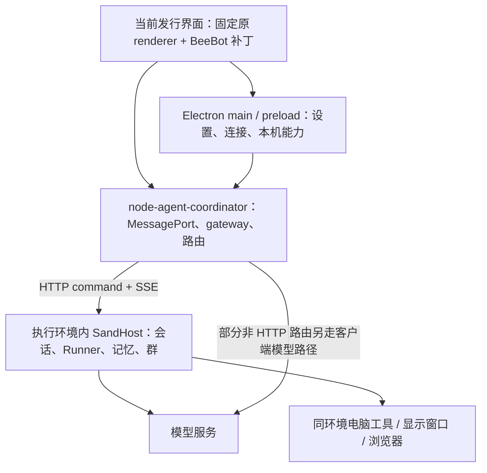

# 现有 BeeBot 实现核对：改造前必读

核对日期：2026-09-17。对象：当前工作树，包含用户已有未提交改动。本文记录已查到的实现，不把目标设计当成现状。

核对方式：沿构建入口、设置、Bot 创建、消息入口、模型路由、群执行、电脑和持久化读取调用链；查阅本地历史构建清单；运行现有类型检查、86 项测试和前端构建。没有启动真实模型任务，没有重建/重启用户电脑，也没有读取用户密钥。

## 1. 当前产品实际上由什么构成

BeeBot 是在现有桌面运行体系上修改的产品，并非一个已经独立部署的 Web 服务。主业务源码为 TypeScript，界面源码为 React；Electron 负责窗口、设置入口、连接与若干本机能力，coordinator 负责客户端消息转发及部分模型路由，Host 承载 Bots、会话、工具和群执行。

**现有 `node-agent-coordinator` 是桌面通信/路由进程，不等于目标架构中用于管理执行节点的 NodeAgent。** 不能只改名称就当作服务与节点分离已经完成。

## 2. 实际发布路径与 React 源码路径不同

| 入口 | 实际行为 | 源码 |
| --- | --- | --- |
| `npm run build` | 调用 fidelity 打包入口 | [scripts/build.mjs](../scripts/build.mjs) |
| `npm run package` | macOS 应用发布也调用 `buildFidelityReconstructedAsar` | [scripts/package-macos.mjs](../scripts/package-macos.mjs) |
| fidelity renderer | 保留固定版本界面，再执行 BeeBot Router、建 Bot、群与菜单等补丁 | [scripts/clean-build.mjs](../scripts/clean-build.mjs)、[router-renderer-patch.mjs](../scripts/lib/router-renderer-patch.mjs) |
| `npm run frontend:build` | Vite 编译可读 React 源码到 `.build/frontend-shell`；不是默认发行入口 | [frontend/vite.config.ts](../frontend/vite.config.ts) |
| React 启动 | 要求 `window.desktop` 与 `coordinatorPort`；普通浏览器无法直接满足 | [bootstrap.tsx](../frontend/src/production/bootstrap.tsx)、[main.tsx](../frontend/src/main.tsx) |
| Host 源码激活 | 组装 production bindings，通过校验后构建实际 Host bundle；不是永远停留在 fallback | [host-production-activation.mjs](../scripts/host-production-activation.mjs) |

`scripts/lib/clean-build.mjs` 的基础 composition 表中仍有 artifact-fallback；上层 `scripts/clean-build.mjs` 会用实际 activation 结果替换它。`buildProductionHostIfSupplied` 在未提供外部 manifest 时也会组装绑定，不能仅根据函数名或基础表断定没有源码 Host。

本机已有 `.build/fidelity/app/dist/reconstruction-build.json`（文件时间为 2026-09-15）记录 Host、Electron main、coordinator 为 clean-source，renderer 为 checksum-pinned-artifact-runtime。它说明一次历史构建的构成，不代表当前修改已进入安装中的应用。另一个核对分支检查了现有 `dist/BeeBot.app` 内嵌清单，结论一致。

当前新功能可能只加在 renderer snippet，也可能只加在 React 源码；二者必须分别盘点。部分 README 关于“默认 React renderer”的说明与实际脚本不一致，以入口、激活结果和产物清单为准。

## 3. 技术栈与构建限制

| 层 | 当前事实 |
| --- | --- |
| 业务源码 | TypeScript；`source/tsconfig.json` 和前端配置启用 strict |
| 前端 | React 19、Vite 8、CSS、既有 Tiptap 编辑器等，具体版本以 package-lock 为准 |
| Node | `package.json` 声明 `>=26.5.0 <27`；本次检查环境为 26.5.0 |
| 网络 | Host 使用 `node:http` / `node:https`，命令与 SSE；已有 ws、Zod 依赖 |
| 存储 | 按 Bot 的 `node:sqlite` 数据库、JSON 配置、Markdown 记忆和文件目录 |
| 构建 | esbuild、Vite、桌面 ASAR 组装、运行依赖/原生模块处理混在现有流水线中 |

旧构建 target 中出现 node22，不能据此把项目运行时擅自降到 Node 22。目标 Web 构建需要统一其编译目标、运行镜像和原生依赖 ABI。

现有 `bootstrap-runtime.mjs` 使用固定官方安装包准备部分构建输入；Vite 开发配置会读取旧 renderer manifest；`renderer-production-build.mjs` 还做旧产物锚点与资源校验。新 Web 的开发、构建和发布必须另建独立入口，不能继续把“先装官方 Mac App”作为依赖。保留既有来源记录和旧构建校验，并不要求新产品执行旧的桌面打包流程。

## 4. 厂商配置、Bot 绑定与模型执行

当前“Model APIs”中的一条配置包含 `id / label / provider / baseUrl / modelId / secretKey`。它同时表示一个接入配置和选定模型，不是“一个厂商下完整的模型目录”。支持的 HTTP 标签是 OpenRouter、OpenAI、DeepSeek 和 Custom，现有 HTTP 路径统一经兼容 Chat 接口调用。

配置从桌面 bridge 进入 Electron `main-edge`，非秘密配置存入 `SandSettingsStore` 的 settings.json；密钥单独写入 vendor secrets，当前本地 Docker 路径再把设置和 secrets 文件挂进执行环境。不是 Web 服务已经提供了配置 API，也不能因为分了文件就声称现有密钥已加密存储。

创建 Bot 后，档案中的 `inferenceVendorId` 引用该配置。Host 的 `resolveInferenceForAgent` 按“Bot 显式绑定 → 默认配置 → 全局 provider”解析；显式绑定已丢失时抛 `MissingInferenceVendorError`，不会悄悄回退。

需要特别处理两个例外：

- coordinator 还会按**全局** provider 截获非 HTTP 路径的 `sendPrompt`，没有复用 Host 的每 Bot resolver；私聊与经 Host 的群成员执行因此存在选择不一致的路径。
- 名为 `codex` 的现有 provider 实现包含读取账号认证后直接请求 Responses 后端的逻辑，不能笼统叫作“调用本机 Codex CLI”。名字、账号来源、实际传输和执行位置必须分别描述。

完整链路与源码见 [模型路由事实核对](./research/2026-09-17-model-routing-audit.md)。目标改造应先统一每 Bot 的配置解析和执行入口，再增加配置界面；不能重新做一个全局路由覆盖 Bot 选择。

## 5. 语言与设置的现状

`source/shared/ui-language.ts` 定义 `en / zh` 两种值，默认 `en`；持久值在旧 settings.json。当前设置是显式选择，不是完整的自动语言检测系统。

现有双语主要覆盖新增 BeeBot 文案和部分 React 组件；官方 renderer 的存量文案、React 各组件的语言状态和菜单补丁没有一个已经完成的全站 i18n 体系。界面语言字段也不等于 Bot 回复语言、群交付语言或时区。

完整读写路径、设置清单和当前覆盖范围见 [语言与设置事实核对](./research/2026-09-17-language-settings-audit.md)。后续需从已有字段迁移，保留用户选择；不能宣称现有 `zh` 已代表全产品中文完成。

## 6. Bot 是长期身份，Runner 是运行中的执行对象

`SandAgentSessionStore` 创建稳定 UUID，并为每个 Bot 建立目录、profile 和数据库。Runner 按 session 创建，绑定该 Bot 的存储和能力。加入群时 `createGroupMemberRunner` 仍调用同一 `createRunner` 构造，增加群上下文，不是给群凭空生成临时人格。

| 数据 | 当前位置/含义 | 迁移注意 |
| --- | --- | --- |
| profile | agent 目录，包含名称、职责、头像属性、inferenceVendorId | 保留 Bot ID 和引用映射 |
| `store.db` | 每 Bot/群会话的持久记录 | 先区分公开消息、私有会话、运行元数据 |
| `conversation-blobs.db` | 会话 blob 存储 | 不能只迁聊天可见文字而丢私有连续性 |
| `memory/profile.md`、`memory/log` | Bot 私有长期记忆 | 保留来源，不当成服务侧公共资料 |
| `user-memory/agents`、项目 memory 分片 | 源码还有显式共享 user/project 记忆的写入模型 | 不是所有 memory 都天然私有；需按原 scope 盘点 |
| routines/workflows/channels | session 绑定的长期能力 | 迁移不能只保留名称与聊天 |
| `active-agent.json`、模块级 transcript cache | 当前活动界面/会话状态 | 不可继续作为多个浏览器的共同焦点 |

共享记忆能力的具体覆盖也不能夸大：`agent-state.ts` 有 agent/user/project 分域写入，`memory-service.ts` 有跨分片读取类；但当前 extension 只明确导出 `createAgentState`，Runner 中可选的 `createUserMemory/createProjectMemory` 并未在该导出中实现。因此“已存在共享记忆数据模型”不等于“所有路径已自动注入共享记忆”。

源码：[agent-session.ts](../source/host/extensions/session/agent-session.ts)、[session-paths.ts](../source/host/extensions/session/session-paths.ts)、[memory-service.ts](../source/host/extensions/memory/memory-service.ts)、[agent-state.ts](../source/host/extensions/memory/agent-state.ts)、[host-runner-composition.ts](../source/host/host-runner-composition.ts)。

## 7. 当前 Group 如何工作

1. Group 复用 agent/session 的承载结构，以 `group.json` 标识成员；同一成员集合目前会复用已有群。
2. `GroupChatOrchestrator.run` 首轮并行唤醒全部成员。
3. 各成员进入自己 session 的独占队列，用自己的 Runner、工具和私有状态处理群提示。
4. 成员通过 SendMessage 向群发公开消息；普通工具结果和私聊上下文不应直接成为群发言。
5. 只要本轮有发言且 epoch 有效，orchestrator 再唤醒全部成员；全员没有可公开消息时退出。
6. 直接私聊有优先路径；群成员被抢占后存在最多三次重投逻辑，但已发确认或 reaction 会影响是否重投。

这已经体现“同事参与群”，并没有一个必须存在的主管 Bot。但是它还不是主规格里的持久工作认领、依赖、评审、预算和交付协议。

几个容易误读的细节：

- `parseGroupMentions` 能从名字解析点名，另有 `resolveResponders` 辅助函数；实际 orchestrator 没有调用该函数筛选 speakers，点名目前主要进入提示词。辅助函数存在不等于定向派发已经生效。
- `GROUP_MAX_ROUNDS=3` 等旧常量仍存在，但当前 orchestrator 的 while 并未使用它们；不能声称现有群有三轮硬上限。
- SendMessage 流式预览可立即出现在活动群缓存；正式 `postGroupMemberMessage` 和数据库提交有另一条路径。现有测试断言预览源码存在，不等于已经证明崩溃时每条发言都持久。
- `SandRunScheduler` 的队列、generation 和 watchdog 在内存中；不是跨服务/跨节点的持久执行租约。
- `host-runner-composition.ts` 的 `SendToAgent`、创建Bot和同事管理工具直接调用同Host的transcript。每Bot独立Runtime后必须改为Service授权的协作/管理命令，不能沿用本地查找其他Bot目录。

源码：[group-chat-orchestrator.ts](../source/host/extensions/transcript/group-chat-orchestrator.ts)、[group-chat-glue.ts](../source/host/extensions/transcript/group-chat-glue.ts)、[group-chat.ts](../source/host/groups/group-chat.ts)、[run-scheduler.ts](../source/host/extensions/transcript/run-scheduler.ts)。

## 8. 电脑、本地/远端与接管

本地 Docker connector 建立固定容器，挂入当前 Host bundle、电脑执行服务、共享工作卷和数据卷。默认 `box-factory` 使用 in-box/loopback，`SharedDesktopSandBox` 为 Bot 分配窗口，但文件仍委托同一个底层 box。**不同 Bot 窗口不等于独立电脑/文件系统/账号隔离。**

设置中的 local/remote 切换的是 Host gateway 连接，并伴随 coordinator 重启；不是一个 Web 服务为各 Bot 独立选择节点。当前默认镜像参数固定 linux/amd64，也不是双架构已经验收。

local-exec 是另一条工具电脑接入路径：用户机器上的 daemon 接收 Host 发出的工具请求。它不能被直接当作具有身份、模型 Runner 和私有记忆的完整 Bot Runtime。

现有电脑界面使用 Electron `WebviewTag` 承载 VNC，并有 interactive/view 状态。它是可复用的交互来源；主规格要求的浏览器授权会话、控制租约、代次校验、断线后保持暂停以及后台进程收束，仍需逐项实现验证。

更多源码定位见 [运行边界核对](./research/2026-09-16-beebot-runtime-boundaries.md)。

## 9. 不能原样搬入新服务的其他能力

Host 的 production registry 组合了 35 类 extensions，包含运行、存储，也包含认证、云同步、通知、遥测、自动化、MCP、托管初始化等。不能把整个 Host 原样放进新 Web 服务，也不能删除 Host 后只保留一个简单模型请求循环。

例如 automations extension 同时连接本地 TriggerHub 与原后端的云同步/事件 relay；memory synthesis 受实验开关和独立推理入口影响。自托管版本需要逐项指定“由 BeeBot 服务管理 / 在 Bot 内执行 / 迁移只读 / 暂未接通”，不能把界面出现过的功能都宣称无账号可用。

源码：[host-production-extensions.ts](../source/host/host-production-extensions.ts)、[automations/extension.ts](../source/host/extensions/automations/extension.ts)、[memory/production.ts](../source/host/extensions/memory/production.ts)。

## 10. 本次验证与适用边界

构建还存在静态import之外的依赖：[clean-build.mjs](../scripts/lib/clean-build.mjs) 单独输出四个Host worker，[agent-worker-pool.ts](../source/host/agent-isolation/agent-worker-pool.ts) 按相对路径启动agent-store worker；[浏览器驱动](../source/host/runner/tools/sand-browser-driver-source.ts) 动态加载playwright-core并依赖box-chrome辅助程序。它们需要在新Bot镜像逐项声明和验证，不能仅凭主bundle编译成功判断完整Bot已经移植。

- `npm run check`：前后端 TypeScript 检查通过，86 项现有测试通过。
- `npm run frontend:build`：通过；仍有既有动态导入、较大 bundle 及 URL 构建警告。
- 部分测试使用 mock、源码匹配或兼容协议样本，不能代替真实厂商调用、真实电脑接管与跨机器故障测试。
- 本次没有重建 macOS 应用，历史 ASAR 清单与当前源码明确分开；没有据此宣称 Docker 三平台、新 Web 或目标群引擎已经完成。

后续设计必须写出“现状依据 → 保留/替换决定 → 目标契约 → 验收”，特别是模型与语言设置、群工作完成语义、私有/共享记忆、桌面桥和构建依赖。源码未证实的能力只能列为需要实现或验证的部分。
