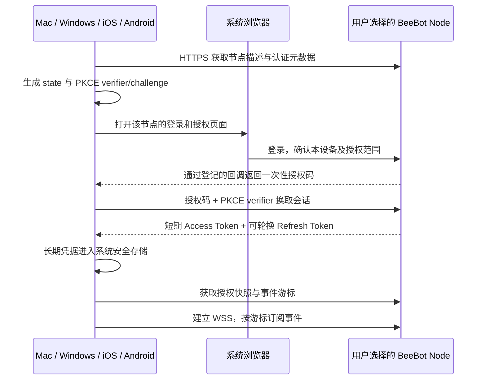
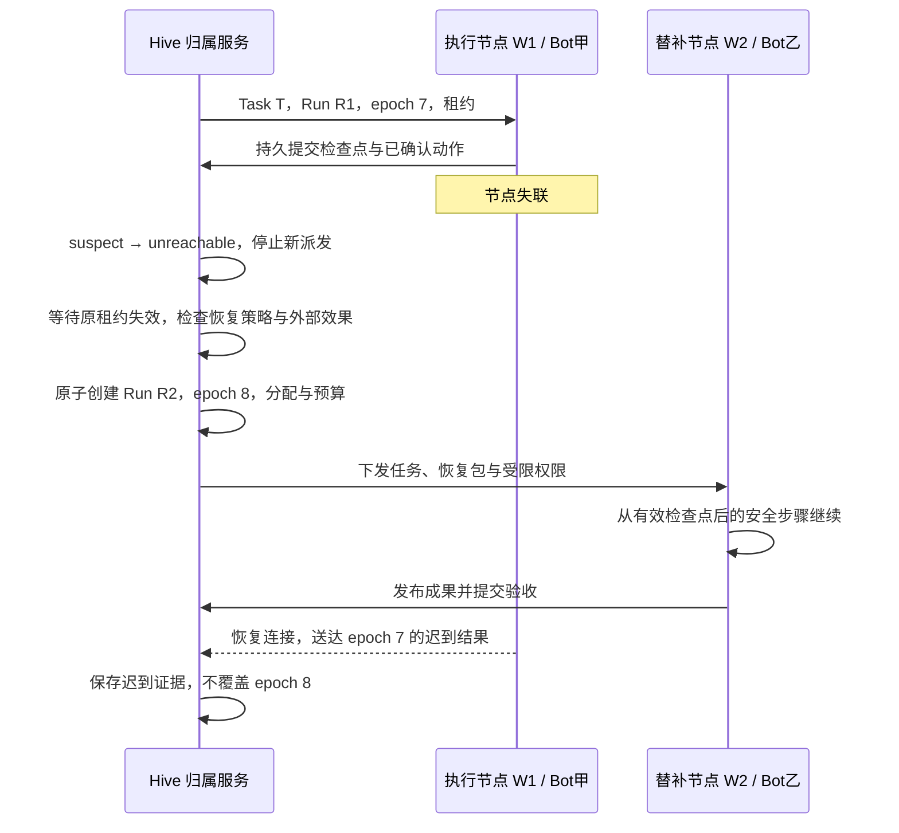

# 客户端、连接认证与节点故障恢复

状态：2026-09-19 的详细目标设计，补充[决策基线 v2](distributed-hive-decisions.md)。用户随后决定先开发 Mac 与服务端，实际完成范围见[实施记录](distributed-hive-implementation.md)。本文保留四端接入和故障接替目标，其他客户端、跨节点接替与 HA 尚未实现。客户端实时通道由先前的 SSE 优先调整为 WSS 优先，SSE 保留为可选适配。

## 1. 工程组织：同仓库，独立应用和发布

采用 monorepo，沿用 TypeScript 与当前 npm 工具链。客户端和服务端是独立工程包、进程和产物，通过公开协议通信；共享代码不等于共享进程或数据库。

目标结构如下，属于渐进迁移目标，不表示这些目录当前已经存在：

```text
beebot/
  apps/
    desktop/                   # Electron + React：macOS / Windows
    mobile/                    # React Native：iOS / Android
    node/                      # 独立 Node 服务端及管理 CLI
  packages/
    protocol/                  # 版本化 API、事件、schema 与兼容性测试
    client-core/               # 连接管理、同步、缓存、命令与业务状态
    client-sdk/                # HTTPS / WSS 客户端与平台适配接口
    design-tokens/             # 颜色、排版、图标、产品用语
    server-core/               # 权限、实例、Hive、任务、账本与恢复
    bot-runtime/               # 复用现有推理、记忆、工具内核
    execution-providers/       # 沙箱及宿主资源适配
  deploy/                      # 容器部署、可选 HA、备份与运维示例
```

首步抽取协议和入口，保留原 `source/` 与正式桌面打包路径的兼容适配。不会为了凑目录结构先搬动全部重建源码。

依赖规则：

- `protocol / client-core / client-sdk` 不导入 Electron、Node 内置文件系统、服务端数据库或 React DOM。
- 桌面与移动应用依赖共享客户端包，各自实现安全存储、网络、文件选择、通知和生命周期适配。
- 服务端可以完全独立构建、部署和升级，不需要先安装桌面客户端。
- 独立版本和发布流水线，按协议主版本协商；兼容改动不强迫所有手机和服务器同日升级。
- 每个发布目标单独验证。现有仓库只有 macOS 正式打包路径，不能以 Electron 支持 Windows 推断当前 Windows 包已经可用。

现在拆成多个 Git 仓库会增加协议联调和变更同步成本；当前阶段固定为同仓。以后若团队/权限边界确实独立，可以发布共享包后再拆仓，不改变网络架构。

## 2. 四端怎么做

| 平台 | 技术与共享关系 | 产品职责 | 本地执行 |
| --- | --- | --- | --- |
| macOS | 现有 Electron + React 演进 | 完整对话、任务、成果、实例和节点管理 | 可安装独立后台 Node，通过 Linux 容器执行 |
| Windows | 与 macOS 共用桌面应用，平台适配单独实现 | 与 Mac 保持核心功能一致 | 可选择容器/WSL2 支持的 Linux 节点部署 |
| iOS | React Native，与 Android 共用移动应用 | 对话、提交目标、查看成果、待决事项、连接管理 | 首版只作远程客户端 |
| Android | 同一 React Native 移动应用，平台适配单独实现 | 与 iOS 保持核心流程一致 | 首版只作远程客户端 |

React Native 支持按平台拆分代码；共享业务逻辑不意味着桌面 DOM 页面可以直接作为原生移动界面。移动端独立设计导航、附件、键盘和触控流程，远程桌面适配手机操作，而不是把桌面多栏界面等比缩小。[React Native 平台适配](https://reactnative.dev/docs/platform-specific-code)

Windows 适配覆盖路径、系统凭据、后台服务、安装/卸载、签名、自动更新和测试。Docker Desktop 的 Windows 后端有 WSL2/Hyper-V 等系统条件，客户端连云端不要求安装 Docker。[Windows 容器环境要求](https://docs.docker.com/desktop/setup/install/windows-install/)

桌面安装器可以提供“同时安装本地节点”的选项，但客户端和后台 Node 分别启停。手机无需 Node.js、Docker 或模型 Key，只需对服务端有授权。

移动端进入后台后不承担任务执行和故障检测。前台实时同步，后台可选系统推送，重新打开后恢复事件。操作系统限制后台工作，因此不能用手机长连接维持蜂群存活。[Apple 后台策略](https://developer.apple.com/documentation/BackgroundTasks/choosing-background-strategies-for-your-app)、[Android 后台工作](https://developer.android.com/develop/background-work/background-tasks)

## 3. 客户端怎样找到并连接服务器

客户端支持多个独立连接档案，每份保存：`connectionId、nodeId、apiOrigin、issuer、用户身份、设备会话、安全存储引用、授权版本、事件游标`。同一节点改显示名称不会改变身份；地址改变需要重新验证绑定，不把新地址自报的 ID 自动当成原服务器。

用户入口固定为三个：

1. **使用本机节点**：桌面读取当前用户有权限的本地发现信息，验证节点，再建立认证会话。Loopback 不等于免认证。
2. **添加服务器**：输入 `https://bot.example.com`，检查 TLS、节点描述与协议兼容性，再登录。
3. **扫描/打开邀请**：二维码包含节点地址、节点标识、用途和短期一次性邀请码；用于接入或获得实例，不包含长期管理员 Token、模型 Key 或 Refresh Token。

局域网发现可以作为便捷入口，但发现结果仍要认证。远程地址默认要求受信 HTTPS；开发时仅明确的同机 loopback 可用 HTTP，不自动忽略自签名证书错误。

手机访问自己电脑时，必须使用电脑的可达地址或私有网络地址。手机上的 `127.0.0.1` 指向手机自身；二维码也无法让只监听电脑 loopback 的服务变得可达。服务端配置检查必须清楚报告这一点。

连接状态机：

```text
未连接 → 检查地址/版本 → 等待登录 → 同步快照 → 在线
                                     ↑           ↓
                               重新认证 ← 会话失效
                                                 ↓
                                           断线重连/离线缓存
```

提交成功以服务端持久回执为准。离线时可以保存草稿；没有收到回执的命令标为“正在确认”，恢复后按原幂等键查询。取消、授权和部署等敏感状态变更不静默堆积成离线队列再迟延执行。

## 4. 认证：登录、邀请和机器授权分开

四端主登录链路固定为 **OAuth 授权码 + PKCE S256 + 系统浏览器**。节点可以内置本地身份服务，也可以接入部署者选择的身份源；不依赖 BeeBot 官方账号中心。原生客户端不内置可充当身份凭据的 client_secret。[原生 OAuth 规范](https://www.rfc-editor.org/info/rfc8252/)

首版节点内置本地账号登录：部署者初始化自己的账号，受邀者在该节点创建或使用受限账号；密码仅提交给该节点的 HTTPS 登录页，服务端采用 Argon2id 等合适的密码哈希并限制登录尝试。密码不会成为客户端访问 API 的日常凭据。Passkey、MFA 和外部 OIDC 是认证服务可扩展入口，客户端仍走同一授权码流程，不为每种身份源重写应用。[密码存储建议](https://cheatsheetseries.owasp.org/cheatsheets/Password_Storage_Cheat_Sheet.html)

具体流程：



默认工程参数：授权码 60 秒且一次有效；Access Token 10 分钟；Refresh Token 轮换、30 天闲置失效、90 天绝对有效期。参数可以按部署策略收紧。检测旧 Refresh Token 重用时撤销相应会话族；客户端对同一连接串行刷新，避免并发刷新误判。[OAuth 安全最佳实践](https://www.rfc-editor.org/info/rfc9700/)

Node 内置登记 BeeBot 的公开客户端标识和严格回调规则：桌面采用 loopback 回调与临时端口，移动采用应用登记的私有 URI scheme；可以后续增强为已验证的应用链接。不开放任意 client_id/redirect_uri，不依赖中央回调服务器。`state` 关联原连接档案和 issuer，防止多节点登录结果串到另一个连接。

CLI 或无法使用正常回调的输入受限设备，可以增加标准 Device Authorization Flow。它不是手机主登录方案；RFC 8628 明确将具备正常浏览器能力的原生应用引向原生 OAuth 实践。[设备授权规范](https://www.rfc-editor.org/info/rfc8628/)

身份初始化和邀请：

- Node 初次启动生成短期安装凭据，由部署者从受控本机终端取得，完成管理员身份初始化；不输出永久管理员 Bearer Token 当日常登录方式。
- B 的邀请说明允许 A 创建/使用哪个专属实例。A 登录或按邀请注册受限身份后再兑换；兑换不能扩大为整节点管理员。
- A 只有客户端时，B 节点创建属于 A 的本地 Principal；A 已有其他节点身份时，通过显式账号关联/授权映射处理，不相信客户端任意填写的 ownerId。
- 增加第二台手机或电脑需要建立第二个设备会话，可以在服务端逐设备撤销。移除连接、退出登录、撤销设备、取消任务和删除实例是不同操作。

凭据存储与隔离：

| 平台/角色 | 凭据保管 |
| --- | --- |
| macOS 桌面 | 主进程保管会话，通过 Keychain/系统加密存储封装；Renderer 不持有长期凭据 |
| Windows 桌面 | 主进程保管，使用当前用户作用域的系统凭据/DPAPI 保护 |
| iOS | Keychain；敏感本地缓存与会话分别管理 |
| Android | 使用 Keystore 保护加密密钥，将会话存入加密存储 |
| Node 对 Node | 由配对建立独立机器身份与有限资源授权，不使用用户手机会话维持节点合作 |
| Worker | 每个 Run 的短期权限，不得到节点管理员或用户长期凭据 |

桌面页面保持隔离上下文、受限 preload 和窄 IPC；不向远端或模型生成内容开放通用 Node.js 执行能力。[Electron 安全建议](https://www.electronjs.org/docs/latest/tutorial/security)

每个 API 写请求与事件订阅都按当前会话/授权版本检查。撤销不只依赖十分钟后 Token 自然过期；服务器会终止对应连接并阻止后续命令。客户端不会把节点 X 的 Token 自动发给节点 Y。

## 5. 连接后的通信、同步与推送

固定分工：HTTPS 处理命令、快照、文件和 Token；WSS 处理前台实时事件。节点间另建经过机器认证的 WSS 会话，与客户端连接生命周期无关。

客户端通过 HTTPS 领取 30 秒有效、只能使用一次的 socket ticket，WSS 建立后在首帧兑换。未认证连接在五秒内关闭并限额；长期 Token 不进入 URL、浏览器历史或访问日志。

事件具有稳定 `eventId + cursor + resourceId + resourceVersion`。重连携带最后已提交到本地缓存的游标；重复事件按 ID 去重；游标过期则重新获取一致快照。权限收窄后服务端重算订阅范围，客户端清理已无权访问的缓存。SSE 适配可以保留同样的事件语义。

客户端与节点兼容性通过协议主版本、支持能力和最低客户端版本协商。未知可选字段可以忽略，未知必需操作明确拒绝。不能直接复用现有 Host 全量 RPC 作为外网多用户协议。

移动推送设计为可选 `PushRelay`：官方 App 的 APNs/FCM 提供者凭据由发布方或用户自己的重签名部署持有，不能分发给所有自托管节点。节点只发送不透明路由标识与“有更新/待处理”的提示；任务正文由客户端认证后读取。没有推送服务仍可使用前台功能，回到前台补同步；任务执行不依赖通知送达。

## 6. 谁判断节点挂了

首版不做全网每个 Bot 两两互 ping。**Hive 的权威归属服务观察成员节点和 Run，将状态变化发布给其他成员及客户端。** Worker 同时观察归属服务，以确定自己的运行租约还能否续期。

观察结果只能说明“从这个观察者看对方不可达”；网络断开、进程卡死、电脑睡眠和主机损坏都可能产生同样现象。不能仅靠超时证明物理机器已经死亡。

| 机制 | 初始默认值 | 作用 |
| --- | --- | --- |
| 应用心跳 | 每 10 秒 | 包含 nodeId、bootId、连接代次、负载和运行摘要 |
| suspect | 30 秒无有效心跳 | 暂停向该节点派发新工作，继续探测 |
| unreachable | 60 秒无有效心跳 | 发布失联事件，开始收集恢复依据 |
| Run 租约 | 120 秒，每 30 秒续约 | 限定某一次执行的有效授权，不由节点心跳替代 |
| Runtime 看门狗 | 监控每个 Bot 进程/工具状态 | 区分节点在线但某个 Bot 崩溃、阻塞或等待用户 |

这些是可调设计默认值，不是 SLA。时间从最后一次有效心跳/租约批准计算，不能一概宣称“故障后正好 120 秒一定完成切换”。

单 Bot 崩溃优先由所在 Node 的 Supervisor 处理，不把同一节点上的所有 Bot 一起判为死亡。所有观察附带 bootId，节点重启后必须对账旧运行，不能把旧进程状态直接当成仍有效。

## 7. 其他节点怎样接替任务

任务不能只存在于执行 Bot 的聊天记录里。权威任务账本和可读取的恢复包，必须在执行节点之外持久保存。

每个可恢复步骤完成后发布 `RecoveryPackage`：

- Task、Goal revision、验收标准、原 Run 与 Assignment epoch。
- 已确认步骤、下一步和等待条件的结构化记录。
- 输入/输出成果引用、摘要、必要工程版本或工作树快照。
- 工具动作的稳定 logicalActionId、状态与第三方结果引用。
- 环境/模板版本、所需权限与资源引用，不能包含通用原始密钥。

文件先持久上传，完整检查后再原子发布恢复包 manifest。可以尽力定期保存进度，但只有完整提交的检查点才具有恢复意义。进程内存、尚未保存的编辑和模型生成到一半的内容不属于连续恢复保证。

恢复的具体过程：



创建 R2 前的条件缺一不可：任务账本可写；恢复资料可读；Bot乙具备能力、权限、地域/宿主策略和预算；原有效执行权已结束；前次外部动作已核验或能够按同一逻辑动作安全重试。没有合格替补时进入 `waiting(resource)`，不能借故障扩大权限。

同一 Task 可以换 Bot，但 Bot甲的私密记忆不会被自动复制给 Bot乙。Bot乙收到的是完成该任务所需的工作恢复包。

## 8. 哪些工作可以自动继续

恢复策略与运行结果是否明确是两个维度。`checkpointable` 不代表所有工具都可重复执行；每个动作仍要单独核验。

| 工作类型 | 恢复方式 | 约束 |
| --- | --- | --- |
| 策略限定的只读查询、独立产物计算 | 自动换 Bot，从头或检查点执行未完成部分 | 旧输出隔离；不能影响外部状态 |
| 已分阶段提交的文件分析/开发 | 读取最近完整检查点，继续后续步骤 | 必须有实际文件/工程快照，不能仅有一句摘要 |
| 提供方支持幂等的外部写入 | 查原结果，必要时沿用原 logicalActionId 重试 | 不因创建新 Run 而生成新的业务动作 ID |
| 邮件发送、发布、任意 Shell/浏览器操作，结果不明确 | 先核验；无法确认时保留 uncertain，创建核验任务/Decision | 不自动重跑整段操作 |
| 只有原电脑才有的文件、设备、桌面或不可迁移登录 | 等待原资源恢复，或由用户明确授权替代资源 | 不能默认改在云端执行 |

分类由执行器能力和工具策略约束，不由模型一句“可重试”决定。一旦运行使用了未覆盖的副作用工具，恢复策略必须保守升级。

关键外部动作通过受控 Connector/Tool Broker：先在独立于执行节点的权威账本持久记录 intent，再执行并记录结果。仅把动作日志写在可能损坏的 Worker 磁盘上不足以支持故障接管。

`assignmentEpoch` 在实际接收写入的 Broker 和成果服务处校验。只在任务表拒绝旧结果，并不能阻止旧进程拿着长期 API Key 继续修改第三方服务；因此这种直接凭据执行不能获得透明自动接管承诺。

结果确认存在不可消除的窗口：第三方已完成操作，但确认信息尚未回来。提供方没有幂等或查询接口时，只能明确报告不确定，不能承诺“恰好执行一次”。

## 9. 恢复同一个 Bot 是独立能力

接替 Task 默认使用其他合格 Bot。若要在另一台服务器恢复原来的 Bot，另外需要：

1. 所有者允许迁移及目标宿主托管授权。
2. 一致的私有记忆快照、工作卷、配置/模板版本和所需环境。
3. 私有备份发送到所有者允许的存储并加密；不作为 Hive 公共资料。
4. 在 Bot 身份登记权威处增加 `hostEpoch`，使旧宿主失去当前身份的执行权。
5. 旧宿主已停机或能够可靠隔离；仅仅联系不上不足以启动第二个同身份的副作用执行器。
6. 对不可导出的服务能力和设备绑定登录重新授权；B 的提供者密钥不跟随导出。

首版提供受控停机导出/恢复，后续才考虑自动实例容灾。无备份时可以接替已经外置资料的 Task，不能恢复丢失的私密记忆；数据损失边界取决于最后成功备份的恢复点。

## 10. 如果挂的是 Hive 归属服务

必须区分两种部署档位。

### 普通自托管模式

一个归属服务 + 本地 SQLite + 持久成果存储。执行节点失联可以按上述规则接替，但归属服务自身故障时，该 Hive 暂停新分配、续约、验收和收尾。Worker 只能在现有租约与工具权限允许范围内继续；到期后保存成果并停止新执行。其他归属服务上的 Hive 可继续。

归属服务恢复后按任务、Run、epoch、动作与检查点对账。备份恢复必须隔离旧写者，不能复制 SQLite 后同时启动两个同身份权威节点。这是低部署成本方案的可用性边界。

### 可选 HA 模式

面向需要归属服务也自动恢复的部署，固定目标方案为：

- 同一管理信任域中的三个控制/数据故障域；Bot 算力节点独立扩展，外部 B 提供者不自动成为投票成员。
- 多个 Node 控制服务副本，共用 PostgreSQL 权威事务存储；Patroni 管理数据库主备，三成员 etcd 提供其一致性协调。
- PostgreSQL 使用严格同步复制与受控自动提升；禁止应用把关键事务降为异步提交。只向用户确认符合持久性策略的已提交命令。
- Hive 级控制权及 `controllerEpoch` 保存在同一 PostgreSQL 事务体系，避免应用选主、任务状态和租约分别由几个无关存储裁决。
- 数据库旧主隔离由经过验证的 watchdog/基础设施 fencing 保证；应用副本的每个状态变更校验当前控制代次。
- 任务、授权、租约、幂等记录、Inbox/Outbox、事件和动作日志共同复制；成果与恢复包另外进入跨故障域的持久对象存储。
- 稳定入口域名、健康路由、认证密钥和必要服务凭据也要具备容灾路径，不能只有数据库做 HA。

Patroni 的同步模式和严格同步配置会用写可用性换取更强的复制保障；数据库主备隔离也必须正确配置。不能笼统承诺所有故障组合下零数据丢失。[Patroni 复制模式](https://patroni.readthedocs.io/en/latest/replication_modes.html)、[旧主隔离](https://patroni.readthedocs.io/en/latest/watchdog.html)

HA 下，关键命令/续约/副作用派发只有在调用者拿到同步提交确认后才对外发送。单独的 Outbox 派发器先完成自己受同步保障的派发记录事务，再发消息；不能看到一条数据库可见记录便假定其复制确认已经完成。提交超时视为结果待查，查询原命令，不直接再次执行。

失去多数派时暂停新写入，不让网络分区两边各自分配同一份工作。新控制者必须尊重已持久批准的未到期 Run 租约，再按恢复规则处理；不能以“领导者换了”为由立即重跑。[etcd 多数派约束](https://etcd.io/docs/v3.6/faq/)

三台进程放在同一台物理机不构成主机级容灾。只有控制账本有副本、文件仍仅在坏机器上，也不构成完整接管。切换时间与可恢复数据范围由数据库、对象存储、运行检查点和网络共同决定，需要实测，不给未经验证的 SLA。

HA 是明确的独立交付档位，不强迫个人电脑安装这套集群，也不将其计入已经完成的首版能力。v2 的首版仍采用普通模式；但 Worker 任务的分级自动接替必须纳入基础能力，而不是仅做到“报错后人工重试”。

## 11. 必须验证的闭环与交付顺序

工程顺序调整为：共享协议/客户端核心 → 普通 Node 与 Runtime → Mac 真实客户端接入 → 双节点任务接替 → Windows 桌面 → iOS/Android 移动端 → 专属托管完整体验。认证、租约和隔离边界从第一阶段进入契约。HA 单独实施与故障演练，不能在普通版本上加一个心跳按钮就称为支持。

验收分平台和故障场景：

- 四端均能添加自托管服务器、打开系统授权页、撤销单设备会话、断线恢复。
- 同一客户端连接两个不同身份发行节点，Token、Bot 列表、缓存和游标不串用。
- 关闭客户端、手机锁屏和推送失败不停止服务端任务。
- 杀死单 Bot、杀死 Worker Node、切断网络、睡眠后唤醒分别触发正确状态。
- W1 仍活但失联、W2 接手后，旧 W1 不能覆盖新成果或提交新的受控外部写入。
- 永久丢失 Worker 磁盘，使用已持久恢复包由其他 Bot 完成剩余可恢复工作。
- 第三方操作成功但确认丢失，不产生第二次同业务操作；不能核验时明确 uncertain。
- 原任务只能用本地设备或目标节点没有权限时，明确等待，不擅自迁移。
- 普通模式归属节点故障明确暂停；HA 模式演练旧主隔离、主备切换、少数派隔离、成果存储故障和提交结果未知。

最终交付必须报告验证过的平台、镜像架构、网络拓扑和故障范围。模拟时钟与单进程测试用于覆盖规则，不能替代真实多进程、跨节点和容器故障验证。
