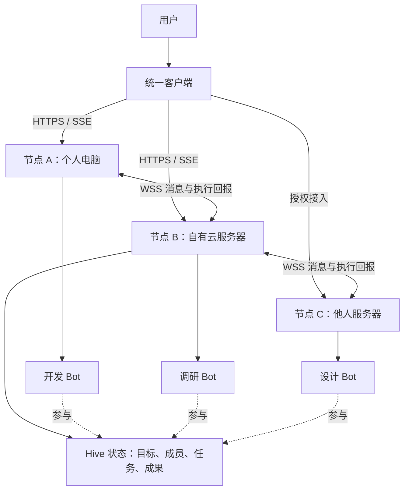
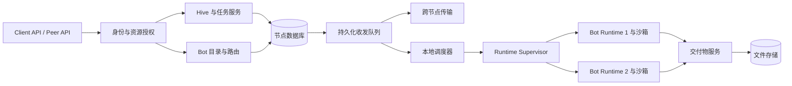
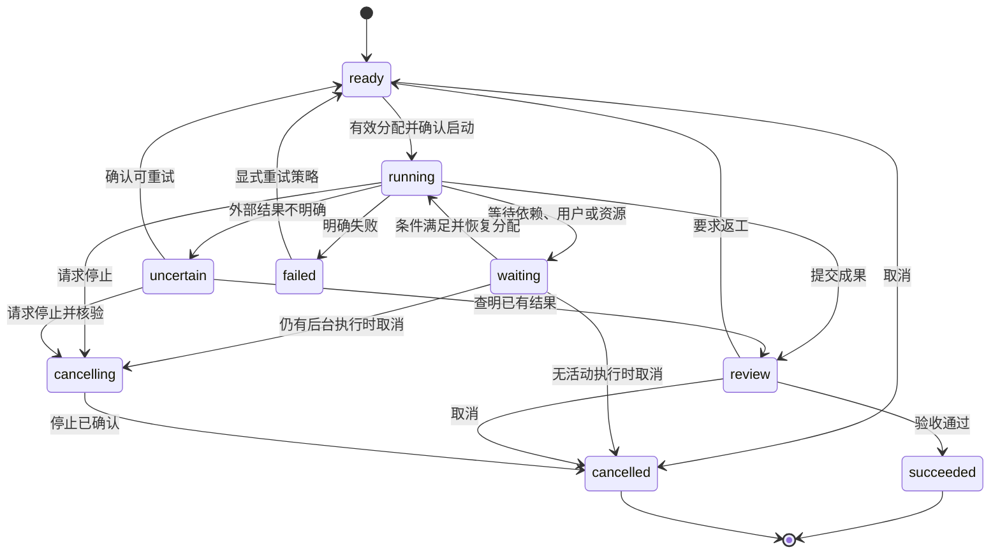
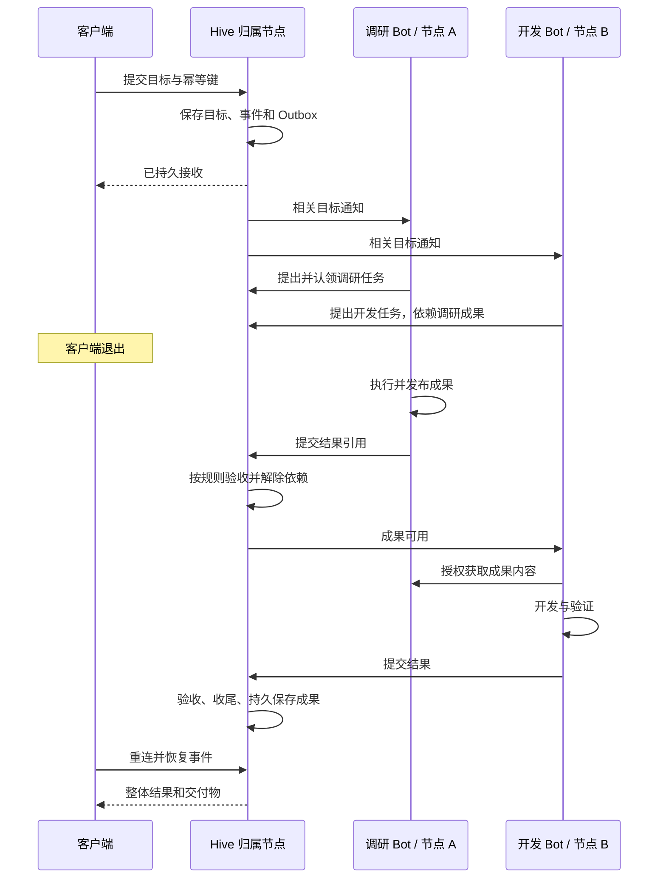

# BeeBot 分布式蜂群架构设计

状态：总体目标架构。2026-09-19 已补充[实施前决策基线 v2](distributed-hive-decisions.md)，具体对象、授权、状态、网络与验收按 v2 执行，冲突处以 v2 为准。按用户最新决定，已先实现 Mac 与独立服务端的单所有者执行闭环；实际完成范围与待办见[实施记录](distributed-hive-implementation.md)，本文的跨节点蜂群能力不能视为全部已实现。

四端应用拆分、连接认证和故障接管详见[客户端、连接认证与节点故障恢复](client-connectivity-and-recovery.md)。该补充将四端前台事件通道收敛为 WSS，SSE 保留兼容；区分任务接替、实例恢复与归属服务 HA。

## 1. 总体决策

采用**统一客户端 + 可独立部署的节点 + 长期 Bot 实例 + 跨节点蜂群**。

客户端承载用户交互；节点负责运行 Bot、存储与通信；Bot 自主判断和执行；每个蜂群选择一个常驻节点保存共同状态。节点之间直接协作，客户端退出不影响已经接收的任务。

主要交付两个程序：`beebot-client` 和 `beebot-node`。节点内部按模块拆分，首版作为一个服务部署；Bot 执行进程和沙箱由节点管理；网络中继作为可选组件。

“服务端就是一个个 Bot”对应产品上的独立服务身份。Node 是承载 Bot 的部署单元，一台机器可以运行多个 Node，一个 Node 可以承载多个 Bot。

| 设计项 | 本方案选择 |
| --- | --- |
| 服务端基础 | 复用 TypeScript/Node.js Host，增加独立构建和启动入口 |
| 客户端 | 先适配现有 macOS 桌面端，协议支持后续网页客户端 |
| 部署目标 | Linux 容器；个人电脑通过本地容器运行节点 |
| 蜂群状态 | 每个 Hive 有一个归属节点，事务确认任务和成员变更 |
| 执行位置 | Bot 分布在不同节点；一个实例同时只有一个有效宿主 |
| 网络 | 客户端 HTTPS + SSE；节点之间 WSS；交付物 HTTPS |
| 存储 | 每节点本地 SQLite 与文件，跨节点通过协议交换 |
| 跨用户使用 | 默认提供使用者专属实例，保留独立身份、记忆和环境 |
| 可用性 | 首版支持持久化恢复，归属节点故障时暂停新分配；自动接管后续增加 |

这是技术设计建议。已确认的产品要求是自主部署、多节点接入、长期 Bot、跨服务器协作、用户可介入及客户端离线后继续工作。

## 2. 总体结构



图中节点 B 保存该 Hive 的共同状态，其他 Hive 可以选择其他节点。一个节点可以承载多个 Hive 和 Bot。

归属节点用代码校验权限、确认认领和记录成果。任务中的协调者由成员按需产生，用户也可以指定。协调 Bot 变化不需要迁移蜂群数据库。

共享工作空间从“共用一台 Linux”扩展为共享目标、任务和成果；不同机器不假定有共同文件系统。

## 3. 核心对象与数据归属

| 对象 | 含义 | 权威数据位置 |
| --- | --- | --- |
| Principal | 用户或服务身份，外部身份用发行节点与 subject 联合识别 | 身份发行节点；接收节点保存授权映射 |
| Node | 部署实例，拥有稳定 ID、地址和服务能力 | 该节点 |
| Bot | 长期身份、人设、记忆、模型、技能与工作环境 | 当前宿主节点 |
| Hive | 成员、共同规则和协作事件 | Hive 归属节点 |
| Goal | 用户目标、边界、验收要求和预算 | Hive 归属节点 |
| Task | 可认领的责任、依赖、负责人、交付要求 | Goal 归属节点 |
| Run | 一次执行尝试，携带分配代次 | 执行节点保留详细日志；归属节点保存任务状态和摘要 |
| Artifact | 交付物、摘要、版本、权限和副本位置 | 发布节点；正式成果持久复制到 Hive 归属节点 |
| Decision | 需要用户处理的判断，包含上下文版本与有效期 | 对应资源的归属节点 |

单 Bot 私聊任务由该 Bot 宿主管理 Goal/Task，不要求用户先创建 Hive。

`nodeId`、`botId`、`hiveId`、`taskId`、`runId` 分开生成，不依赖 IP、域名和文件夹名。受信目录把 Bot ID 映射到当前节点。节点迁移通过授权流程更新宿主版本，不能根据对端自报的相同 ID 覆盖旧绑定。

## 4. 客户端与节点职责

客户端包含连接管理、Bot/蜂群列表、任务视图、对话、成果预览与待决事项。它维护多个节点连接，各自保存凭据、可用能力、连接状态和同步游标；按资源归属路由命令，按稳定 ID 合并视图。

客户端缓存用于展示。收到服务端持久接收回执后，界面才显示“已提交”。取消任务是显式命令，关闭窗口或事件流仅断开交互连接。

桌面端可以直连多个节点。网页端通过所选入口节点提供的同源 Web Gateway 登录和访问，再由 Gateway 在授权范围内转发；浏览器会话、Origin 和 CSRF 在此处理。现有网关拒绝带 Origin 的请求，因此网页接入需要适配，不能只放开任意跨域。



| 节点模块 | 主要职责 |
| --- | --- |
| API / Auth / Policy | 验证请求、身份、资源权限、邀请、额度与撤销 |
| Directory / Peer Router | 定位 Bot、连接节点、选择传输路径 |
| Hive Service | 目标、任务认领、依赖、验收、共同状态和待决事项 |
| Inbox / Outbox | 持久收发、重试、去重、接收回执 |
| Scheduler | 根据相关事件唤醒 Bot，控制并发、等待恢复和预算 |
| Runtime Supervisor | 启停 Worker、检查运行状态、恢复与资源限制 |
| Bot Runtime | 模型推理、工具循环、记忆、任务执行 |
| Artifact Service | 文件发布、授权读取、复制、校验和回收 |
| Notification Service | 保存通知，向在线客户端或配置的外部渠道发送 |

节点是模块化服务，Worker 崩溃只影响自己的执行。先通过增加节点分摊 Bot 负载，出现实测瓶颈后再拆独立消息或存储服务。

## 5. Bot 的身份、记忆和执行环境

每个 Bot 默认有独立工作卷、记忆和浏览器配置。同一 Bot 只运行一个修改会话与记忆的主推理循环；后台 Shell 和网络工作可以并行，通过持久完成事件回到该 Bot。GUI 操作在该 Bot 的桌面上互斥。

跨用户托管时，Runtime 与工具执行位于独立沙箱。Bot 不挂载其他用户目录、节点数据库、Docker socket 或全量密钥。沙箱供应接口只接受管理员定义的规格，不能由模型任意指定宿主挂载和镜像启动参数。

Docker 的 daemon 权限和容器配置影响隔离，因此执行器采用非特权运行、最小挂载与资源限制；更强的隔离执行器可以替换现有 Provider。[Docker 安全模型](https://docs.docker.com/engine/security/)

模型配置属于执行节点并按 Owner/Bot 授权。Bot 只取得所需能力，使用量按调用者与任务记录。CLI 模型必须在执行节点可用，不能隐含依赖客户端 Mac 的登录。

用户电脑专属工具通过显式连接提供。该电脑离线时相关任务等待资源，服务端其他工作继续。电脑睡眠或节点退出不能被描述为持续在线。

## 6. 跨服务器通信与授权

### 6.1 连接拓扑

客户端用 HTTPS 提交命令、SSE 接收事件。节点用 WSS 双向会话收发业务消息；文件走独立 HTTPS 传输，避免大文件阻塞控制消息。

内网节点可以主动连接公网节点，会话建立后双向投递。两端都不能接受入站连接时，需要可达的中继或私有网络；知道地址不等于网络可达。WebSocket 提供双向连接，持久投递和恢复属于应用协议。[WebSocket 标准](https://www.rfc-editor.org/info/rfc6455/)

首版每个成员节点优先连接 Hive 归属节点。成员间可直连时直接通信，否则由归属节点中转已授权的 Hive 协作数据。中转节点持久接收后可确认这一跳，但只有最终接收端确认才完成端到端投递。私聊不经过无权读取内容的应用层中转节点。

可选 Relay 后续采用保持端到端 TLS 的网络隧道，不拥有任务状态，也不要求依赖官方服务。Relay 故障只影响依赖它的路径。

### 6.2 身份与资源权限

通过短期、一次性邀请完成配对，接收节点签发自己管理、可撤销的访问凭据。凭据绑定允许的 Bot/Hive、动作和有效期。双向访问分别授权，接入一个 Bot 不授予整个节点管理权。

连接验证确定发送节点，资源校验进一步确定它是否能代表某个 Bot 操作某个任务。不能信任请求正文自报的 owner、角色或 Bot ID。Worker 使用受限的自身运行凭据。

成员变更与新分配由 Hive 归属节点确认。远程缓存授权带版本和有效期；无法确认时等待，不扩大权限。撤销阻止后续在线操作，并通知相关节点，但不能瞬间终止失联节点上的外部操作或撤回已下载数据。

### 6.3 持久消息

建议协议封装如下；字段值为示例，接口尚未实现。

```json
{
  "protocolVersion": 1,
  "messageId": "msg_example",
  "kind": "task.result.submitted",
  "from": { "nodeId": "node_b", "botId": "bot_research" },
  "to": { "nodeId": "node_a", "hiveId": "hive_example" },
  "goalId": "goal_example",
  "taskId": "task_example",
  "runId": "run_example",
  "assignmentEpoch": 3,
  "causationId": "msg_request_example",
  "traceId": "trace_example",
  "payload": { "artifactIds": ["artifact_example"] }
}
```

发送端先写 Outbox。接收端验证身份和载荷，在一个事务中写 Inbox 和待处理工作，再返回接收回执。`(senderNodeId, messageId)` 唯一；重复消息返回原回执，同 ID 不同内容则拒绝。

接收、开始执行、完成是三种状态。断线后重投未确认消息；至少一次投递配合业务幂等与版本检查，不能据此宣称外部工具恰好执行一次。

建议默认自动重投最长 7 天、去重记录至少 30 天；过期记录明确投递失败。人工再次执行前先查询任务结果，不能单纯换一个消息 ID。长任务产生结果时创建新的结果消息。截止时间由接收端检查并限制，不信任对端时钟延长授权。

协议握手交换主版本和能力集合，不兼容明确拒绝。每个 Hive 有自己的状态顺序，不建立全网单一事件序号。

### 6.4 客户端同步

节点在一致读视图中返回“状态快照 + 游标”，客户端从游标后订阅。每节点、每授权范围分别保存同步位置；游标过期时重新获取快照。

SSE 用 `id` 与 `Last-Event-ID` 传递恢复位置；实际回放来自服务端持久事件日志，不能只依赖 SSE 自动重连。[SSE 标准](https://html.spec.whatwg.org/multipage/server-sent-events.html#the-last-event-id-header)

## 7. 蜂群协作与任务生命周期

### 7.1 自主分工与冲突控制

Goal 包含目标、边界、验收要求和预算。相关成员根据能力与负载收到通知，提出职责明确的任务，认领、请求帮助和交接。

向 Bot 提供受控操作：`propose_task`、`claim_task`、`send_to_bot`、`request_help`、`publish_artifact`、`submit_result`、`request_decision`。模型提出操作，领域服务执行授权和事务。

认领携带预期版本，归属节点比较并更新，确保同一任务只有一个有效负责人。新任务记录 `scopeKey` 与交付范围以发现重复意图；不同措辞的语义重复仍需成员协商，不能把 ID 去重说成能消除所有重复劳动。

Goal 带 `goalRevision`。用户修改目标、边界或验收要求会产生新版本，相关任务据影响暂停或调整；旧版本成果保留但必须重新核对。收尾事务校验目标版本和当前任务集合，防止用户刚增加工作，旧收尾结果却把目标标为完成。

点名任务只唤醒被点名 Bot。普通消息按相关任务、能力订阅和依赖关系投递；等待同伴或用户期间不持续调用模型。

### 7.2 状态、尝试与验收



`waiting` 记录原因、依赖或 Decision ID。依赖图在归属节点校验并拒绝环。Task ID 稳定，重试创建新 Run 与分配代次。

认领事务先写有效分配与待启动命令；Worker 确认启动才标为 running。任务接收、已分配、执行中在内部各有记录，状态图省略了启动握手的中间状态。

创建任务时定义验收方式：可执行检查、同伴审查或用户确认。成果进入 review，再按规则验收；需要独立检查的工作不能只靠执行 Bot 声明完成。

必需任务完成且无未决依赖时，系统创建唯一收尾任务，由有能力的成员认领，汇总并检查整体交付。需要用户判断的标准生成 Decision；最终成果可持久读取后，Goal 才结束。协调和收尾都是按目标产生的角色。

### 7.3 租约、网络分区与副作用

分配携带 `assignmentEpoch` 和可续约租约。建议初值为 120 秒租约、30 秒续约，联调后调整。Worker 用本地单调时间保守计算有效期，不能因对端时间漂移自行延长。

- 归属节点只接受有效代次结果；旧代次成果留待核验，不能覆盖新负责人。
- 断网时已授权执行在有效租约内继续；租约过期后停止启动新的有副作用操作，保存已有结果等待恢复。
- 已提交到外部系统的操作可能继续，取消或过期不能假定回滚。
- 只读或独立产物任务在确认租约失效后可按策略重新分配；副作用结果不明则进入 uncertain，不能立即换 Bot 重做。
- 关键操作先记录意图和稳定逻辑动作 ID。外部系统支持幂等键时，同一逻辑动作重试沿用 `taskId + logicalActionId`；不支持时核验实际结果，仍不明确则请求判断。

分配代次保护共享状态，外部动作的去重还需要工具适配和提供方支持。

### 7.4 唤醒与预算

每 Bot 的主推理串行处理，普通同伴消息进入队列，在安全点处理；用户修改目标和取消优先。长时间等待保存恢复条件，不消耗模型轮次空转。

每 Goal 设费用、时间、活跃任务数和重试预算。无进展检测触发一次有界检查，再形成明确阻塞事项。达到预算后等待用户选择，不把无效群聊当作推进。

并行执行前由归属节点预留资源预算，节点本地强制并发、时间和调用次数限制，结束后按实际用量结算。模型费用预估和提供方计费存在差异，应展示已发生与已预留用量，不能把估算上限承诺为精确账单。

## 8. 一次完整任务



网络业务消息走持久收发队列。引用已到达而文件尚不可用时，下游等待文件传输，不能把“收到成果消息”当作“取得成果内容”。

## 9. 持久化与文件

`node.db` 保存节点目录、授权、Hive/Goal/Task、Run 摘要、命令去重、Inbox、Outbox、事件和 Decision。权威状态、事件与待投递消息在同一事务提交后才确认接收。

沿用现有 `node:sqlite` 基础。新控制库与 Worker 的关键接收日志使用 WAL + `synchronous=FULL`，拒写时不返回成功；关键控制库损坏时停止接受写入，不能静默清空重建。

每个 Bot 的对话和记忆保留独立存储。节点库与 Bot 库之间通过稳定 runId、本地持久启动命令和执行回报恢复；不能假定跨库事务原子。Worker 的接收日志与待执行记录在自己的事务内提交，再向 Supervisor 确认。

SQLite WAL 要求同机访问，多附加数据库也不能据此获得跨库原子性，因此各节点不共用网络盘 SQLite。节点间只交换协议消息。[SQLite WAL 说明](https://sqlite.org/wal.html)

关键持久化约束如下：

| 记录 | 唯一性或一致性约束 |
| --- | --- |
| `commands` | 身份、动作、资源和幂等键联合唯一；保存请求摘要与处理结果 |
| `inbox` | 发送节点与消息 ID 联合唯一；接收记录和待处理工作一起提交 |
| `outbox` | 保留投递目标、状态和原消息 ID；路由重试不改变业务身份 |
| `tasks` | 任务版本、当前 Run、分配代次在一次比较并更新中修改 |
| `events` | 状态变更与事件一起提交，Hive 内递增顺序用于恢复 |
| `runtime_commands` | runId 与命令类型唯一，避免重复启动已接收的 Run |
| `decisions` | 决策仅处理一次，且上下文版本仍有效；过期回答不自动应用 |

```text
data/
  node.db
  secrets/                         # 不进入 Bot 挂载
  owners/<ownerId>/
    bots/<botId>/
      profile.json
      store.db
      runtime-journal.db
      memory/
      workspace/
      browser-profile/
    artifacts/<artifactId>/
      manifest.json
      content
```

Artifact 包含创建者、所属任务、摘要、大小、类型、版本和权限。上传写临时文件，校验并持久化后再发布元数据；孤立临时文件过保留期回收。发布后不可原位覆盖，修改产生新版本。

下载按权限读取并校验摘要，不能通过猜内容哈希越权。跨节点不接受任意宿主路径；浏览器 Cookie、密钥和私密记忆不随交付物传播。

目标接受的必需成果，必须复制到 Hive 归属节点并验证后才能完成整体交付。这样执行节点离线不会使正式成果消失。备份使用一致数据库快照与文件清单，恢复时核验未结束 Run。

## 10. 跨用户托管与独立实例

服务提供者、实例所有者和部署位置分开。B 发布能力和授权，A 获准后拥有由 B 节点托管的独立 Bot 实例。

1. B 设定可用能力、资源/模型额度和邀请。
2. A 接受邀请，建立受限服务授权。
3. B 节点为 A 创建独立 botId、存储、工作卷、沙箱和运行凭据。
4. A 把该 Bot 加入自己的 Hive；Hive 成员关系与 B 的执行授权分别验证。
5. Bot 通过标准协议参与任务，A 的客户端可以退出。

这延续此前明确提出的独立身份、记忆和工作环境；能力配置可来自 B 的版本化定义，但实例配置不随 B 修改默认值而悄然改变。正在执行的 Run 固定其配置版本。

共享同一 Bot 给多个用户可作为未来显式分享模式，不能默认把他们的私密记忆混合。实例隔离针对不同使用者；宿主管理员仍处于信任边界内。

节点管理员、实例所有者、Hive 成员、Worker 运行身份分别授权。加入 Hive 不赋予读取成员全部历史或扩大用户授权的能力。

## 11. API 与模块边界

以下为新增接口提案，当前不存在。新协议带版本，旧桌面 RPC 通过适配层调用，不直接把整张旧方法表开放为公共网络 API。

| 接口 | 语义 |
| --- | --- |
| `GET /v1/node` | 验证连接后返回节点身份、版本和能力 |
| `POST /v1/pairings/redeem` | 兑换一次性邀请 |
| `GET/POST /v1/bots` | 列出获授权实例或创建实例 |
| `POST /v1/hives` | 在本节点创建蜂群 |
| `POST /v1/hives/:id/members` | 带版本和远程授权更新成员 |
| `POST /v1/hives/:id/goals` | 持久接收目标 |
| `POST /v1/tasks/:id/claim` | 原子认领并获取代次和租约 |
| `POST /v1/tasks/:id/actions` | 续约、提交、取消和显式重试 |
| `POST /v1/decisions/:id/resolve` | 基于上下文版本处理待决事项 |
| `GET /v1/snapshot`、`GET /v1/events` | 一致快照和可恢复事件 |
| `GET /v1/commands/:id` | 查询命令接收及处理结果 |
| `POST /v1/artifacts`、`GET /v1/artifacts/:id/content` | 发布和读取成果 |
| `GET /v1/peers/session` | 经身份验证后升级 WSS |

写入命令带 `Idempotency-Key`，去重范围包含身份、动作和资源；同键不同正文拒绝。长任务返回 `202` 与命令 ID，更新冲突 `409`，资源额度 `429`，无法持久接收 `503`。

内部端口保持窄接口：

- `PeerTransport`：持久入队、投递状态、节点连接状态。入队成功只表示本地保存。
- `BotRuntimeAdapter`：按 runId 幂等启动、检查运行、请求取消。取消请求接收与停止确认分别记录。
- `ExecutionProvider`：根据批准规格创建和连接沙箱，管理资源生命周期。
- `ArtifactStore`：发布、授权读取、复制及摘要验证。
- `HiveRepository`：在本地事务中更新共同状态、事件和 Outbox。

## 12. 部署与故障行为

| 场景 | 部署组成 |
| --- | --- |
| 自己电脑 | 桌面客户端 + 后台 Node 服务 + Bot 容器 |
| 自己云服务器 | Node 服务 + Bot 容器 + 本地持久卷 + TLS 入口 |
| 混合蜂群 | 常在线归属节点 + 本地、其他云端与他人托管 Bot |
| 他人托管 | B 的 Node + A 专属实例与卷 |

Node 控制服务与沙箱管理器通过受限本地接口连接。Node 可以作为宿主服务，或与受控沙箱管理器分别容器化；不向 Bot 暴露 Docker socket。

服务镜像以 Linux amd64/arm64 为目标并分别验证。现有 macOS 客户端优先；其他桌面系统与网页端需独立交付，不能从服务器支持 Linux 推断客户端已跨平台。

| 故障 | 行为 |
| --- | --- |
| 客户端退出 | 继续已接收工作，保存结果与通知 |
| 提交后请求超时 | 按原幂等键/命令 ID 查询，不重复新建任务 |
| Worker 崩溃 | 恢复当前 Run，或在外部结果不明时转 uncertain |
| 执行节点重启 | 核对旧 Run 和有效代次，重放未确认回报 |
| 网络中断 | 持久队列保留，重连后重投 |
| 归属节点离线 | 暂停新认领和共同状态写入；已有工作受租约约束 |
| 取消时节点失联 | 显示停止待确认，不能宣称已停止 |
| 磁盘满或控制库损坏 | 拒绝新增工作，保留诊断与恢复入口 |
| 模型凭据失效/额度耗尽 | 明确等待或失败，有界重试 |
| 用户电脑工具离线 | 等待相应资源，不改变执行机器 |

首版一个 Hive 只有一个活动归属节点。迁移要冻结新分配、处理活动 Run、生成一致快照，再切换归属版本并停用旧写者。自动接管需后续增加可靠选主；复制数据库文件本身不足以解决双写。

通知先保存在服务端。外部推送通过可配置渠道发送，未配置时用户重连后看到待决事项，不宣称关闭客户端后一定能触达用户。

## 13. 现有代码迁移

以下为源码检查结论，不代表已经验证独立云端运行可用。

| 当前模块 | 改造 |
| --- | --- |
| `source/host/main.ts` | 独立 Node 启动装配，验证无 Electron 初始化仍能运行 |
| `source/host/gateway-server.ts`、`gateway-config.ts` | 新增版本化 API、授权上下文和事件回放，保留兼容适配 |
| `source/node-agent-coordinator/main.ts` | 单 GatewayClient 改为多连接与资源路由 |
| `source/electron-main/box/local-docker-host-connector.ts` | 分离本地部署操作和通用连接 |
| `source/host/extensions/transcript/agent-to-agent-messaging.ts` | 本机和远程目标统一消息端口 |
| `source/host/extensions/transcript/group-chat-orchestrator.ts` | 保留旧 Group；新增 Goal/Task 驱动的 Hive 调度 |
| `source/host/extensions/cross-user-sharing/` | 参考远程成员与去重，去掉新协议对原有账号/中继的必需依赖 |
| `source/host/extensions/inference/provider-session.ts` | 按执行节点和 Owner/Bot 范围读取模型配置 |
| `source/host/extensions/session/agent-db.ts` | 保留对话记忆，适配 Run 接收与恢复 |
| `source/host/extensions/transcript/prompt-acceptance-ledger.ts` | 兼容旧客户端去重；新增控制记录进节点事务 |
| `source/host/box/shared-desktop-sand-box.ts` | 受信本机保留兼容；跨用户采用独立执行 Provider |
| `scripts/package-macos.mjs` | 沿实际固定渲染器加补丁的打包路径接入 UI |

建议新增 `source/shared/hive-protocol/`、`source/node/` 和 `source/client-connections/`。Node 下按 api、identity、directory、federation、hive、scheduler、runtime、artifacts、persistence 分模块；继续复用 `source/host/` 执行内核，先加端口再逐步迁移。

新增功能标记为 BeeBot 扩展，保留重建证据、校验和及打包检查。仅修改 `frontend/` 不代表正式包界面已经更新。

## 14. 实施顺序与验收

| 阶段 | 交付 | 验收 |
| --- | --- | --- |
| P0 独立节点 | 独立构建、配置、模型、数据目录、执行器 | 全新 Linux 环境无需 Electron 完成真实任务；重启保留身份与记录 |
| P1 远程客户端 | 显式接入、授权、命令去重、事件恢复 | 退出客户端仍执行；重连读完整结果；重复提交不重复建任务 |
| P2 跨节点 Bot | 配对、稳定 ID、持久消息、Run 回报、文件传输 | 两节点独立运行，断网恢复投递；同 Run 不重复启动 |
| P3 蜂群任务 | 认领、依赖、租约、验收和收尾 | 成员分工交接；并发认领仅一方成功；按成果结束 |
| P4 跨用户托管 | 专属实例、沙箱隔离、额度与撤销 | A 使用 B 托管实例，越权被拒，撤销与运行状态可解释 |
| P5 接入扩展 | 网页客户端、可选中继、外部通知 | 跨网络可达性、浏览器会话、离线触达分别验证 |

身份与资源范围从 P1 就进入协议，不能到 P4 才补授权。每阶段提供可运行闭环，再进入下一阶段。

故障验收覆盖：接收后回执丢失、事务提交后退出、Worker 启动回报丢失、同键不同内容、旧代次结果、重复投递、取消时断网、双 Bot 认领、上传中断、归属节点重启和磁盘拒写。

最终验收：用户提交一个共同目标，两个不同服务器上的 Bot 完成分工和文件交接；期间关闭客户端并短暂断开一条节点连接；重连后得到可信状态和持久成果，需幂等保护的动作没有因恢复被盲目重复执行。

## 15. 取舍

本方案让每个 Hive 自选常驻归属节点，保留自主部署与明确状态归属。代价是首版存在每 Hive 的单节点可用性边界，不能承诺该节点故障后的无缝切换。

必需的统一中心服务会简化发现和运维，但所有部署都依赖它；完全对等复制则需先解决选主、网络分区和冲突。本设计先采用分布式执行与每 Hive 单写者，把工程投入集中到跨服务器的真实交付。
