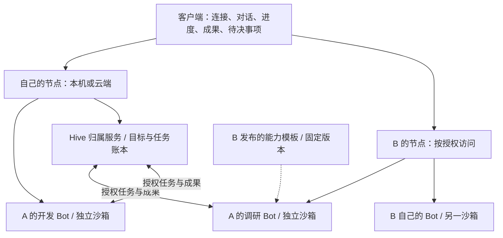

# 分布式蜂群：实施前决策基线 v2

状态：2026-09-19 的目标工程设计。本文把[总体架构](distributed-hive-architecture.md)中的选择具体化；冲突处以本文为准。用户随后决定先跑通 Mac 与服务端，首轮落地范围见[实施记录](distributed-hive-implementation.md)。完整跨节点协作、A 使用 B 能力的专属托管实例、自动接替仍是后续阶段。本文中的具体工程默认值不冒充用户逐项确认。

核心要求：客户端负责交互；长期 Bot 在本地或云端节点运行；跨服务器合作；A 使用 B 提供的能力时，获得属于 A 的独立实例；客户端离线后工作可以继续。

四端工程组织、首次连接、OAuth 登录、节点心跳和任务接替已进一步固定在[客户端、连接认证与节点故障恢复](client-connectivity-and-recovery.md)。其中四端前台实时通道统一选择 WSS，SSE 作为可选适配；任务分级接替属于基础能力，归属服务 HA 是独立部署档位。

## 1. 这次收紧的关键点

1. **Hive 与 Goal 分开。** Hive 是长期团队；Goal 是一次交付。不能把每个目标都建成一个新团队，也不能修改目标时覆盖历史。
2. **Bot 模板、实例所有者、运行宿主分开。** B 的能力模板可以复用，B 的记忆、登录和个人凭据不随模板复制。
3. **实例独立必须包括执行隔离。** 不同目录或不同 Node.js 进程不足以承诺跨用户隔离；跨用户托管必须使用受控沙箱。
4. **按任务产生协调关系。** 不能把最初接单的 Bot 写成永久负责分配和汇总的管理者。
5. **任务完成必须经过验收。** 模型结束一轮对话、发送了消息或子任务全部返回，都不足以直接宣布目标完成。
6. **取消、重试、租约必须反映真实执行状态。** 不能收到取消请求便写 cancelled，也不能把旧结果静默丢弃后假定外部动作没有发生。
7. **控制消息、交付文件和私密记忆分开。** 不把文件 Base64 和完整运行对象反复塞入事件与消息；不把整个 Bot 对话同步给全体成员。
8. **先交付一条完整闭环。** 首版做持久协作、专属实例和故障恢复；全网自动发现、自动主节点切换和公共市场不进入首版。

## 2. 产品形态与部署边界

交付 `beebot-client` 与 `beebot-node`。Node 管理 Bot Runtime 和执行沙箱；Sandbox Manager 是节点的内部基础设施，用户不必理解成第三个产品。



- 一台机器可以运行多个 Node；一个 Node 可以托管多个所有者的 Bot。
- **Node 是部署和管理单位，Bot 是用户认识和使用的长期个体。** 不要求一个 Bot 占一台服务器，也不把一个 Node 当成一个 Bot。
- 一个 Bot 可以参加多个 Hive，但主推理循环串行执行；节点对不同 Hive 的工作公平排队，避免某个 Hive 长期独占 Bot。
- 每个 Hive 有一个明确的归属节点。首版不自动切换归属节点；该节点是状态裁决者，不是负责思考的“主脑”。
- 本机模式也使用同一协议：客户端 → 本地 Node → Bot。客户端退出不停止后台 Node；电脑睡眠和 Node 停机仍会影响执行。
- 桌面客户端优先沿现有产品演进。网页客户端预留接口，不能为了新服务端临时另造一套替代界面并称为完成原客户端改造。

现有“共用一台 Linux”保留为受信本地模式。新蜂群把共同工作场所扩展为共同目标、任务与显式交付物，不再要求所有成员能读取同一块磁盘；长期个体、自主分工、按任务协调的设计哲学继续保留。

## 3. A 使用 B 能力的准确语义

明确区分两类对象：

| 对象 | 包含内容 | 是否包含运行中的个人状态 |
| --- | --- | --- |
| BotTemplateRevision | 人设初值、技能版本、工具能力、模型策略、环境镜像摘要、允许的覆盖项 | 否 |
| BotInstance | botId、ownerPrincipalId、宿主与宿主代次、模板来源、个人配置、记忆卷、工作卷、浏览器状态 | 是 |

首版提供两个创建入口：用户在自己的节点创建 Bot；用户接受 B 的托管邀请，在 B 的节点创建属于自己的专属 Bot。接入已存在实例则只新增连接，不重新创建身份。

托管流程固定为：

1. B 发布不可变的模板版本，创建带实例数、工具范围、模型额度和期限的 `ProvisionGrant`。
2. A 在客户端接受邀请并认证身份。B 根据邀请建立 A 的身份映射，不能相信请求正文任意填写的 ownerId。
3. B 的节点持久创建实例记录，再由 Supervisor 创建独立存储和沙箱；创建流程为 `provisioning → ready / failed`。
4. A 获得该实例的管理/使用授权，可以聊天、查看自己的记录、加入自己的 Hive、导出允许的数据。B 仍负责宿主运维和服务额度。
5. Bot 运行在 B 的机器上，通过标准协议参与 A 的 Hive；A 的客户端退出不改变所有权。

邀请兑换与实例创建各有幂等键。实例 ID 在部署沙箱前确定；创建超时后按该 ID 检查已存在的沙箱/卷，不再创建第二份。部分创建失败可以继续或清理未使用资源，不能删除已有实例数据。

继承规则：

- 复制允许公开的人设和技能配置；不复制 B 的对话、个人记忆、浏览器 Cookie 和 OAuth 登录。
- 使用 B 提供的模型或连接器时，通过受限能力访问，由 B 的服务端保管凭据；不把 B 的通用 API Key 发给 A 的 Bot。
- A 可以在授权范围内调整实例配置，形成自己的覆盖项。
- B 发布新模板时，已有实例不自动改变。普通升级需实例所有者选择；安全撤销可以停止受影响能力，并明确报告原因。
- 每个 Run 固定 `templateRevision + instanceConfigVersion + toolPolicyVersion`；升级不悄悄改变正在执行的任务。
- A 的逻辑所有权不等于对宿主管理员的保密保证。B 控制的机器仍位于信任边界内。

“调用 B 自己的共享 Bot”与“获得 A 的专属实例”是两种产品语义。本轮按用户已明确选择的后者实现；共享服务调用以后作为显式模式添加。

A 不必先部署自己的 Node。如果 A 只有客户端，B 的邀请兑换流程可以为 A 建立独立的受限 Principal，实例和 A 的 Hive 都归属 B 节点保存；该 Principal 与 B 的管理员身份分开。如果 A 已有身份，邀请兑换显式绑定该已认证身份；任何情况都不接受客户端随意指定其他人的 ownerId。

## 4. 身份、权限和信任

`Principal` 用 `(issuerNodeId, subjectId)` 标识。名称、邮箱显示值、IP 和正文中的 ownerId 都不作为授权依据。首版不要求官方账号中心；个人节点可初始化本地所有者，跨节点邀请建立显式映射。

标识分开：`nodeId / botId / hiveId / goalId / taskId / runId / artifactId / decisionId`。Bot 目录保存 `hostNodeId + hostEpoch`；宿主变化需要所有者授权，不接受对端自报相同 botId 覆盖绑定。首版不做在线迁移。

权限按用途分开：

| 授权 | 允许的操作 | 不隐含的权限 |
| --- | --- | --- |
| NodeAdmin | 配置部署、模板、额度、连接、运维 | 不把管理员凭据交给模型 |
| InstanceOwner | 使用/配置自己的实例、管理其数据与参与关系 | 不能管理宿主和其他用户实例 |
| ProvisionGrant | 用指定模板创建有限数量的实例 | 不授予整节点管理 |
| BotUseGrant | 指定调用者在指定用途内使用某个实例 | 不自动允许读全部历史、读密钥或向外再授权 |
| HiveMembership | 在该 Hive 内看允许的共同资料、承担工作 | 不扩大远程节点给 Bot 的执行授权 |
| RunCapability | 当前 runId、Bot、分配代次允许的具体操作 | 不能修改成员、增加权限或读取其他运行数据 |

有效权限取 **实例所有者策略、服务提供者策略、Hive 范围、Run 范围的交集**。节点连接成功只证明通信对端，不代表对方可以运行全部 Bot。双向业务授权分别授予、分别撤销。

网络传输使用 HTTPS/WSS；明文只允许明确的 loopback 开发场景。首次配对通过有过期时间的一次性邀请，认证后签发可撤销的节点连接凭据。发行方只保存 Bearer 凭据摘要，调用方保存在节点秘密存储；运维管理员、客户端和 Worker 使用不同凭据。首版不自行发明新的全网 PKI 或必须依赖外部登录服务。

Worker 使用每次运行签发的短期凭据，服务端从凭据恢复 Bot、Run 和权限，拒绝仅靠请求正文选择其他 runId。模板和模型只能提出工具操作，实际授权由 Node/Tool Broker 执行。

撤销立即阻止节点上的新操作，并通知远程运行；失联运行的停止状态显示“待确认”。撤销不能撤回已交付的数据，也不能保证第三方系统已经开始的操作立即终止。

## 5. Bot Runtime、记忆与工作环境

默认每个实例一个持久沙箱；空闲可以停机，身份、记忆、工作卷和浏览器配置不消失。执行沙箱必须与节点控制库、节点凭据和其他用户卷隔离。

跨用户模式要求：非特权用户、受控镜像、最小挂载、资源限制、禁止 Docker socket 和宿主控制路径进入 Bot。沙箱规格来自管理员配置，模型不能任意指定镜像、挂载、权限或宿主路径。容器是否构成足够隔离取决于实际配置，不能以“用了 Docker”代替隔离验证。[Docker 安全模型](https://docs.docker.com/engine/security/)

`ExecutionProvider` 第一实现面向 Linux 容器；本机 macOS 通过容器运行同一套 Node/Runtime。直接启动宿主进程仅用于单用户开发验证，不能宣传为可承载不受信用户的托管方案。

三种数据作用域明确分开：

| 作用域 | 内容 | 共享方式 |
| --- | --- | --- |
| Bot 私有 | 个人记忆、对话、浏览器状态、工作目录 | 默认只有实例所有者和该 Bot 的授权执行可用 |
| Hive 共同资料 | 目标、任务、显式发布的工作信息和成果 | 按成员与任务权限读取 |
| Run 临时上下文 | 当前任务输入、所需依赖成果、权限和预算 | 按此次运行授予，结束后回收凭据 |

不让 Bot 直接读取另一个 Bot 的记忆数据库；不默认共享浏览器登录；跨服务器通过已发布的成果交接。同一所有者需要共享工程目录时，将其作为显式 `WorkspaceResource` 授权，写入要有互斥或独立分支；首版默认独立工作目录和文件成果交接。

工具能力通过 manifest 如实公布：shell、filesystem、browser、desktop、模型与连接器。Headless Runtime 不能宣称具备桌面能力；桌面/浏览器能力复用原有执行器时，远程显示通道按实例授权，同一桌面只允许一个 GUI 操作者。不能公开裸 VNC 端口作为权限方案。

模型与 CLI 登录在执行节点配置。需要用户电脑的工具通过显式设备连接提供，电脑离线时产生 `waiting(resource)`，不能悄悄改在云服务器执行。

## 6. Hive、Goal、Task 与协作规则

| 对象 | 生命周期与责任 |
| --- | --- |
| Hive | 长期团队、成员和协作规则，保留多次目标历史 |
| Goal | 一次目标、边界、验收、预算；可有多个不可变 revision |
| Task | 目标中一项责任、输入/输出、依赖、执行者约束、验收策略 |
| Assignment | 对 Task 的有效认领，带任务版本、epoch、Run 和租约 |
| Run | 一个有边界的执行尝试或恢复片段；不能代替 Bot 身份 |
| Decision | 需要用户判断的一项明确问题，携带上下文版本和失效条件 |

首版一个 Hive 同时有一个活动 Goal，历史 Goal 保留；需要同时推进多个目标时使用多个 Hive。同一个 Bot 可以参与这些 Hive。单 Bot 私聊由其宿主在内部创建个人工作上下文，不要求用户手动建 Hive。

目标输入必须包含任务意图和工作边界，验收标准可由接单 Bot 草拟；涉及实际授权扩大时由用户决定。首版不把自然语言当成任意访问能力的授权来源。

协作过程：

1. 用户指定接单 Bot，或系统按能力、当前负载和稳定排序选择一个临时接单者。它负责把目标变成可执行工作，不获得节点或成员管理权。
2. 任一当前任务的执行 Bot 都可提出新任务、请求同伴帮助、提交接替建议。归属服务检查成员授权、预算、重复工作范围和依赖环。
3. 对点名任务只通知指定 Bot。开放任务只向符合能力和授权的候选者发出有界认领通知，不唤醒所有成员讨论每条消息。
4. Bot 按自己能力认领；归属服务用任务版本做原子比较更新，同一任务只有一个有效 Assignment。
5. 每次认领前预留预算和并发槽。排队期间不启动模型，不对尚未开始的任务发无限续约。
6. Bot 发布成果并提交验收。依赖只在所需成果验证并可读取后解除。
7. 所有必需任务通过验收后创建收尾任务。收尾者根据能力/验收要求选择，不固定为最初接单 Bot。

提供给模型的领域工具固定为：`HiveStatus`、`ProposeTask`、`ClaimTask`、`RequestHelp`、`PublishArtifact`、`SubmitResult`、`RequestDecision`。普通消息可以表达交流，但不能通过聊天文本直接改变认领、权限或完成状态。

待同伴结果时，Bot 持久记录 `waitCondition` 并释放主推理循环；成果事件满足条件后恢复，不持续轮询模型。Run ID 对每次恢复片段重新生成，Task 与 Bot 身份保持不变。

释放 Run 前必须确认没有未受管理的活动工具执行。仍有后台操作时，继续记录其执行、租约和取消责任，不能把 Task 写成 waiting 后遗忘后台进程。恢复等待条件与创建待启动命令同事务提交，重复成果通知不能唤醒出两次执行。

依赖图由归属节点检查；改变依赖必须带 expectedVersion 且不能形成环。任务用 `scopeKey + deliverableSpec` 提示重复工作范围；不把 ID 去重等同于理解了所有语义重复。

## 7. 状态机、验收与用户介入

Task 状态固定为：

```text
ready → assigned → running → review → succeeded
                    ↓          ↓
                  waiting    ready（返工，保留前次 Run）
                    ↓
                  ready（恢复条件满足）

assigned / running → cancelling → cancelled（停止已确认）
assigned / running / cancelling → uncertain（效果或停止状态不明确）
明确失败 → failed；重试由策略或显式决策创建新 Run
```

`assigned` 与 `running` 必须分开：归属节点发出分配不等于执行节点已启动。启动接受回执也不等于工具已经开始执行。

Run 至少记录 `accepted / starting / running / suspended / finished / stopping / stopped / uncertain`，并保存本地接收日志与工具执行摘要。Task 的状态由这些回报和验收规则产生，不直接复制最后一条 Run 消息。

验收策略在 Task 创建时明确：

- **规则验收**：需要的文件、校验和、结构化输出和指定测试达到条件；测试执行记录可以追溯。
- **同伴验收**：需要独立检查时由其他合格 Bot 评审；模型意见是评审结果，不能冒充实际运行过测试。
- **用户验收**：主观取舍或需要新增授权时生成 Decision。

工作成果进入 `review`。缺少验收证据时保持该状态，不能因为模型结束推理自动写入 succeeded。

收尾使用唯一约束 `(goalId, goalRevision, completionGeneration)`。收尾前封存本轮必需任务集合并记录集合版本；新增必需任务使本轮收尾失效。提交收尾结果时原子检查：

1. Goal revision 和任务集合版本仍相同。
2. 必需任务都已通过验收，没有未解决的阻塞 Decision。
3. 必需成果已持久复制到归属节点。
4. 收尾自身的验收也通过。

这里的工作集合版本只计算必需工作任务，不计算收尾任务本身。必需任务新增、返工或验收失效都会增加版本，并撤销原收尾分配；新的 completionGeneration 只有在工作再次满足条件时产生。

用户修改目标会产生新 revision，暂停受影响分配并失效旧收尾；首版保守地暂停该 Goal 的活动执行，再由协调任务判断哪些成果可以复用，不把旧结果静默当成新目标成果。

用户取消立即阻止新分配，然后等待 Worker 的停止确认。若仍有外部动作效果未查明，保留 uncertain；用户可以选择核验或接受已发生的副作用后结束，不把“取消”描述为回滚。

Decision 的回答必须匹配问题版本和相关 goalRevision；重复回答返回原结果，过期回答拒绝。通知先持久保存；在线客户端立即展示，离线外部触达仅通过用户已配置的渠道发送。

## 8. 执行租约、重启与副作用

首版运行租约默认 120 秒，每 30 秒请求续约。这是可配置工程默认值，不属于不可修改的协议常量。

- 归属节点在分配事务中更新 `assignmentEpoch`、当前 Run、授权/预算预留和待启动消息。
- Worker 在自身接收日志中记录 runId 和请求摘要，再返回接受回执；重复启动命令读取已有状态。
- 续约往返用本地单调时间保守计算剩余有效期：以发出续约请求时刻加批准 TTL 作为上界，不能以收到响应的时刻直接加 TTL。
- 重启后的进程不继承内存中的有效租约；先与权威节点核对，再恢复。权威节点重启也不立即重新分配旧运行中的工作。
- 过期后 Tool Broker 禁止新有副作用操作，Supervisor 请求停止/冻结沙箱工作；已经提交到外部系统的请求另行核验。
- 旧 epoch 的结果保存为迟到证据，不覆盖现任执行者和新目标；不能“拒绝更新”后顺便删掉可能已经发生操作的证据。

工具执行有独立日志：`intent recorded → submitted → confirmed / unknown`。稳定 `logicalActionId` 跨 Run 重试沿用；提供方支持幂等键时透传，不支持时先查询实际结果。

首版对任意 Shell、浏览器提交、写入外部系统的中断执行默认进入 uncertain，禁止自动重跑整个任务。只有被策略明确限定为只读或可幂等的操作才允许有界自动重试。不能仅凭模型声明“没有副作用”放宽此规则。

单个 Shell 里可以启动后台进程，因此仅在工具调用前检查租约不能保证已开始的命令及时停止。沙箱进程和网络控制属于执行层；即便已终止沙箱，外部系统的效果也不保证撤销。

## 9. 通信、网络可达性与文件传输

首版采用以 Hive 归属节点为中心的业务拓扑：成员之间的工作交接经该 Hive 的任务与成果接口完成。底层连接可以主动拨出或接受拨入，不要求所有节点组成全连接网络；私聊仍只发送给有权限的资源节点。

| 通道 | 用途 | 约束 |
| --- | --- | --- |
| HTTPS 命令 API | 客户端操作、邀请、实例管理、成果传输 | 资源授权，写命令幂等 |
| WSS（SSE 可选） | 客户端状态、进度、待决事项 | 有持久游标及重放，与节点间会话分开 |
| WSS | 节点控制消息、运行回报、授权内事件 | 版本协商，Inbox/Outbox，有限帧大小 |
| 受保护桌面通道 | 已授权 Bot 的屏幕与输入 | 单实例能力令牌，GUI 操作互斥 |

WSS 能双向通信，但不天然提供持久交付，也不使另一端的 HTTP 地址自动可达；这些属于应用与网络部署责任。[WebSocket 标准](https://www.rfc-editor.org/info/rfc6455/)

文件路径在配对时协商并验证：

- 归属节点公网可达：内网 Worker 主动上传成果，也能主动下载已授权依赖。
- Worker 公网可达、归属节点在内网：归属节点主动拉取 Worker 成果、主动推送依赖到 Worker 的受限暂存端点。
- 双方都没有可入站地址：先通过私有网络或 TLS 隧道取得可达路径；首版明确显示“需要网络连接配置”，不承诺自动穿透所有 NAT。

HTTP 传输权限绑定指定 Artifact、Task、方向、大小和期限；不接受任意 URL 抓取或任意宿主文件路径。传输器只访问已验证对端的登记端点，重定向不能带着凭据跳向其他站点。

控制消息只传成果 manifest 和引用。文件分块传输、可恢复上传；首版默认单成果上限 100 MiB、块大小 4 MiB，可由部署策略调小。大文件不会占用 SQLite 状态行和 WSS 控制帧。

首版不交付自建中继网络、全网发现、跨节点共识或自动容灾。用户可以自行配置可达的公网节点或私有网络，不依赖官方服务。

## 10. 持久化、幂等与同步契约

每节点本地 SQLite 保存权威元数据，Bot 自己的记忆库分开；文件进入独立成果存储。控制数据库使用 WAL 和 `synchronous=FULL`，拒写不返回接收成功；损坏时停止写服务，不清空重建。WAL 不适用于跨机器共享网络盘，多个数据库也不能据此得到跨库原子性。[SQLite WAL 说明](https://sqlite.org/wal.html)

必须在同一个控制库事务内提交：业务状态变化、可展示事件、待发送消息、幂等响应。对 Worker 记忆库和沙箱操作采用稳定命令 ID 与恢复日志，禁止跨网络/跨库伪装单个事务。

```text
commands:       UNIQUE(principalId, action, resourceId, idempotencyKey)
inbox:          UNIQUE(authenticatedSenderNodeId, messageId)
runtimeInputs:  UNIQUE(botId, runId, commandType)
assignments:    每个 taskId 只保留一个有效 epoch
decisions:      expectedVersion + resolveOnce
finalizations:  UNIQUE(goalId, goalRevision, completionGeneration)
```

同幂等键、不同正文摘要返回冲突；超时客户端查询原命令，不换键创建第二份。接收回执、开始回报、结果提交、验收通过是四个不同事实。

消息包含版本、消息 ID、发送节点、目标资源、命令/关联 ID、goalRevision、Task/Run/epoch 和载荷；任何正文身份都必须与认证上下文及记录匹配。协议不兼容明确拒绝，不猜测字段语义。

重发使用同一个 messageId；对确定性拒绝持久记录失败回执，对暂时不能落盘不发送接收成功。乱序通过 expectedVersion/epoch 处理，不假定重连前后全网消息有单一顺序。

默认控制消息重投最多 7 天、消息去重至少 30 天。业务命令与运行记录保留到对应资源保留期结束；拒绝已经过期的原消息重新执行。归档和清理不能让一条旧命令再次变成新命令。

客户端每个节点、每个授权范围分别保存游标。`snapshot + cursor` 来自一致读视图；WSS 事件订阅从该 cursor 之后开始，SSE 适配使用 `id / Last-Event-ID`。游标过期或权限版本变化时重新取快照，删除已无权显示的缓存。实时连接只是传输机制，历史回放来自服务端事件存储。[SSE 标准](https://html.spec.whatwg.org/multipage/server-sent-events.html#the-last-event-id-header)

事件分成持久业务事件与可丢弃的即时输出：目标/状态/成果/Decision 必须回放；token 增量和瞬时指标可以合并，通过持久对话/执行记录恢复正文。事件中不包含凭据、文件字节或其他成员的私密记忆。

成果提交步骤固定为：创建上传会话 → 限额写临时文件 → 校验大小/摘要 → 持久化文件 → 原子发布 manifest。发布后不可原位覆盖；缺失/未复制成果阻止依赖解除和 Goal 完成。残留临时文件可以回收，已引用成果不能仅因执行节点离线删除。

备份包含一致数据库快照、凭据/身份恢复材料和成果清单；不能把运行中的 SQLite 文件随意复制后称为可恢复备份。恢复旧快照时必须撤销旧租约并核验未结束运行。

## 11. 预算、用户体验与接口边界

初始默认：每 Bot 一个主执行循环，每 Node 最多四个并行主执行，每 Hive 最多十六个成员，每 Goal 最多三十二个任务且预留收尾额度，委派深度最多三层。默认值可配置，越限产生明确阻塞状态。

Goal 包含任务数、模型请求数、执行时长和可选费用预算。归属节点预留全局额度，执行节点再执行本地上限，结束后结算。模型费用显示实际报告与估算的区别；未知单价不显示虚构的精确费用。

等待用户/依赖时释放计算并发，不消耗新的模型轮次；用户可以继续、调整目标、增加预算或取消。运行超时与目标截止时间分别设置，不能把用户等待时间不加区分地视为模型执行时间。

客户端只暴露用户需要的工作概念：

- **连接**：这是谁的服务器、是否可用、哪些 Bot 授权给我。
- **Bot**：身份、擅长什么、运行在哪里、当前工作、我的对话与设置。
- **Hive**：共同目标、谁负责什么、依赖、进度、成果、待我判断。
- **结果**：经过什么检查、有哪些文件、仍有什么限制。

数据库、消息 ID、租约细节保留在诊断视图；普通用户不需要手动调度分布式系统。

公共 API 按资源拆开：

| 资源边界 | 核心操作 |
| --- | --- |
| 身份/邀请 | 登录与凭据、连接邀请、托管邀请、兑换、撤销 |
| 模板/实例 | 固定版本模板、异步实例创建、配置版本、停启、导出 |
| Hive | 创建团队、成员版本、成员授权范围 |
| Goal | 创建目标、修订、取消、预算与验收规则 |
| Task/Run | 提议、认领、启动回报、续约、等待、提交验收、核验、重试 |
| Artifact | 上传会话、分块、发布、授权下载、复制状态 |
| Decision | 待决事项、基于版本的回答与失效 |
| Sync | 一致快照、授权事件流、命令状态 |

最小接口契约同时固定，具体字段在 D0 由同一份 schema 生成服务端校验与客户端类型：

```text
POST /v1/provisioning-requests           templateRevisionId + grantId + allowedOverrides
GET  /v1/commands/:commandId            查询持久接收和处理状态
POST /v1/hives                         成员及每个远程实例的授权引用
POST /v1/hives/:hiveId/goals            目标、边界、验收、预算
POST /v1/goals/:goalId/revisions        expectedRevision + 新目标/边界
POST /v1/goals/:goalId/cancel           expectedRevision + 原因
POST /v1/tasks                         goalId + goalRevision + scopeKey + 任务说明
POST /v1/tasks/:taskId/claim            expectedVersion + 候选 Bot 身份
POST /v1/runs/:runId/actions            受限 RunCapability 下的领域操作
POST /v1/decisions/:decisionId/resolve  expectedVersion + 回答
POST /v1/artifact-transfers             指定任务/成果的受限上传或下载会话
GET  /v1/artifacts/:artifactId/content  授权后读取不可变成果
GET  /v1/snapshot                      状态 + 同一读视图下的游标
GET  /v1/events                        从游标继续读取授权事件
```

写命令统一要求 `Idempotency-Key`；需要并发控制的对象同时要求 expectedVersion/revision。服务端只在持久接收后返回 `202 + commandId`；校验/版本冲突返回明确错误，存储不可用返回 `503`。异步处理失败记录在原 commandId，不把第二次提交当成恢复手段。

命令状态、任务状态与节点连接状态分别展示和查询；例如“命令已接收、任务等待资源、执行节点离线”可以同时成立。客户端未知的网络结果显示“正在确认”，不能擅自显示成功或失败。

旧桌面 RPC 只通过内部适配器接入。禁止把旧 Host 全部方法原样暴露为公网上的多用户 API。

## 12. 首版范围、迁移顺序与开发门槛

首版完整范围：本机/云端部署、客户端连接、长期实例、A 在 B 上的专属实例、两个以上节点协作、可恢复任务与交付物、明确验收、用户介入。共享市场、开放注册计费、自动选主、在线迁移、内置 NAT 中继和跨所有者共管 Hive 后置。

首版 Hive 由一个 Owner 管理；成员可分布在不同提供者的机器上，但须由该 Owner 获得有效使用授权。这样已覆盖“A 的团队使用 B 托管的 A 实例”，又不会把跨用户群组权限问题混入第一版。

开发按以下闭环推进，不同时展开全部模块：

| 顺序 | 可运行结果 | 进入下一阶段前必须证明 |
| --- | --- | --- |
| D0 契约与执行边界 | 类型、状态机、授权矩阵、Runtime/Sandbox 接口 | 不存在仅靠路径/请求正文隔离用户的设计；模拟故障状态明确 |
| D1 单节点单 Bot | 无 Electron 服务端、真实工具运行、独立数据与沙箱、接收/停止/恢复 | 客户端退出后继续；重启不重复启动未核验副作用；源码独立构建 |
| D2 客户端与第二节点 | 多连接路由、节点配对、持久投递、双向文件传输 | 两种 NAT 方向验证；断网重连不重建任务；不丢成果 |
| D3 一个目标的蜂群 | 提议/认领、依赖、等待、同伴验收、收尾 | 双认领冲突有裁决；成员分工；修改目标不能误完成旧收尾 |
| D4 专属托管 | 模板发布、A 的实例、独立沙箱/卷/凭据、额度/撤销 | A 与 B 数据不混用；不能越权调用；创建失败可恢复 |
| D5 完整产品验收 | 接入现有正式客户端打包链路、部署文档、升级/备份 | 本机 + 云端 + 他人托管场景闭环；公布实际验证过的平台与能力 |

身份、权限、隔离接口在 D0/D1 即存在；D4 是托管体验的完成，不能届时再给单用户数据表临时加 ownerId。

保持现有桌面模式可运行。新 Node 功能采用明确入口和迁移适配层；不自动搬走既有 Bot 数据，不给旧私密记忆隐含增加远程访问权限。正式包使用仓库当前的固定渲染器与补丁路径，单改 `frontend/` 不算交付。

核心验收矩阵：

| 故障/竞争 | 正确结果 |
| --- | --- |
| 同一提交回执丢失后重试 | 相同 command/goal/task，无重复工作 |
| 相同幂等键但内容不同 | 明确冲突，无新写入 |
| 两个 Bot 同时认领 | 一个有效 Assignment，失败方刷新状态 |
| 接收事务提交后进程退出 | 恢复原命令和待处理事件 |
| 工具提交后、确认前崩溃 | uncertain，先核验实际效果 |
| Worker 启动回报丢失 | 根据 runId 查询原运行，不启动第二份 |
| 网络分区超过租约 | 禁止新有副作用操作，保留既有结果与停止待确认状态 |
| 旧代次结果晚到 | 留作证据，不覆盖新负责人 |
| 用户修订目标与收尾并发 | 旧收尾不能完成新目标 |
| 取消时 Worker 失联 | cancelling/uncertain，不能显示已停 |
| 文件传输中断或摘要不符 | 恢复/拒绝发布，依赖不提前解除 |
| 数据库拒写或磁盘满 | 不返回已接收、不继续接新工作 |
| 邀请重复兑换/部署中断 | 返回原实例/继续部署，不创建第二份 |
| A 请求 B 的私有 Bot/文件 | 拒绝；不是只在客户端隐藏 |
| 模板升级/撤销与运行并发 | 版本固定或显式停止，不悄悄换配置 |
| 事件游标过期/权限撤销 | 重新授权快照，清理失去权限的缓存 |

最终场景：A 提交目标；本机 Bot 与 B 服务器上属于 A 的 Bot 分工，交换真实文件；关闭客户端并制造一次断连；恢复后能够读到经过验收的完整成果，且副作用没有因重试被盲目重复执行。

## 13. 对暂停草稿的审查结论

先前探索已经验证：现有 Host 内核可从源码独立构建，并在本机临时数据目录创建 Bot、运行脚本化模型会话、保留对话。这只是可复用内核的验证，不是云端部署、真实模型或分布式蜂群验收。

尚未完成的代码已从正式源码路径移出并保留在本地 `.build/hive-prototype-paused-20260919/`。原桌面源码恢复原状，避免未完成的工具接入和控制面类型错误影响现有构建。

后续不能直接把草稿提升为正式实现，至少需要修正：

- Hive 内嵌 Goal、缺少验收与等待/停止确认状态。
- 把首个协调 Bot 固定为收尾者，限制了按任务形成的角色。
- 工作进程只有目录隔离，未形成跨用户沙箱与授权链。
- 用远端墙上时钟计算租约，没有完整执行层副作用日志。
- 在控制消息和事件中携带文件字节和完整运行内容。
- 凭据、命令/事件保留、异常消息处理和实例部署恢复尚未闭环。

独立构建与执行器端口改造可以在 D1 中选择性复用；其余以本文的状态和契约重新实现。本轮交付是详细设计与干净基线，不把草稿代码计为已完成能力。
