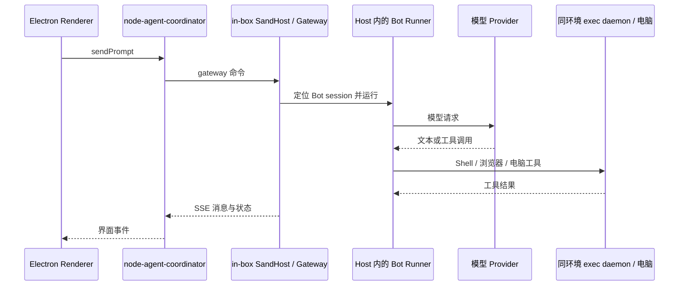

# BeeBot 当前 Bot 运行边界核对

核对日期：2026-09-16。依据：本仓库源码静态阅读；本文不代表运行测试结果，也不制定新的部署架构。

**结论：当前普通 Host 路径将 Bot 会话、记忆、模型 Runner 与默认工作电脑放在同一运行环境中。一个 Host 管理多个 Bot，当前并非每个 Bot 已有独立进程或独立容器。** 先前方案中的“公共 Worker 执行所有 Bot，电脑容器只提供工具”属于新设计假设，不能描述为现有实现。

以下源码引用均相对仓库根目录，行号对应本次核对时的工作树。

## 1. Bot 的身份、记忆和执行在哪里

| 内容 | 当前事实 | 源码依据 |
| --- | --- | --- |
| 长期 Bot 身份 | Host 数据根目录下的 `agents/<agentId>`，包含档案和会话资料 | `source/host/storage/agent-paths.ts:2`；`source/host/extensions/session/agent-session.ts:93` |
| 档案与模型厂商选择 | 按 Bot 写入 profile，包括 name、description、title、inferenceVendorId | `source/host/extensions/session/agent-session.ts:96` |
| 会话与持久记录 | 每 Bot 的 `store.db`；conversation blobs 另有数据库 | `source/host/extensions/session/session-paths.ts:9`、`:28` |
| 私有记忆 | `<agentDir>/memory`，由 Host 的 MemoryService 读取和写入 | `source/host/extensions/memory/memory-service.ts:31`、`:159` |
| 模型 Runner | SandHost 按 session 构造 SandAgentRunner，绑定该 Bot 的会话、记忆、工作流等 | `source/host/sand-host.ts:167`；`source/host/host-runner-composition.ts:2587`、`:2604` |
| 默认电脑工具 | 访问本运行环境内的 loopback exec daemon、浏览器和显示服务 | `source/host/box/box-factory.ts:7`；`source/host/box/loopback-sand-box.ts:30` |

Host 内的 roster、Runner 和每 Bot 持久目录是不同概念。长期身份不要求一个永远不退出的 Runner 对象；按回合创建 Runner，也不意味着 Bot 是临时角色。

`source/host/agent-isolation/agent-store-worker.ts:1` 使用 Node `worker_threads`，`:35` 打开 conversation blob 数据库。这是存储访问的线程边界，不能据此认定模型 Runner 或整台 Bot 电脑已经独立部署。

## 2. 普通消息和电脑工具路径



`source/host/main.ts:222` 启动或复用 exec daemon，随后启动 Host 与 gateway（`:223`、`:226`）。`source/host/sand-host.ts:172` 构造 SandAgentRunner。`source/host/box/box-factory.ts:7` 的启动说明明确写为 `loopback (in-box)` 和 `host's own container`。

本机 Docker 路径将 `host-main.cjs` 挂入工作容器（`source/electron-main/box/local-docker-host-connector.ts:201`），通过同一容器的 gateway 提供能力。默认生产 box composition 将 loopback box 包成 SharedDesktopSandBox（`source/host/box/production.ts:162`、`:217`）。

SharedDesktopSandBox 按 Bot 分配窗口，文件操作仍委托共享 box（`source/host/box/shared-desktop-sand-box.ts:32`、`:36`）。不同 Bot 的显示窗口和持久会话目录，不能当作独立 OS、文件系统或账号隔离的证据。

此外，`source/host/box/loopback-sand-box.ts:47` 的下载实现直接读取 Host 本地路径；现有默认电脑适配不能仅更换地址就视为完整支持任意远程电脑。

## 3. local / remote 切换的是整个 Host 连接

`source/electron-main/box/local-docker-host-connector.ts:249` 根据全局 `settings.getBoxRuntime()` 选择 `localConnect()` 或 `remote.connect()`。

- **local-docker**：创建/使用固定 `grok-bot-local-vm`，连接 `http://127.0.0.1:1340`（同文件 `:14`、`:15`）。Host 数据与电脑环境在该本机 Docker 路径内。
- **remote**：broker 调用 `ensureSandBox()`，返回该 box 的 gateway URL、凭据与 VNC 地址（`source/electron-main/box/box-host-connector.ts:84`、`:99`）；也可通过 `SAND_HOST_GATEWAY_URL` 指定 gateway（`:16`、`:149`）。
- UI 修改该配置后重启 coordinator（`source/electron-main/main-edge.ts:232`）。这不是同一个中心服务为每个 Bot 单独选择执行节点，也不能推断切换时两处历史会自动合并。

外部 broker 的内部实现不在上述代码中；这里只确认客户端如何取得并连接 in-box gateway，不推断云端内部服务或存储拓扑。

## 4. local-exec 能分离工具电脑，但不是完整 Bot 节点

现有 local-exec 路径允许 Host Runner 操作另一个已注册的用户电脑：

```text
Host Runner → LocalExecBridge → gateway SSE 请求
  → 用户电脑上的 local-exec-daemon → 本机工具执行
  → HTTP POST 结果 → Host Runner
```

coordinator 请求客户端宿主启动 daemon（`source/node-agent-coordinator/local-exec/supervisor.ts:155`）；Electron 以 detached 子进程启动它（`source/electron-main/local-exec/local-exec-native.ts:35`）。Provider 主动连接 gateway 并注册 computerId（`source/host/local-exec/local-exec-provider.ts:112`、`:116`），通过 POST 回传结果（`:105`）。

Runner 取得 `localExec.box` 与 `userComputers`（`source/host/host-runner-composition.ts:1393`、`:1406`）。该通道承担工具、文件和电脑操作；Bot 的模型回合、身份、记忆仍由 Host 管理，不能直接把 local-exec daemon 称为完整 Bot Runtime。

## 5. 客户端 CLI 推理是另一条现存路径

`source/node-agent-coordinator/inference-router.ts:213` 会拦截 Codex/Claude Code 等非 HTTP provider 的 `sendPrompt`；默认 cursor 和 HTTP provider 路径不在这里拦截。被拦截的请求在 coordinator 调用 `runRoutedProviderText`（`:170`），历史写入客户端 `inference-router-transcript.json`（`:60`），工具通过 routed MCP 调用。

因此，“全部模型推理都在 in-box Host”同样不准确：普通 Host Runner 与客户端 CLI router 是两条现存路径。Web 改造需要显式处理该差异，不能用一张统一 Worker 示意图当作源码现状。

## 6. 本次核对的边界

当前已存在独立客户端、可远程连接的 Host gateway、按 Bot 的持久会话/记忆，以及可远程连接的工具执行通道；尚不能由这些事实推出“平台服务已独立于完整 Bot Runtime”“每 Bot 已有独立电脑”或“任意 Bot 可单独部署到不同节点”。这些属于需要另外决定和实施的产品架构，本文不作选择。
